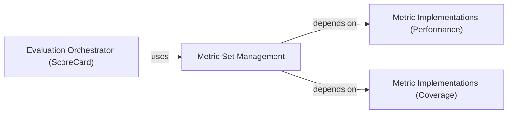

## Details

The `Metric Set Management` component is fundamental because it provides a structured and extensible way to group related metrics into reusable `MetricSet` objects. This aligns with the "Modular Design" and "Component-Based Architecture" patterns, promoting reusability and clear separation of concerns. The `getClassHierarchy` output confirms that `ClassificationMetricSet`, `CoverageMetricSet`, `RankingMetricSet`, and `RatingMetricSet` all inherit from `MetricSet`, demonstrating a well-defined hierarchy and adherence to the Strategy Pattern, where each subclass represents a specific evaluation strategy.

### Metric Set Management [[Expand]](./Metric_Set_Management.md)
This component, primarily located in `rexmex.metricset`, is responsible for defining and managing collections of evaluation metrics. It provides a structured and extensible way to group related metrics into reusable `MetricSet` objects (e.g., `ClassificationMetricSet`, `RankingMetricSet`, `RatingMetricSet`, `CoverageMetricSet`). The base class `rexmex.metricset.MetricSet` establishes a common interface, allowing for the aggregation of individual `Metric Definitions` (from `rexmex.metrics.*`) into coherent evaluation scenarios. This component embodies the Strategy Pattern, where different `MetricSet` implementations represent distinct evaluation strategies.

**Related Classes/Methods**:

- <a href="https://github.com/AstraZeneca/rexmex/blob/main/rexmex/metricset.py#L16-L74" target="_blank" rel="noopener noreferrer">`rexmex.metricset.MetricSet` (16:74)</a>
- <a href="https://github.com/AstraZeneca/rexmex/blob/main/rexmex/metricset.py#L77-L108" target="_blank" rel="noopener noreferrer">`rexmex.metricset.ClassificationMetricSet` (77:108)</a>
- <a href="https://github.com/AstraZeneca/rexmex/blob/main/rexmex/metricset.py#L169-L179" target="_blank" rel="noopener noreferrer">`rexmex.metricset.RankingMetricSet` (169:179)</a>
- <a href="https://github.com/AstraZeneca/rexmex/blob/main/rexmex/metricset.py#L111-L148" target="_blank" rel="noopener noreferrer">`rexmex.metricset.RatingMetricSet` (111:148)</a>
- <a href="https://github.com/AstraZeneca/rexmex/blob/main/rexmex/metricset.py#L151-L166" target="_blank" rel="noopener noreferrer">`rexmex.metricset.CoverageMetricSet` (151:166)</a>

### Metric Implementations (Performance)
This component includes implementations of performance-related evaluation metrics, such as classification, ranking, and rating metrics. These are the concrete metric calculations that are aggregated by the `Metric Set Management` component.

**Related Classes/Methods**:

- <a href="https://github.com/AstraZeneca/rexmex/blob/main/rexmex/metrics/classification.py#L1-L1" target="_blank" rel="noopener noreferrer">`rexmex.metrics.classification` (1:1)</a>
- <a href="https://github.com/AstraZeneca/rexmex/blob/main/rexmex/metrics/ranking.py#L1-L1" target="_blank" rel="noopener noreferrer">`rexmex.metrics.ranking` (1:1)</a>
- <a href="https://github.com/AstraZeneca/rexmex/blob/main/rexmex/metrics/rating.py#L1-L1" target="_blank" rel="noopener noreferrer">`rexmex.metrics.rating` (1:1)</a>

### Metric Implementations (Coverage)
This component includes implementations of coverage-related evaluation metrics. Similar to performance metrics, these are the specific calculations used within `MetricSet` objects.

**Related Classes/Methods**:

- <a href="https://github.com/AstraZeneca/rexmex/blob/main/rexmex/metrics/coverage.py#L1-L1" target="_blank" rel="noopener noreferrer">`rexmex.metrics.coverage` (1:1)</a>

### Evaluation Orchestrator (ScoreCard)
This component is responsible for orchestrating the evaluation process, typically using `Metric Sets` to generate scorecards. It acts as a Facade, simplifying the evaluation workflow for users by leveraging the defined metric sets.

**Related Classes/Methods**:

- <a href="https://github.com/AstraZeneca/rexmex/blob/main/rexmex/scorecard.py#L13-L93" target="_blank" rel="noopener noreferrer">`rexmex.scorecard.ScoreCard` (13:93)</a>
- <a href="https://github.com/AstraZeneca/rexmex/blob/main/rexmex/scorecard.py#L96-L158" target="_blank" rel="noopener noreferrer">`rexmex.scorecard.CoverageScoreCard` (96:158)</a>

### [FAQ](https://github.com/CodeBoarding/GeneratedOnBoardings/tree/main?tab=readme-ov-file#faq)