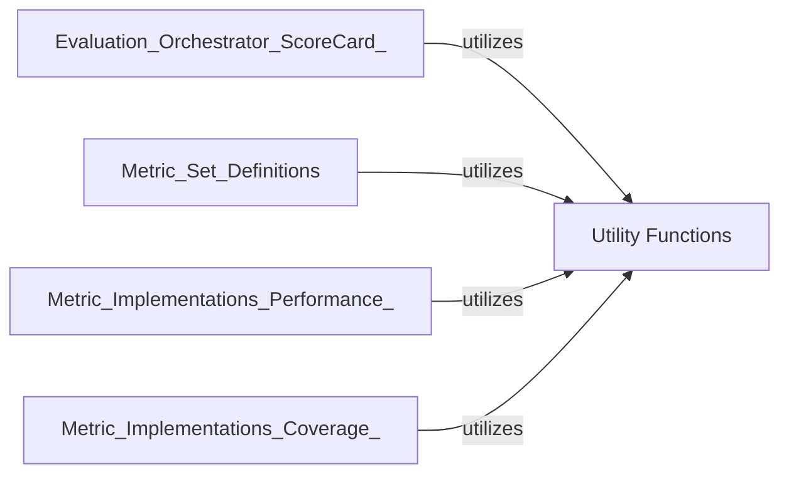

## Details

The `Utility Functions` component is fundamental to the `rexmex` library, serving as a data preprocessing backbone with functions like `binarize` and `normalize`. It enhances discoverability and extensibility through the `Annotator` class for metadata attachment. By centralizing common helper functions, it promotes modularity and reusability, preventing code duplication. Its pervasive usage across components like `Evaluation Orchestrator`, `Metric Set Definitions`, and `Metric Implementations` underscores its foundational role as a shared toolkit.

### Utility Functions [[Expand]](./Utility_Functions.md)
This component offers a collection of versatile helper functions and classes that support various operations across the `rexmex` library. It includes crucial data transformation utilities like `binarize` and `normalize`, which are vital for preprocessing prediction and ground-truth vectors into appropriate formats for metric computation. Additionally, the `Annotator` class within this component facilitates the annotation and registration of functions (likely metrics) with valuable metadata such as value ranges, descriptions, and links. This enhances the discoverability, usability, and extensibility of various components within the library.

**Related Classes/Methods**:

- <a href="https://github.com/AstraZeneca/rexmex/blob/main/rexmex/utils.py#L16-L35" target="_blank" rel="noopener noreferrer">`rexmex.utils.binarize` (16:35)</a>
- <a href="https://github.com/AstraZeneca/rexmex/blob/main/rexmex/utils.py#L38-L59" target="_blank" rel="noopener noreferrer">`rexmex.utils.normalize` (38:59)</a>
- <a href="https://github.com/AstraZeneca/rexmex/blob/main/rexmex/utils.py#L62-L117" target="_blank" rel="noopener noreferrer">`rexmex.utils.Annotator` (62:117)</a>

### [FAQ](https://github.com/CodeBoarding/GeneratedOnBoardings/tree/main?tab=readme-ov-file#faq)