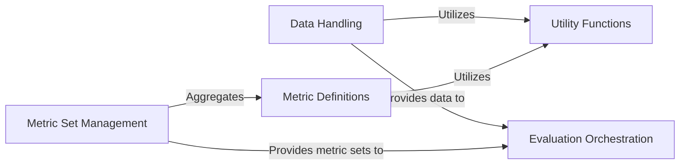

## Details

Abstract Components Overview

### Data Handling
This component is responsible for managing and preparing datasets for recommender system evaluation. It handles loading, preprocessing, and formatting ground truth and prediction data into structures suitable for metric computation.

**Related Classes/Methods**:

- <a href="https://github.com/AstraZeneca/rexmex/blob/main/rexmex/dataset.py#L6-L24" target="_blank" rel="noopener noreferrer">`rexmex.dataset.DatasetReader` (6:24)</a>
- <a href="https://github.com/AstraZeneca/rexmex/blob/main/rexmex/dataset.py#L12-L24" target="_blank" rel="noopener noreferrer">`rexmex.dataset.DatasetReader:read_dataset` (12:24)</a>

### Metric Definitions [[Expand]](./Metric_Definitions.md)
This component encapsulates the core implementations of various individual evaluation metrics. These metrics are categorized by type (e.g., classification, ranking, rating, coverage) and provide the fundamental algorithms for quantitative assessment.

**Related Classes/Methods**:

- <a href="https://github.com/AstraZeneca/rexmex/blob/main/rexmex/metrics/classification.py#L1-L1" target="_blank" rel="noopener noreferrer">`rexmex.metrics.classification` (1:1)</a>
- <a href="https://github.com/AstraZeneca/rexmex/blob/main/rexmex/metrics/ranking.py#L1-L1" target="_blank" rel="noopener noreferrer">`rexmex.metrics.ranking` (1:1)</a>
- <a href="https://github.com/AstraZeneca/rexmex/blob/main/rexmex/metrics/rating.py#L1-L1" target="_blank" rel="noopener noreferrer">`rexmex.metrics.rating` (1:1)</a>
- <a href="https://github.com/AstraZeneca/rexmex/blob/main/rexmex/metrics/coverage.py#L1-L1" target="_blank" rel="noopener noreferrer">`rexmex.metrics.coverage` (1:1)</a>

### Metric Set Management [[Expand]](./Metric_Set_Management.md)
This component enables the creation, combination, and management of collections of metrics. It allows users to define specific evaluation scenarios by aggregating individual `Metric Definitions` into reusable `MetricSet` objects (e.g., `ClassificationMetricSet`, `RankingMetricSet`).

**Related Classes/Methods**:

- <a href="https://github.com/AstraZeneca/rexmex/blob/main/rexmex/metricset.py#L16-L74" target="_blank" rel="noopener noreferrer">`rexmex.metricset.MetricSet` (16:74)</a>
- <a href="https://github.com/AstraZeneca/rexmex/blob/main/rexmex/metricset.py#L77-L108" target="_blank" rel="noopener noreferrer">`rexmex.metricset.ClassificationMetricSet` (77:108)</a>
- <a href="https://github.com/AstraZeneca/rexmex/blob/main/rexmex/metricset.py#L111-L148" target="_blank" rel="noopener noreferrer">`rexmex.metricset.RatingMetricSet` (111:148)</a>
- <a href="https://github.com/AstraZeneca/rexmex/blob/main/rexmex/metricset.py#L151-L166" target="_blank" rel="noopener noreferrer">`rexmex.metricset.CoverageMetricSet` (151:166)</a>
- <a href="https://github.com/AstraZeneca/rexmex/blob/main/rexmex/metricset.py#L169-L179" target="_blank" rel="noopener noreferrer">`rexmex.metricset.RankingMetricSet` (169:179)</a>

### Evaluation Orchestration [[Expand]](./Evaluation_Orchestration.md)
This is the central component that orchestrates the entire evaluation workflow. It takes prepared input data and a defined set of metrics to compute performance scores, generate comprehensive scorecards, and present the evaluation results.

**Related Classes/Methods**:

- <a href="https://github.com/AstraZeneca/rexmex/blob/main/rexmex/scorecard.py#L13-L93" target="_blank" rel="noopener noreferrer">`rexmex.scorecard.ScoreCard` (13:93)</a>
- <a href="https://github.com/AstraZeneca/rexmex/blob/main/rexmex/scorecard.py#L96-L158" target="_blank" rel="noopener noreferrer">`rexmex.scorecard.CoverageScoreCard` (96:158)</a>

### Utility Functions [[Expand]](./Utility_Functions.md)
This component provides a collection of general-purpose helper functions that support various operations across the library. This includes data transformation utilities (e.g., binarization, normalization) and other auxiliary functions that enhance the overall functionality and usability.

**Related Classes/Methods**:

- <a href="https://github.com/AstraZeneca/rexmex/blob/main/rexmex/utils.py#L1-L1" target="_blank" rel="noopener noreferrer">`rexmex.utils` (1:1)</a>

### [FAQ](https://github.com/CodeBoarding/GeneratedOnBoardings/tree/main?tab=readme-ov-file#faq)