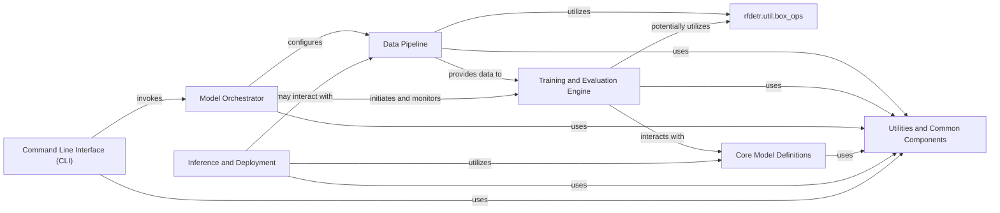

## Details

Component overview for a Machine Learning Library/Framework, detailing the Data Pipeline, Training and Evaluation Engine, utility components, Model Orchestrator, Core Model Definitions, Inference and Deployment, Command Line Interface, and general Utilities, along with their interactions.

### Data Pipeline [[Expand]](./Data_Pipeline.md)
This component is responsible for the entire lifecycle of data handling, from loading raw input data (e.g., images) to preparing it for the neural network. It includes functionalities for dataset-specific conversions (e.g., COCO dataset handling), preprocessing operations like padding, resizing, and normalization, and data augmentation.

**Related Classes/Methods**:

- <a href="https://github.com/roboflow/rf-detr/blob/develop/rfdetr/datasets/transforms.py#L280-L365" target="_blank" rel="noopener noreferrer">`rfdetr.datasets.transforms.Pad` (280:365)</a>
- <a href="https://github.com/roboflow/rf-detr/blob/develop/rfdetr/datasets/coco.py#L55-L95" target="_blank" rel="noopener noreferrer">`rfdetr.datasets.coco.ConvertCoco` (55:95)</a>
- <a href="https://github.com/roboflow/rf-detr/blob/develop/rfdetr/datasets/coco.py#L39-L52" target="_blank" rel="noopener noreferrer">`rfdetr.datasets.coco.CocoDetection` (39:52)</a>

### Training and Evaluation Engine
Manages the core machine learning lifecycle, including model training loops, optimization, loss calculation, and performance evaluation. It orchestrates the learning process and assesses model efficacy.

**Related Classes/Methods**:

- `rfdetr.train` (1:1)

### rfdetr.util.box_ops
Provides specialized utility functions for common bounding box operations, such as intersection-over-union (IoU) calculations, box format conversions, and non-maximum suppression, crucial for object detection tasks.

**Related Classes/Methods**:

- <a href="https://github.com/roboflow/rf-detr/blob/develop/rfdetr/util/box_ops.py#L1-L1" target="_blank" rel="noopener noreferrer">`rfdetr.util.box_ops` (1:1)</a>

### Model Orchestrator
Centralizes the configuration and coordination of various components, managing the overall flow of training, evaluation, and potentially inference processes. It acts as a control plane for the ML system.

**Related Classes/Methods**:

- `rfdetr.config`
- `rfdetr.runner` (1:1)

### Core Model Definitions
Contains the architectural definitions of the neural network models, including layers, forward passes, and model-specific configurations, forming the backbone of the object detection capabilities.

**Related Classes/Methods**:

- `rfdetr.models` (1:1)

### Inference and Deployment
Handles the loading of trained models, performing predictions on new data, and preparing models for deployment in various environments (e.g., local, cloud, edge devices).

**Related Classes/Methods**:

- `rfdetr.inference` (1:1)
- `rfdetr.deploy` (1:1)

### Command Line Interface (CLI)
Provides a user-friendly command-line interface for interacting with the library, enabling users to initiate training, run inference, manage datasets, or perform other high-level operations without direct code interaction.

**Related Classes/Methods**:

- `rfdetr.cli` (1:1)
- `rfdetr.main`

### Utilities and Common Components
A collection of general-purpose helper functions, classes, and modules that support various parts of the system but do not belong to a specific core component. This includes general data manipulation, file I/O, logging, or other common functionalities not covered by specialized utilities like rfdetr.util.box_ops.

**Related Classes/Methods**:

- `rfdetr.util` (1:1)
- `rfdetr.common` (1:1)

### [FAQ](https://github.com/CodeBoarding/GeneratedOnBoardings/tree/main?tab=readme-ov-file#faq)