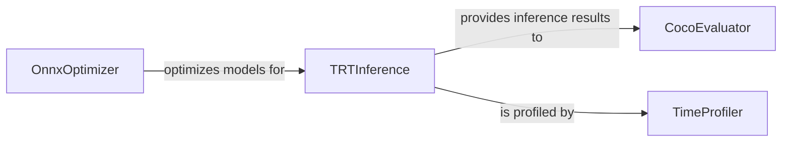

## Details

This component is responsible for taking trained machine learning models and preparing them for efficient deployment and execution in various environments. It encompasses functionalities for model optimization (e.g., ONNX conversion, TensorRT optimization), performance benchmarking, and evaluation of inference results. This component is critical for transitioning models from development to production, ensuring high performance and compatibility across different hardware.

### OnnxOptimizer
Optimizes deep learning models, primarily for export to the ONNX format. This includes graph optimizations and preparing models for efficient inference on various runtimes, including potentially those compatible with TensorRT.

**Related Classes/Methods**:

- <a href="https://github.com/roboflow/rf-detr/blob/develop/rfdetr/deploy/_onnx/optimizer.py#L27-L578" target="_blank" rel="noopener noreferrer">`rfdetr.deploy._onnx.optimizer.OnnxOptimizer` (27:578)</a>

### TRTInference
Manages and executes inference using NVIDIA TensorRT, a high-performance inference optimizer and runtime. It takes optimized models and performs predictions, leveraging GPU acceleration.

**Related Classes/Methods**:

- <a href="https://github.com/roboflow/rf-detr/blob/develop/rfdetr/deploy/benchmark.py#L391-L534" target="_blank" rel="noopener noreferrer">`rfdetr.deploy.benchmark.TRTInference` (391:534)</a>

### CocoEvaluator
Evaluates the performance of object detection models based on the COCO dataset metrics. It processes inference results (e.g., bounding box predictions) and compares them against ground truth annotations to compute standard metrics like mAP.

**Related Classes/Methods**:

- <a href="https://github.com/roboflow/rf-detr/blob/develop/rfdetr/deploy/benchmark.py#L56-L132" target="_blank" rel="noopener noreferrer">`rfdetr.deploy.benchmark.CocoEvaluator` (56:132)</a>

### TimeProfiler
Measures and profiles the execution time of various operations, particularly inference steps. It helps identify performance bottlenecks and quantify the speed of model execution.

**Related Classes/Methods**:

- <a href="https://github.com/roboflow/rf-detr/blob/develop/rfdetr/deploy/benchmark.py#L537-L554" target="_blank" rel="noopener noreferrer">`rfdetr.deploy.benchmark.TimeProfiler` (537:554)</a>

### [FAQ](https://github.com/CodeBoarding/GeneratedOnBoardings/tree/main?tab=readme-ov-file#faq)