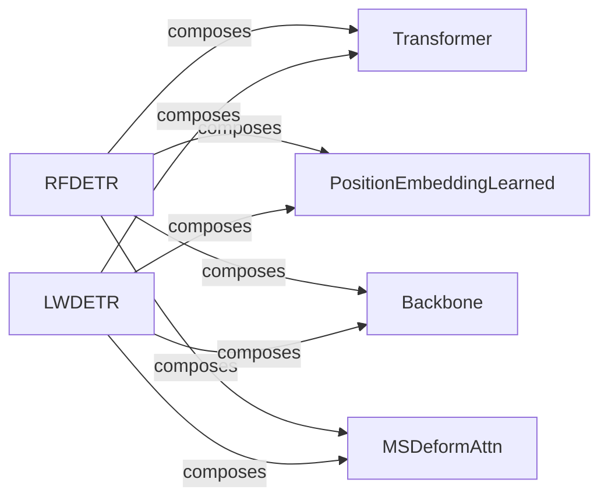

## Details

The `Model Definition` component is fundamentally important as it directly implements the core intellectual property of the `rf-detr` project – the object detection models themselves. Following the "Model-Centric" architectural pattern, this component encapsulates the neural network architectures, their learnable parameters, and the forward pass logic. Its modular design, evident in the composition relationships (e.g., `RFDETR` composing `Transformer`, `Backbone`, `PositionEmbeddingLearned`, and `MSDeformAttn`), allows for flexibility in swapping out different sub-components (e.g., various backbones or transformer configurations) without altering the overall model structure. This aligns with the project's goal of modularity and extensibility, crucial for a machine learning library/framework.

### RFDETR
The core RFDETR model variant for object detection.

**Related Classes/Methods**:

- <a href="https://github.com/roboflow/rf-detr/blob/develop/rfdetr/detr.py#L39-L393" target="_blank" rel="noopener noreferrer">`rfdetr.detr.RFDETR` (39:393)</a>

### LWDETR
The lightweight LWDETR model variant for object detection.

**Related Classes/Methods**:

- <a href="https://github.com/roboflow/rf-detr/blob/develop/rfdetr/models/lwdetr.py#L37-L247" target="_blank" rel="noopener noreferrer">`rfdetr.models.lwdetr.LWDETR` (37:247)</a>

### Transformer
Fundamental transformer components used in DETR models.

**Related Classes/Methods**:

- <a href="https://github.com/roboflow/rf-detr/blob/develop/rfdetr/models/transformer.py#L128-L302" target="_blank" rel="noopener noreferrer">`rfdetr.models.transformer.Transformer` (128:302)</a>
- <a href="https://github.com/roboflow/rf-detr/blob/develop/rfdetr/models/transformer.py#L305-L441" target="_blank" rel="noopener noreferrer">`rfdetr.models.transformer.TransformerDecoder` (305:441)</a>
- <a href="https://github.com/roboflow/rf-detr/blob/develop/rfdetr/models/transformer.py#L444-L549" target="_blank" rel="noopener noreferrer">`rfdetr.models.transformer.TransformerDecoderLayer` (444:549)</a>

### PositionEmbeddingLearned
Learned position encoding mechanism for spatial awareness.

**Related Classes/Methods**:

- <a href="https://github.com/roboflow/rf-detr/blob/develop/rfdetr/models/position_encoding.py#L100-L130" target="_blank" rel="noopener noreferrer">`rfdetr.models.position_encoding.PositionEmbeddingLearned` (100:130)</a>

### Backbone
Backbone networks for feature extraction from input images.

**Related Classes/Methods**:

- <a href="https://github.com/roboflow/rf-detr/blob/develop/rfdetr/models/backbone/backbone.py#L35-L172" target="_blank" rel="noopener noreferrer">`rfdetr.models.backbone.backbone.Backbone` (35:172)</a>
- <a href="https://github.com/roboflow/rf-detr/blob/develop/rfdetr/models/backbone/base.py#L14-L19" target="_blank" rel="noopener noreferrer">`rfdetr.models.backbone.base.BackboneBase` (14:19)</a>
- `rfdetr.models.backbone.dinov2_with_windowed_attn`

### MSDeformAttn
Multi-Scale Deformable Attention module for efficient feature processing.

**Related Classes/Methods**:

- <a href="https://github.com/roboflow/rf-detr/blob/develop/rfdetr/models/ops/modules/ms_deform_attn.py#L39-L139" target="_blank" rel="noopener noreferrer">`rfdetr.models.ops.modules.ms_deform_attn.MSDeformAttn` (39:139)</a>

### [FAQ](https://github.com/CodeBoarding/GeneratedOnBoardings/tree/main?tab=readme-ov-file#faq)