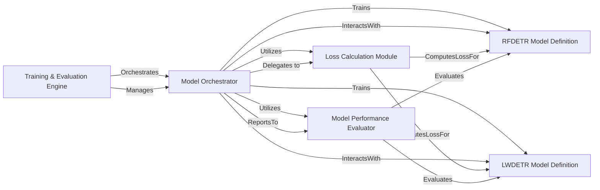

## Details

This subsystem is central to the `rfdetr` project, orchestrating the entire lifecycle of model training and performance assessment. It adheres to Machine Learning Library/Framework patterns by clearly separating concerns related to model definition, training orchestration, loss computation, and evaluation.

### Training & Evaluation Engine [[Expand]](./Training_Evaluation_Engine.md)
This overarching component defines the boundaries for the core training and evaluation processes. It manages the complete training loop, including optimization, loss application, and performance evaluation of object detection models.

**Related Classes/Methods**:

- `rfdetr.main`

### Model Orchestrator
Acts as the central coordinator within the `Training & Evaluation Engine`. It manages the training loop, directs model forward passes, and orchestrates interactions with loss calculation and performance evaluation components.

**Related Classes/Methods**:

- <a href="https://github.com/roboflow/rf-detr/blob/develop/rfdetr/main.py#L75-L564" target="_blank" rel="noopener noreferrer">`rfdetr.main.Model` (75:564)</a>

### Loss Calculation Module
Responsible for applying various loss functions (e.g., classification, bounding box regression) and computing the total loss during the model's training phase, guiding the optimization process.

**Related Classes/Methods**:

- <a href="https://github.com/roboflow/rf-detr/blob/develop/rfdetr/models/lwdetr.py#L250-L489" target="_blank" rel="noopener noreferrer">`rfdetr.models.lwdetr.SetCriterion` (250:489)</a>

### Model Performance Evaluator
Dedicated to assessing the trained model's performance. It utilizes specific metrics, such as COCO evaluation metrics, to provide quantitative feedback on the model's accuracy and effectiveness.

**Related Classes/Methods**:

- <a href="https://github.com/roboflow/rf-detr/blob/develop/rfdetr/datasets/coco_eval.py#L35-L175" target="_blank" rel="noopener noreferrer">`rfdetr.datasets.coco_eval.CocoEvaluator` (35:175)</a>

### RFDETR Model Definition
Encapsulates the architectural design, layers, and forward pass logic for the RFDETR (Roboflow Detection Transformer) object detection model.

**Related Classes/Methods**:

- <a href="https://github.com/roboflow/rf-detr/blob/develop/rfdetr/detr.py#L39-L393" target="_blank" rel="noopener noreferrer">`rfdetr.detr.RFDETR` (39:393)</a>

### LWDETR Model Definition
Defines the architecture and forward pass for the Lightweight Detection Transformer (LWDETR) model, likely an optimized or more efficient variant for object detection.

**Related Classes/Methods**:

- <a href="https://github.com/roboflow/rf-detr/blob/develop/rfdetr/models/lwdetr.py#L37-L247" target="_blank" rel="noopener noreferrer">`rfdetr.models.lwdetr.LWDETR` (37:247)</a>

### [FAQ](https://github.com/CodeBoarding/GeneratedOnBoardings/tree/main?tab=readme-ov-file#faq)