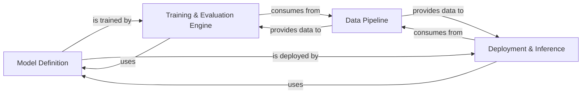

## Details

The `rf-detr` project is structured as a modular Machine Learning Library/Framework for object detection. Its core architecture revolves around four main components: the **Model Definition** component, which encapsulates the neural network architectures like DETR and its backbones; the **Data Pipeline** component, responsible for loading, transforming, and augmenting input data; the **Training & Evaluation Engine**, which orchestrates the model training, loss calculation, and performance evaluation using data from the Data Pipeline and interacting with the Model Definition; and finally, the **Deployment & Inference** component, which handles running trained models for predictions, benchmarking, and optimization for production environments, also consuming data from the Data Pipeline and utilizing the Model Definition. This design prioritizes a clear separation of concerns, enabling flexible development and deployment of object detection models.

### Model Definition [[Expand]](./Model_Definition.md)
This component defines the core neural network structures for object detection, including the main DETR model variants, their fundamental building blocks like transformer components, position encoding mechanisms, and various backbone implementations. It encapsulates the learnable parameters and the forward pass logic of the detection model.

**Related Classes/Methods**:

- <a href="https://github.com/roboflow/rf-detr/blob/develop/rfdetr/detr.py#L39-L393" target="_blank" rel="noopener noreferrer">`rfdetr.detr.RFDETR` (39:393)</a>
- <a href="https://github.com/roboflow/rf-detr/blob/develop/rfdetr/models/lwdetr.py#L37-L247" target="_blank" rel="noopener noreferrer">`rfdetr.models.lwdetr.LWDETR` (37:247)</a>
- <a href="https://github.com/roboflow/rf-detr/blob/develop/rfdetr/models/transformer.py#L128-L302" target="_blank" rel="noopener noreferrer">`rfdetr.models.transformer.Transformer` (128:302)</a>
- <a href="https://github.com/roboflow/rf-detr/blob/develop/rfdetr/models/transformer.py#L305-L441" target="_blank" rel="noopener noreferrer">`rfdetr.models.transformer.TransformerDecoder` (305:441)</a>
- <a href="https://github.com/roboflow/rf-detr/blob/develop/rfdetr/models/transformer.py#L444-L549" target="_blank" rel="noopener noreferrer">`rfdetr.models.transformer.TransformerDecoderLayer` (444:549)</a>
- <a href="https://github.com/roboflow/rf-detr/blob/develop/rfdetr/models/position_encoding.py#L100-L130" target="_blank" rel="noopener noreferrer">`rfdetr.models.position_encoding.PositionEmbeddingLearned` (100:130)</a>
- <a href="https://github.com/roboflow/rf-detr/blob/develop/rfdetr/models/backbone/backbone.py#L35-L172" target="_blank" rel="noopener noreferrer">`rfdetr.models.backbone.backbone.Backbone` (35:172)</a>
- <a href="https://github.com/roboflow/rf-detr/blob/develop/rfdetr/models/backbone/base.py#L14-L19" target="_blank" rel="noopener noreferrer">`rfdetr.models.backbone.base.BackboneBase` (14:19)</a>
- `rfdetr.models.backbone.dinov2_with_windowed_attn`
- <a href="https://github.com/roboflow/rf-detr/blob/develop/rfdetr/models/ops/modules/ms_deform_attn.py#L39-L139" target="_blank" rel="noopener noreferrer">`rfdetr.models.ops.modules.ms_deform_attn.MSDeformAttn` (39:139)</a>

### Data Pipeline [[Expand]](./Data_Pipeline.md)
This component is responsible for the entire lifecycle of data handling, from loading raw input data (e.g., images) to preparing it for the neural network. It includes functionalities for dataset-specific conversions (e.g., COCO dataset handling), preprocessing operations like padding, resizing, and normalization, and data augmentation.

**Related Classes/Methods**:

- <a href="https://github.com/roboflow/rf-detr/blob/develop/rfdetr/datasets/transforms.py#L280-L365" target="_blank" rel="noopener noreferrer">`rfdetr.datasets.transforms.Pad` (280:365)</a>
- <a href="https://github.com/roboflow/rf-detr/blob/develop/rfdetr/datasets/coco.py#L55-L95" target="_blank" rel="noopener noreferrer">`rfdetr.datasets.coco.ConvertCoco` (55:95)</a>
- <a href="https://github.com/roboflow/rf-detr/blob/develop/rfdetr/datasets/coco.py#L39-L52" target="_blank" rel="noopener noreferrer">`rfdetr.datasets.coco.CocoDetection` (39:52)</a>

### Training & Evaluation Engine [[Expand]](./Training_Evaluation_Engine.md)
This central component orchestrates the complete training and evaluation process of the object detection models. Its responsibilities include managing the training loop, applying various loss functions, optimizing model parameters, and evaluating model performance using relevant metrics. The `rfdetr.main.Model` class acts as a primary orchestrator within this subsystem.

**Related Classes/Methods**:

- <a href="https://github.com/roboflow/rf-detr/blob/develop/rfdetr/main.py#L75-L564" target="_blank" rel="noopener noreferrer">`rfdetr.main.Model` (75:564)</a>
- <a href="https://github.com/roboflow/rf-detr/blob/develop/rfdetr/models/lwdetr.py#L250-L489" target="_blank" rel="noopener noreferrer">`rfdetr.models.lwdetr.SetCriterion` (250:489)</a>
- <a href="https://github.com/roboflow/rf-detr/blob/develop/rfdetr/datasets/coco_eval.py#L35-L175" target="_blank" rel="noopener noreferrer">`rfdetr.datasets.coco_eval.CocoEvaluator` (35:175)</a>

### Deployment & Inference [[Expand]](./Deployment_Inference.md)
This component focuses on utilizing trained models for prediction and optimizing them for various deployment environments. It includes functionalities for benchmarking inference speed, converting and optimizing models for specific hardware (e.g., NVIDIA TensorRT), and exporting models to formats like ONNX.

**Related Classes/Methods**:

- <a href="https://github.com/roboflow/rf-detr/blob/develop/rfdetr/deploy/benchmark.py#L56-L132" target="_blank" rel="noopener noreferrer">`rfdetr.deploy.benchmark.CocoEvaluator` (56:132)</a>
- <a href="https://github.com/roboflow/rf-detr/blob/develop/rfdetr/deploy/benchmark.py#L391-L534" target="_blank" rel="noopener noreferrer">`rfdetr.deploy.benchmark.TRTInference` (391:534)</a>
- <a href="https://github.com/roboflow/rf-detr/blob/develop/rfdetr/deploy/benchmark.py#L537-L554" target="_blank" rel="noopener noreferrer">`rfdetr.deploy.benchmark.TimeProfiler` (537:554)</a>
- <a href="https://github.com/roboflow/rf-detr/blob/develop/rfdetr/deploy/_onnx/optimizer.py#L27-L578" target="_blank" rel="noopener noreferrer">`rfdetr.deploy._onnx.optimizer.OnnxOptimizer` (27:578)</a>

### [FAQ](https://github.com/CodeBoarding/GeneratedOnBoardings/tree/main?tab=readme-ov-file#faq)