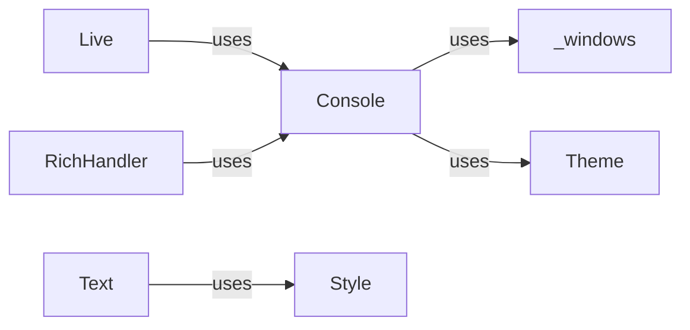

## Component Details

### Console
The central component for rendering rich text output to the terminal. It handles formatting, styling, and outputting text, tables, and other rich content. It manages the terminal's capabilities, such as color support and cursor positioning. The Console class is the main interface for interacting with the terminal and provides methods for printing, clearing, and controlling the cursor.
- **Related Classes/Methods**: `rich.console.Console`

### Live
Enables dynamic updates to the console, allowing for animations and real-time displays. It manages the rendering and refreshing of content within a designated area of the console, providing a smooth and flicker-free experience. The Live class is used to create a live display that can be updated with new content.
- **Related Classes/Methods**: `rich.live.Live`

### RichHandler
A logging handler that integrates with the Rich library to provide styled and formatted logging output to the console. It allows developers to easily add rich text formatting to their log messages, making them more readable and informative. The RichHandler class is used to integrate Rich with Python's logging module.
- **Related Classes/Methods**: `rich.logging.RichHandler`

### Style
Represents a style that can be applied to text. It includes attributes like color, background color, bold, italic, etc. Styles are used to format text in the console.
- **Related Classes/Methods**: `rich.style.Style`

### Theme
Manages the color themes used by Rich. It allows users to customize the appearance of the console output. Themes are used to define the colors and styles used by Rich.
- **Related Classes/Methods**: `rich.theme.Theme`

### Text
Represents a string of text with associated styles. It's a fundamental building block for rich text output. The Text class is used to create rich text objects that can be rendered to the console.
- **Related Classes/Methods**: `rich.text.Text`

### _windows
A module containing functions for interacting with the Windows console API, enabling features such as color support and terminal size detection. It provides a platform-specific implementation for Windows consoles, ensuring that Rich works correctly on that platform.
- **Related Classes/Methods**: `rich._windows`
