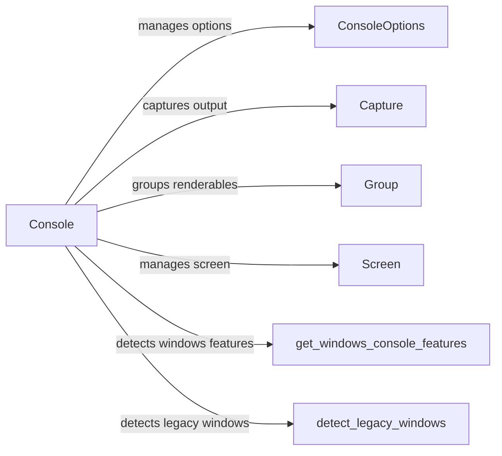

## Component Details

The Rich Console Interface provides a powerful and flexible way to render rich text and other objects to the terminal. It manages terminal capabilities, output formatting, styling, and user interaction. The core component is the `Console` class, which acts as the main interface for printing content. It leverages other components like `ConsoleOptions` for managing console settings, `Capture` for capturing output, and `Group` for organizing renderables. The console also interacts with the terminal to handle screen updates and paging.

### Console
The `Console` class is the central component, serving as the main interface for printing rich text and other objects to the terminal. It handles output formatting, styling, and terminal interaction. It manages a buffer, detects terminal capabilities, and renders objects using the rich render protocol. It also provides methods for printing, logging, and interacting with the terminal.
- **Related Classes/Methods**: `rich.console.Console`

### ConsoleOptions
The `ConsoleOptions` class stores options related to the console, such as width, height, and style. It allows updating and resetting these options, providing a way to configure the console's behavior and appearance. These options are used by the `Console` class to determine how to render output.
- **Related Classes/Methods**: `rich.console.ConsoleOptions`

### Capture
The `Capture` class is used to capture the output of the console. It allows capturing the rendered output as a string, which can be useful for testing, debugging, or generating reports. The `Console` class provides methods for starting and stopping capture.
- **Related Classes/Methods**: `rich.console.Capture`

### Group
The `Group` class is a renderable that groups other renderables together. It allows organizing complex layouts and structures within the console output. The `Console` class can render `Group` objects, which in turn render their child renderables.
- **Related Classes/Methods**: `rich.console.Group`

### Screen
The `Screen` class represents the terminal screen and provides methods for updating and manipulating the screen content. It is used by the `Console` class to manage the display and handle terminal interactions.
- **Related Classes/Methods**: `rich.console.Screen`

### get_windows_console_features
The `get_windows_console_features` function detects features of the Windows console, such as support for ANSI escape codes. This information is used by the `Console` class to adapt its output to the capabilities of the terminal.
- **Related Classes/Methods**: `rich.console:get_windows_console_features`

### detect_legacy_windows
The `detect_legacy_windows` function detects if a legacy Windows console is being used. This allows the `Console` class to provide a fallback rendering strategy for older terminals that do not support modern features.
- **Related Classes/Methods**: `rich.console:detect_legacy_windows`
