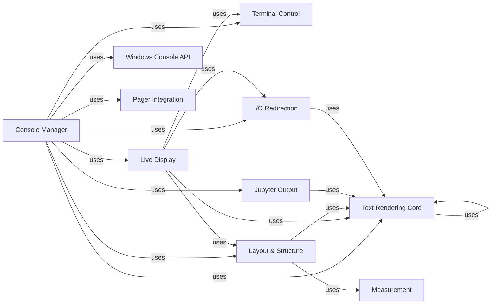

## Component Details

This graph illustrates the core components involved in managing and rendering output to the console within the Rich library. The central `Console Manager` orchestrates the display of various Rich objects, handles dynamic updates, and manages terminal state. It relies on fundamental components like `Text Rendering Core` for text manipulation and styling, `Terminal Control` for low-level terminal interactions, and `Layout & Structure` for content arrangement. Specialized components such as `Live Display`, `I/O Redirection`, `Windows Console API`, `Jupyter Output`, and `Pager Integration` extend its capabilities for dynamic content, stream management, platform-specific handling, and external tool integration. `Measurement` supports layout calculations.

### Console Manager
This central component manages all interactions with the terminal, including rendering various Rich objects, handling live updates, and managing screen buffers and cursor positions. It serves as the primary interface for displaying all Rich content. It orchestrates the rendering process, manages terminal state, handles output streams, and provides mechanisms for dynamic and interactive displays.

**Related Classes/Methods**:

- <a href="https://github.com/Textualize/rich/blob/master/rich/console.py#L593-L2607" target="_blank" rel="noopener noreferrer">`rich.console.Console` (593:2607)</a>
- <a href="https://github.com/Textualize/rich/blob/master/rich/console.py#L125-L255" target="_blank" rel="noopener noreferrer">`rich.console.ConsoleOptions` (125:255)</a>
- <a href="https://github.com/Textualize/rich/blob/master/rich/console.py#L304-L319" target="_blank" rel="noopener noreferrer">`rich.console.ScreenUpdate` (304:319)</a>
- <a href="https://github.com/Textualize/rich/blob/master/rich/console.py#L322-L352" target="_blank" rel="noopener noreferrer">`rich.console.Capture` (322:352)</a>
- <a href="https://github.com/Textualize/rich/blob/master/rich/console.py#L376-L412" target="_blank" rel="noopener noreferrer">`rich.console.PagerContext` (376:412)</a>
- <a href="https://github.com/Textualize/rich/blob/master/rich/console.py#L415-L459" target="_blank" rel="noopener noreferrer">`rich.console.ScreenContext` (415:459)</a>
- <a href="https://github.com/Textualize/rich/blob/master/rich/console.py#L462-L492" target="_blank" rel="noopener noreferrer">`rich.console.Group` (462:492)</a>
- <a href="https://github.com/Textualize/rich/blob/master/rich/console.py#L292-L301" target="_blank" rel="noopener noreferrer">`rich.console.NewLine` (292:301)</a>
- `rich.console.get_console` (full file reference)
- `rich.console.reconfigure` (full file reference)
- `rich.console.print` (full file reference)
- `rich.console.print_json` (full file reference)
- `rich.console.inspect` (full file reference)
- <a href="https://github.com/Textualize/rich/blob/master/rich/console.py#L495-L514" target="_blank" rel="noopener noreferrer">`rich.console.group` (495:514)</a>
- <a href="https://github.com/Textualize/rich/blob/master/rich/console.py#L578-L585" target="_blank" rel="noopener noreferrer">`rich.console.get_windows_console_features` (578:585)</a>
- <a href="https://github.com/Textualize/rich/blob/master/rich/console.py#L588-L590" target="_blank" rel="noopener noreferrer">`rich.console.detect_legacy_windows` (588:590)</a>
- <a href="https://github.com/Textualize/rich/blob/master/rich/console.py#L288-L289" target="_blank" rel="noopener noreferrer">`rich.console.CaptureError` (288:289)</a>
- <a href="https://github.com/Textualize/rich/blob/master/rich/console.py#L355-L373" target="_blank" rel="noopener noreferrer">`rich.console.ThemeContext` (355:373)</a>
- <a href="https://github.com/Textualize/rich/blob/master/rich/console.py#L548-L553" target="_blank" rel="noopener noreferrer">`rich.console.ConsoleThreadLocals` (548:553)</a>

### Terminal Control
Provides methods for sending low-level terminal control codes to manipulate the cursor, clear the screen, set window titles, and manage alternative screen buffers.

**Related Classes/Methods**:

- <a href="https://github.com/Textualize/rich/blob/master/rich/control.py#L54-L184" target="_blank" rel="noopener noreferrer">`rich.control.Control` (54:184)</a>
- <a href="https://github.com/Textualize/rich/blob/master/rich/control.py#L75-L77" target="_blank" rel="noopener noreferrer">`rich.control.Control:bell` (75:77)</a>
- <a href="https://github.com/Textualize/rich/blob/master/rich/control.py#L80-L82" target="_blank" rel="noopener noreferrer">`rich.control.Control:home` (80:82)</a>
- <a href="https://github.com/Textualize/rich/blob/master/rich/control.py#L85-L111" target="_blank" rel="noopener noreferrer">`rich.control.Control:move` (85:111)</a>
- <a href="https://github.com/Textualize/rich/blob/master/rich/control.py#L114-L135" target="_blank" rel="noopener noreferrer">`rich.control.Control:move_to_column` (114:135)</a>
- <a href="https://github.com/Textualize/rich/blob/master/rich/control.py#L138-L148" target="_blank" rel="noopener noreferrer">`rich.control.Control:move_to` (138:148)</a>
- <a href="https://github.com/Textualize/rich/blob/master/rich/control.py#L151-L153" target="_blank" rel="noopener noreferrer">`rich.control.Control:clear` (151:153)</a>
- <a href="https://github.com/Textualize/rich/blob/master/rich/control.py#L156-L158" target="_blank" rel="noopener noreferrer">`rich.control.Control:show_cursor` (156:158)</a>
- <a href="https://github.com/Textualize/rich/blob/master/rich/control.py#L161-L166" target="_blank" rel="noopener noreferrer">`rich.control.Control:alt_screen` (161:166)</a>
- <a href="https://github.com/Textualize/rich/blob/master/rich/control.py#L169-L175" target="_blank" rel="noopener noreferrer">`rich.control.Control:title` (169:175)</a>

### Live Display
Manages dynamic content updates on the terminal, such as progress bars or status messages, by continuously refreshing a renderable. It handles I/O redirection and uses a separate thread for refreshing.

**Related Classes/Methods**:

- <a href="https://github.com/Textualize/rich/blob/master/rich/live.py#L35-L268" target="_blank" rel="noopener noreferrer">`rich.live.Live` (35:268)</a>
- <a href="https://github.com/Textualize/rich/blob/master/rich/live.py#L51-L89" target="_blank" rel="noopener noreferrer">`rich.live.Live:__init__` (51:89)</a>
- <a href="https://github.com/Textualize/rich/blob/master/rich/live.py#L104-L132" target="_blank" rel="noopener noreferrer">`rich.live.Live:start` (104:132)</a>
- <a href="https://github.com/Textualize/rich/blob/master/rich/live.py#L134-L163" target="_blank" rel="noopener noreferrer">`rich.live.Live:stop` (134:163)</a>
- <a href="https://github.com/Textualize/rich/blob/master/rich/live.py#L165-L167" target="_blank" rel="noopener noreferrer">`rich.live.Live:__enter__` (165:167)</a>
- <a href="https://github.com/Textualize/rich/blob/master/rich/live.py#L169-L175" target="_blank" rel="noopener noreferrer">`rich.live.Live:__exit__` (169:175)</a>
- <a href="https://github.com/Textualize/rich/blob/master/rich/live.py#L177-L185" target="_blank" rel="noopener noreferrer">`rich.live.Live:_enable_redirect_io` (177:185)</a>
- <a href="https://github.com/Textualize/rich/blob/master/rich/live.py#L197-L204" target="_blank" rel="noopener noreferrer">`rich.live.Live:renderable` (197:204)</a>
- <a href="https://github.com/Textualize/rich/blob/master/rich/live.py#L206-L218" target="_blank" rel="noopener noreferrer">`rich.live.Live:update` (206:218)</a>
- <a href="https://github.com/Textualize/rich/blob/master/rich/live.py#L220-L247" target="_blank" rel="noopener noreferrer">`rich.live.Live:refresh` (220:247)</a>
- <a href="https://github.com/Textualize/rich/blob/master/rich/live.py#L249-L268" target="_blank" rel="noopener noreferrer">`rich.live.Live:process_renderables` (249:268)</a>
- <a href="https://github.com/Textualize/rich/blob/master/rich/live.py#L16-L32" target="_blank" rel="noopener noreferrer">`rich.live._RefreshThread` (16:32)</a>
- <a href="https://github.com/Textualize/rich/blob/master/rich/live_render.py#L20-L112" target="_blank" rel="noopener noreferrer">`rich.live_render.LiveRender` (20:112)</a>
- <a href="https://github.com/Textualize/rich/blob/master/rich/live_render.py#L47-L66" target="_blank" rel="noopener noreferrer">`rich.live_render.LiveRender:position_cursor` (47:66)</a>
- <a href="https://github.com/Textualize/rich/blob/master/rich/live_render.py#L68-L80" target="_blank" rel="noopener noreferrer">`rich.live_render.LiveRender:restore_cursor` (68:80)</a>
- <a href="https://github.com/Textualize/rich/blob/master/rich/live_render.py#L82-L112" target="_blank" rel="noopener noreferrer">`rich.live_render.LiveRender:__rich_console__` (82:112)</a>

### Text Rendering Core
The fundamental unit of Rich's rendering, representing a piece of text with an associated style. It provides methods for splitting, cropping, and applying styles to text.

**Related Classes/Methods**:

- <a href="https://github.com/Textualize/rich/blob/master/rich/segment.py#L64-L668" target="_blank" rel="noopener noreferrer">`rich.segment.Segment` (64:668)</a>
- <a href="https://github.com/Textualize/rich/blob/master/rich/segment.py#L82-L89" target="_blank" rel="noopener noreferrer">`rich.segment.Segment:cell_length` (82:89)</a>
- <a href="https://github.com/Textualize/rich/blob/master/rich/segment.py#L111-L156" target="_blank" rel="noopener noreferrer">`rich.segment.Segment:_split_cells` (111:156)</a>
- <a href="https://github.com/Textualize/rich/blob/master/rich/segment.py#L279-L323" target="_blank" rel="noopener noreferrer">`rich.segment.Segment:split_and_crop_lines` (279:323)</a>
- <a href="https://github.com/Textualize/rich/blob/master/rich/segment.py#L326-L368" target="_blank" rel="noopener noreferrer">`rich.segment.Segment:adjust_line_length` (326:368)</a>
- <a href="https://github.com/Textualize/rich/blob/master/rich/segment.py#L371-L381" target="_blank" rel="noopener noreferrer">`rich.segment.Segment:get_line_length` (371:381)</a>
- <a href="https://github.com/Textualize/rich/blob/master/rich/segment.py#L384-L395" target="_blank" rel="noopener noreferrer">`rich.segment.Segment:get_shape` (384:395)</a>
- <a href="https://github.com/Textualize/rich/blob/master/rich/segment.py#L398-L431" target="_blank" rel="noopener noreferrer">`rich.segment.Segment:set_shape` (398:431)</a>
- <a href="https://github.com/Textualize/rich/blob/master/rich/segment.py#L602-L668" target="_blank" rel="noopener noreferrer">`rich.segment.Segment:divide` (602:668)</a>
- <a href="https://github.com/Textualize/rich/blob/master/rich/segment.py#L671-L693" target="_blank" rel="noopener noreferrer">`rich.segment.Segments` (671:693)</a>
- <a href="https://github.com/Textualize/rich/blob/master/rich/segment.py#L696-L718" target="_blank" rel="noopener noreferrer">`rich.segment.SegmentLines` (696:718)</a>
- <a href="https://github.com/Textualize/rich/blob/master/rich/style.py#L31-L759" target="_blank" rel="noopener noreferrer">`rich.style.Style` (31:759)</a>
- <a href="https://github.com/Textualize/rich/blob/master/rich/style.py#L199-L201" target="_blank" rel="noopener noreferrer">`rich.style.Style.null` (199:201)</a>
- <a href="https://github.com/Textualize/rich/blob/master/rich/style.py#L765-L796" target="_blank" rel="noopener noreferrer">`rich.style.StyleStack` (765:796)</a>
- <a href="https://github.com/Textualize/rich/blob/master/rich/style.py#L789-L796" target="_blank" rel="noopener noreferrer">`rich.style.StyleStack.pop` (789:796)</a>
- <a href="https://github.com/Textualize/rich/blob/master/rich/style.py#L781-L787" target="_blank" rel="noopener noreferrer">`rich.style.StyleStack.push` (781:787)</a>
- <a href="https://github.com/Textualize/rich/blob/master/rich/text.py#L118-L1333" target="_blank" rel="noopener noreferrer">`rich.text.Text` (118:1333)</a>
- <a href="https://github.com/Textualize/rich/blob/master/rich/text.py#L357-L400" target="_blank" rel="noopener noreferrer">`rich.text.Text.assemble` (357:400)</a>
- <a href="https://github.com/Textualize/rich/blob/master/rich/text.py#L483-L507" target="_blank" rel="noopener noreferrer">`rich.text.Text.stylize_before` (483:507)</a>
- <a href="https://github.com/Textualize/rich/blob/master/rich/text.py#L779-L816" target="_blank" rel="noopener noreferrer">`rich.text.Text.join` (779:816)</a>
- <a href="https://github.com/Textualize/rich/blob/master/rich/text.py#L1055-L1061" target="_blank" rel="noopener noreferrer">`rich.text.Text.copy_styles` (1055:1061)</a>
- <a href="https://github.com/Textualize/rich/blob/master/rich/color.py#L409-L420" target="_blank" rel="noopener noreferrer">`rich.color.Color.from_rgb` (409:420)</a>
- <a href="https://github.com/Textualize/rich/blob/master/rich/color.py#L580-L591" target="_blank" rel="noopener noreferrer">`rich.color.Color.blend_rgb` (580:591)</a>

### Layout & Structure
Components responsible for arranging and structuring renderable content, including layouts, columns, panels, padding, alignment, and screen management.

**Related Classes/Methods**:

- <a href="https://github.com/Textualize/rich/blob/master/rich/layout.py#L142-L415" target="_blank" rel="noopener noreferrer">`rich.layout.Layout` (142:415)</a>
- <a href="https://github.com/Textualize/rich/blob/master/rich/layout.py#L395-L415" target="_blank" rel="noopener noreferrer">`rich.layout.Layout:__rich_console__` (395:415)</a>
- <a href="https://github.com/Textualize/rich/blob/master/rich/layout.py#L366-L393" target="_blank" rel="noopener noreferrer">`rich.layout.Layout.render` (366:393)</a>
- <a href="https://github.com/Textualize/rich/blob/master/rich/columns.py#L16-L171" target="_blank" rel="noopener noreferrer">`rich.columns.Columns` (16:171)</a>
- <a href="https://github.com/Textualize/rich/blob/master/rich/columns.py#L62-L171" target="_blank" rel="noopener noreferrer">`rich.columns.Columns:__rich_console__` (62:171)</a>
- `rich.columns.Columns.__rich_console__.iter_renderables` (full file reference)
- <a href="https://github.com/Textualize/rich/blob/master/rich/panel.py#L17-L298" target="_blank" rel="noopener noreferrer">`rich.panel.Panel` (17:298)</a>
- <a href="https://github.com/Textualize/rich/blob/master/rich/panel.py#L141-L276" target="_blank" rel="noopener noreferrer">`rich.panel.Panel:__rich_console__` (141:276)</a>
- `rich.panel.Panel.__rich_console__.align_text` (full file reference)
- <a href="https://github.com/Textualize/rich/blob/master/rich/padding.py#L19-L135" target="_blank" rel="noopener noreferrer">`rich.padding.Padding` (19:135)</a>
- <a href="https://github.com/Textualize/rich/blob/master/rich/padding.py#L79-L123" target="_blank" rel="noopener noreferrer">`rich.padding.Padding:__rich_console__` (79:123)</a>
- <a href="https://github.com/Textualize/rich/blob/master/rich/padding.py#L61-L74" target="_blank" rel="noopener noreferrer">`rich.padding.Padding.unpack` (61:74)</a>
- <a href="https://github.com/Textualize/rich/blob/master/rich/align.py#L23-L231" target="_blank" rel="noopener noreferrer">`rich.align.Align` (23:231)</a>
- <a href="https://github.com/Textualize/rich/blob/master/rich/align.py#L70-L89" target="_blank" rel="noopener noreferrer">`rich.align.Align:left` (70:89)</a>
- <a href="https://github.com/Textualize/rich/blob/master/rich/align.py#L92-L111" target="_blank" rel="noopener noreferrer">`rich.align.Align:center` (92:111)</a>
- <a href="https://github.com/Textualize/rich/blob/master/rich/align.py#L114-L133" target="_blank" rel="noopener noreferrer">`rich.align.Align:right` (114:133)</a>
- <a href="https://github.com/Textualize/rich/blob/master/rich/align.py#L135-L225" target="_blank" rel="noopener noreferrer">`rich.align.Align:__rich_console__` (135:225)</a>
- <a href="https://github.com/Textualize/rich/blob/master/rich/align.py#L227-L231" target="_blank" rel="noopener noreferrer">`rich.align.Align:__rich_measure__` (227:231)</a>
- `rich.align.Align.__rich_console__.generate_segments` (full file reference)
- `rich.align.Align.__rich_console__.blank_lines` (full file reference)
- <a href="https://github.com/Textualize/rich/blob/master/rich/align.py#L234-L288" target="_blank" rel="noopener noreferrer">`rich.align.VerticalCenter` (234:288)</a>
- <a href="https://github.com/Textualize/rich/blob/master/rich/align.py#L257-L282" target="_blank" rel="noopener noreferrer">`rich.align.VerticalCenter:__rich_console__` (257:282)</a>
- <a href="https://github.com/Textualize/rich/blob/master/rich/align.py#L284-L288" target="_blank" rel="noopener noreferrer">`rich.align.VerticalCenter:__rich_measure__` (284:288)</a>
- `rich.align.VerticalCenter.__rich_console__.blank_lines` (full file reference)
- <a href="https://github.com/Textualize/rich/blob/master/rich/screen.py#L18-L54" target="_blank" rel="noopener noreferrer">`rich.screen.Screen` (18:54)</a>
- <a href="https://github.com/Textualize/rich/blob/master/rich/screen.py#L28-L38" target="_blank" rel="noopener noreferrer">`rich.screen.Screen:__init__` (28:38)</a>
- <a href="https://github.com/Textualize/rich/blob/master/rich/screen.py#L40-L54" target="_blank" rel="noopener noreferrer">`rich.screen.Screen:__rich_console__` (40:54)</a>
- <a href="https://github.com/Textualize/rich/blob/master/rich/bar.py#L17-L93" target="_blank" rel="noopener noreferrer">`rich.bar.Bar` (17:93)</a>
- <a href="https://github.com/Textualize/rich/blob/master/rich/bar.py#L48-L84" target="_blank" rel="noopener noreferrer">`rich.bar.Bar:__rich_console__` (48:84)</a>
- <a href="https://github.com/Textualize/rich/blob/master/rich/rule.py#L12-L114" target="_blank" rel="noopener noreferrer">`rich.rule.Rule` (12:114)</a>

### I/O Redirection
Handles the redirection of standard input/output streams, often used in conjunction with live displays to capture and manipulate console output.

**Related Classes/Methods**:

- <a href="https://github.com/Textualize/rich/blob/master/rich/file_proxy.py#L11-L57" target="_blank" rel="noopener noreferrer">`rich.file_proxy.FileProxy` (11:57)</a>
- <a href="https://github.com/Textualize/rich/blob/master/rich/file_proxy.py#L14-L18" target="_blank" rel="noopener noreferrer">`rich.file_proxy.FileProxy:__init__` (14:18)</a>
- <a href="https://github.com/Textualize/rich/blob/master/rich/file_proxy.py#L28-L48" target="_blank" rel="noopener noreferrer">`rich.file_proxy.FileProxy:write` (28:48)</a>
- <a href="https://github.com/Textualize/rich/blob/master/rich/ansi.py#L120-L211" target="_blank" rel="noopener noreferrer">`rich.ansi.AnsiDecoder` (120:211)</a>

### Windows Console API
Provides a low-level interface for interacting with legacy Windows consoles, including cursor manipulation and text output, by directly calling Windows API functions.

**Related Classes/Methods**:

- <a href="https://github.com/Textualize/rich/blob/master/rich/_win32_console.py#L331-L572" target="_blank" rel="noopener noreferrer">`rich._win32_console.LegacyWindowsTerm` (331:572)</a>
- <a href="https://github.com/Textualize/rich/blob/master/rich/_win32_console.py#L362-L374" target="_blank" rel="noopener noreferrer">`rich._win32_console.LegacyWindowsTerm:__init__` (362:374)</a>
- <a href="https://github.com/Textualize/rich/blob/master/rich/_win32_console.py#L377-L384" target="_blank" rel="noopener noreferrer">`rich._win32_console.LegacyWindowsTerm:cursor_position` (377:384)</a>
- <a href="https://github.com/Textualize/rich/blob/master/rich/_win32_console.py#L387-L394" target="_blank" rel="noopener noreferrer">`rich._win32_console.LegacyWindowsTerm:screen_size` (387:394)</a>
- <a href="https://github.com/Textualize/rich/blob/master/rich/_win32_console.py#L405-L442" target="_blank" rel="noopener noreferrer">`rich._win32_console.LegacyWindowsTerm:write_styled` (405:442)</a>
- <a href="https://github.com/Textualize/rich/blob/master/rich/_win32_console.py#L444-L452" target="_blank" rel="noopener noreferrer">`rich._win32_console.LegacyWindowsTerm:move_cursor_to` (444:452)</a>
- <a href="https://github.com/Textualize/rich/blob/master/rich/_win32_console.py#L454-L468" target="_blank" rel="noopener noreferrer">`rich._win32_console.LegacyWindowsTerm:erase_line` (454:468)</a>
- <a href="https://github.com/Textualize/rich/blob/master/rich/_win32_console.py#L470-L482" target="_blank" rel="noopener noreferrer">`rich._win32_console.LegacyWindowsTerm:erase_end_of_line` (470:482)</a>
- <a href="https://github.com/Textualize/rich/blob/master/rich/_win32_console.py#L484-L491" target="_blank" rel="noopener noreferrer">`rich._win32_console.LegacyWindowsTerm:erase_start_of_line` (484:491)</a>
- <a href="https://github.com/Textualize/rich/blob/master/rich/_win32_console.py#L493-L501" target="_blank" rel="noopener noreferrer">`rich._win32_console.LegacyWindowsTerm:move_cursor_up` (493:501)</a>
- <a href="https://github.com/Textualize/rich/blob/master/rich/_win32_console.py#L503-L512" target="_blank" rel="noopener noreferrer">`rich._win32_console.LegacyWindowsTerm:move_cursor_down` (503:512)</a>
- <a href="https://github.com/Textualize/rich/blob/master/rich/_win32_console.py#L514-L524" target="_blank" rel="noopener noreferrer">`rich._win32_console.LegacyWindowsTerm:move_cursor_forward` (514:524)</a>
- <a href="https://github.com/Textualize/rich/blob/master/rich/_win32_console.py#L526-L533" target="_blank" rel="noopener noreferrer">`rich._win32_console.LegacyWindowsTerm:move_cursor_to_column` (526:533)</a>
- <a href="https://github.com/Textualize/rich/blob/master/rich/_win32_console.py#L535-L545" target="_blank" rel="noopener noreferrer">`rich._win32_console.LegacyWindowsTerm:move_cursor_backward` (535:545)</a>
- <a href="https://github.com/Textualize/rich/blob/master/rich/_win32_console.py#L547-L551" target="_blank" rel="noopener noreferrer">`rich._win32_console.LegacyWindowsTerm:hide_cursor` (547:551)</a>
- <a href="https://github.com/Textualize/rich/blob/master/rich/_win32_console.py#L553-L557" target="_blank" rel="noopener noreferrer">`rich._win32_console.LegacyWindowsTerm:show_cursor` (553:557)</a>
- `rich.control.Control:set_title` (full file reference)
- <a href="https://github.com/Textualize/rich/blob/master/rich/_win32_console.py#L568-L572" target="_blank" rel="noopener noreferrer">`rich._win32_console.LegacyWindowsTerm._get_cursor_size` (568:572)</a>
- <a href="https://github.com/Textualize/rich/blob/master/rich/_win32_console.py#L67-L68" target="_blank" rel="noopener noreferrer">`rich._win32_console.CONSOLE_CURSOR_INFO` (67:68)</a>
- <a href="https://github.com/Textualize/rich/blob/master/rich/_win32_console.py#L78-L87" target="_blank" rel="noopener noreferrer">`rich._win32_console.GetStdHandle` (78:87)</a>
- <a href="https://github.com/Textualize/rich/blob/master/rich/_win32_console.py#L228-L241" target="_blank" rel="noopener noreferrer">`rich._win32_console.GetConsoleScreenBufferInfo` (228:241)</a>
- <a href="https://github.com/Textualize/rich/blob/master/rich/_win32_console.py#L204-L217" target="_blank" rel="noopener noreferrer">`rich._win32_console.SetConsoleTextAttribute` (204:217)</a>
- <a href="https://github.com/Textualize/rich/blob/master/rich/_win32_console.py#L252-L264" target="_blank" rel="noopener noreferrer">`rich._win32_console.SetConsoleCursorPosition` (252:264)</a>
- <a href="https://github.com/Textualize/rich/blob/master/rich/_win32_console.py#L128-L155" target="_blank" rel="noopener noreferrer">`rich._win32_console.FillConsoleOutputCharacter` (128:155)</a>
- <a href="https://github.com/Textualize/rich/blob/master/rich/_win32_console.py#L169-L193" target="_blank" rel="noopener noreferrer">`rich._win32_console.FillConsoleOutputAttribute` (169:193)</a>
- <a href="https://github.com/Textualize/rich/blob/master/rich/_win32_console.py#L319-L328" target="_blank" rel="noopener noreferrer">`rich._win32_console.SetConsoleTitle` (319:328)</a>
- <a href="https://github.com/Textualize/rich/blob/master/rich/_windows_renderer.py#L7-L56" target="_blank" rel="noopener noreferrer">`rich._windows_renderer.legacy_windows_render` (7:56)</a>

### Jupyter Output
Enables Rich to render content correctly within Jupyter notebooks, converting Rich segments into appropriate Jupyter display formats.

**Related Classes/Methods**:

- `rich.jupyter` (full file reference)
- <a href="https://github.com/Textualize/rich/blob/master/rich/jupyter.py#L36-L56" target="_blank" rel="noopener noreferrer">`rich.jupyter.JupyterMixin` (36:56)</a>
- <a href="https://github.com/Textualize/rich/blob/master/rich/jupyter.py#L41-L56" target="_blank" rel="noopener noreferrer">`rich.jupyter.JupyterMixin:_repr_mimebundle_` (41:56)</a>
- <a href="https://github.com/Textualize/rich/blob/master/rich/jupyter.py#L59-L81" target="_blank" rel="noopener noreferrer">`rich.jupyter._render_segments` (59:81)</a>
- <a href="https://github.com/Textualize/rich/blob/master/rich/jupyter.py#L60-L62" target="_blank" rel="noopener noreferrer">`rich.jupyter._render_segments.escape` (60:62)</a>
- <a href="https://github.com/Textualize/rich/blob/master/rich/jupyter.py#L84-L95" target="_blank" rel="noopener noreferrer">`rich.jupyter.display` (84:95)</a>
- <a href="https://github.com/Textualize/rich/blob/master/rich/jupyter.py#L98-L101" target="_blank" rel="noopener noreferrer">`rich.jupyter.print` (98:101)</a>
- <a href="https://github.com/Textualize/rich/blob/master/rich/jupyter.py#L18-L33" target="_blank" rel="noopener noreferrer">`rich.jupyter.JupyterRenderable` (18:33)</a>

### Pager Integration
Provides functionality to pipe console output through a system pager, allowing users to scroll through large amounts of text.

**Related Classes/Methods**:

- <a href="https://github.com/Textualize/rich/blob/master/rich/pager.py#L17-L25" target="_blank" rel="noopener noreferrer">`rich.pager.SystemPager` (17:25)</a>
- <a href="https://github.com/Textualize/rich/blob/master/rich/pager.py#L23-L25" target="_blank" rel="noopener noreferrer">`rich.pager.SystemPager:show` (23:25)</a>
- <a href="https://github.com/Textualize/rich/blob/master/rich/pager.py#L20-L21" target="_blank" rel="noopener noreferrer">`rich.pager.SystemPager._pager` (20:21)</a>

### Measurement
Provides utilities for calculating the dimensions (width and height) required to render various Rich objects.

**Related Classes/Methods**:

- <a href="https://github.com/Textualize/rich/blob/master/rich/measure.py#L11-L122" target="_blank" rel="noopener noreferrer">`rich.measure.Measurement` (11:122)</a>
- <a href="https://github.com/Textualize/rich/blob/master/rich/measure.py#L79-L122" target="_blank" rel="noopener noreferrer">`rich.measure.Measurement.get` (79:122)</a>
- <a href="https://github.com/Textualize/rich/blob/master/rich/measure.py#L125-L151" target="_blank" rel="noopener noreferrer">`rich.measure.measure_renderables` (125:151)</a>

### [FAQ](https://github.com/CodeBoarding/GeneratedOnBoardings/tree/main?tab=readme-ov-file#faq)