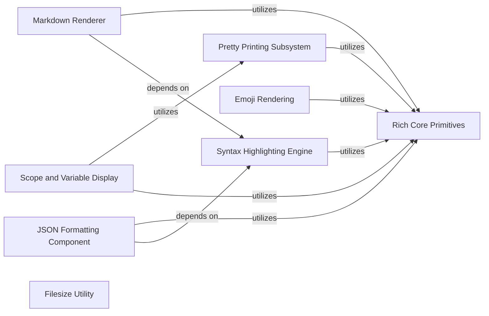

## Component Details

This graph illustrates the structure and interactions within the 'Content Formatting & Highlighting' subsystem of the project. The main flow involves various components responsible for transforming raw content into richly formatted and styled output suitable for console display. This includes pretty-printing Python objects, applying syntax highlighting to code, rendering Markdown text, displaying local variables, handling emoji rendering, and formatting file sizes. These components often rely on a set of core primitives for fundamental console management, text rendering, and styling.

### Pretty Printing Subsystem
This component provides comprehensive functionality for pretty-printing Python objects, including object introspection, structured representation generation, and integration with various display environments. It handles complex data structures, recursion, and depth limits to produce readable output.

**Related Classes/Methods**:

- <a href="https://github.com/Textualize/rich/blob/master/rich/pretty.py#L253-L354" target="_blank" rel="noopener noreferrer">`rich.pretty.Pretty` (253:354)</a>
- <a href="https://github.com/Textualize/rich/blob/master/rich/pretty.py#L409-L490" target="_blank" rel="noopener noreferrer">`rich.pretty.Node` (409:490)</a>
- <a href="https://github.com/Textualize/rich/blob/master/rich/pretty.py#L494-L558" target="_blank" rel="noopener noreferrer">`rich.pretty._Line` (494:558)</a>
- <a href="https://github.com/Textualize/rich/blob/master/rich/highlighter.py#L80-L103" target="_blank" rel="noopener noreferrer">`rich.highlighter.ReprHighlighter` (80:103)</a>
- <a href="https://github.com/Textualize/rich/blob/master/rich/_inspect.py#L21-L233" target="_blank" rel="noopener noreferrer">`rich._inspect.Inspect` (21:233)</a>

### Syntax Highlighting Engine
This component is responsible for applying syntax highlighting to code snippets using various themes and highlighting mechanisms. It leverages external libraries like Pygments for rich syntax styling.

**Related Classes/Methods**:

- <a href="https://github.com/Textualize/rich/blob/master/rich/syntax.py#L227-L819" target="_blank" rel="noopener noreferrer">`rich.syntax.Syntax` (227:819)</a>
- <a href="https://github.com/Textualize/rich/blob/master/rich/syntax.py#L136-L175" target="_blank" rel="noopener noreferrer">`rich.syntax.PygmentsSyntaxTheme` (136:175)</a>
- <a href="https://github.com/Textualize/rich/blob/master/rich/syntax.py#L178-L208" target="_blank" rel="noopener noreferrer">`rich.syntax.ANSISyntaxTheme` (178:208)</a>
- <a href="https://github.com/Textualize/rich/blob/master/rich/highlighter.py#L17-L47" target="_blank" rel="noopener noreferrer">`rich.highlighter.Highlighter` (17:47)</a>
- <a href="https://github.com/Textualize/rich/blob/master/rich/highlighter.py#L50-L58" target="_blank" rel="noopener noreferrer">`rich.highlighter.NullHighlighter` (50:58)</a>

### Markdown Renderer
This component parses Markdown text and renders it into Rich's console-friendly format, supporting various Markdown elements like headings, code blocks, lists, tables, and links.

**Related Classes/Methods**:

- <a href="https://github.com/Textualize/rich/blob/master/rich/markdown.py#L503-L686" target="_blank" rel="noopener noreferrer">`rich.markdown.Markdown` (503:686)</a>
- <a href="https://github.com/Textualize/rich/blob/master/rich/markdown.py#L30-L84" target="_blank" rel="noopener noreferrer">`rich.markdown.MarkdownElement` (30:84)</a>
- <a href="https://github.com/Textualize/rich/blob/master/rich/markdown.py#L96-L109" target="_blank" rel="noopener noreferrer">`rich.markdown.TextElement` (96:109)</a>
- <a href="https://github.com/Textualize/rich/blob/master/rich/markdown.py#L112-L129" target="_blank" rel="noopener noreferrer">`rich.markdown.Paragraph` (112:129)</a>
- <a href="https://github.com/Textualize/rich/blob/master/rich/markdown.py#L132-L164" target="_blank" rel="noopener noreferrer">`rich.markdown.Heading` (132:164)</a>
- <a href="https://github.com/Textualize/rich/blob/master/rich/markdown.py#L167-L189" target="_blank" rel="noopener noreferrer">`rich.markdown.CodeBlock` (167:189)</a>
- <a href="https://github.com/Textualize/rich/blob/master/rich/markdown.py#L192-L215" target="_blank" rel="noopener noreferrer">`rich.markdown.BlockQuote` (192:215)</a>
- <a href="https://github.com/Textualize/rich/blob/master/rich/markdown.py#L218-L227" target="_blank" rel="noopener noreferrer">`rich.markdown.HorizontalRule` (218:227)</a>
- <a href="https://github.com/Textualize/rich/blob/master/rich/markdown.py#L230-L260" target="_blank" rel="noopener noreferrer">`rich.markdown.TableElement` (230:260)</a>
- <a href="https://github.com/Textualize/rich/blob/master/rich/markdown.py#L299-L327" target="_blank" rel="noopener noreferrer">`rich.markdown.TableDataElement` (299:327)</a>
- <a href="https://github.com/Textualize/rich/blob/master/rich/markdown.py#L330-L359" target="_blank" rel="noopener noreferrer">`rich.markdown.ListElement` (330:359)</a>
- <a href="https://github.com/Textualize/rich/blob/master/rich/markdown.py#L362-L401" target="_blank" rel="noopener noreferrer">`rich.markdown.ListItem` (362:401)</a>
- <a href="https://github.com/Textualize/rich/blob/master/rich/markdown.py#L404-L412" target="_blank" rel="noopener noreferrer">`rich.markdown.Link` (404:412)</a>
- <a href="https://github.com/Textualize/rich/blob/master/rich/markdown.py#L415-L452" target="_blank" rel="noopener noreferrer">`rich.markdown.ImageItem` (415:452)</a>
- <a href="https://github.com/Textualize/rich/blob/master/rich/markdown.py#L455-L500" target="_blank" rel="noopener noreferrer">`rich.markdown.MarkdownContext` (455:500)</a>

### JSON Formatting Component
This component provides specialized tools for pretty-printing and syntax-highlighting JSON data, making it more readable in console output.

**Related Classes/Methods**:

- <a href="https://github.com/Textualize/rich/blob/master/rich/json.py#L9-L102" target="_blank" rel="noopener noreferrer">`rich.json.JSON` (9:102)</a>
- <a href="https://github.com/Textualize/rich/blob/master/rich/highlighter.py#L106-L140" target="_blank" rel="noopener noreferrer">`rich.highlighter.JSONHighlighter` (106:140)</a>

### Scope and Variable Display
This component offers functionality to inspect and display the local variables and scope of a Python program, often used for debugging and introspection.

**Related Classes/Methods**:

- <a href="https://github.com/Textualize/rich/blob/master/rich/scope.py#L14-L67" target="_blank" rel="noopener noreferrer">`rich.scope.render_scope` (14:67)</a>

### Emoji Rendering
This component handles the processing and rendering of emoji characters, ensuring they are displayed correctly in the console.

**Related Classes/Methods**:

- <a href="https://github.com/Textualize/rich/blob/master/rich/emoji.py#L27-L78" target="_blank" rel="noopener noreferrer">`rich.emoji.Emoji` (27:78)</a>

### Filesize Utility
A utility component for formatting file sizes into human-readable strings.

**Related Classes/Methods**:

- <a href="https://github.com/Textualize/rich/blob/master/rich/filesize.py#L1-L100" target="_blank" rel="noopener noreferrer">`rich.filesize` (1:100)</a>

### Rich Core Primitives
This component represents the foundational building blocks of the Rich library that other components rely on for console management, text rendering, and basic styling.

**Related Classes/Methods**:

- <a href="https://github.com/Textualize/rich/blob/master/rich/console.py#L593-L2607" target="_blank" rel="noopener noreferrer">`rich.console.Console` (593:2607)</a>
- <a href="https://github.com/Textualize/rich/blob/master/rich/text.py#L118-L1333" target="_blank" rel="noopener noreferrer">`rich.text.Text` (118:1333)</a>
- <a href="https://github.com/Textualize/rich/blob/master/rich/segment.py#L64-L668" target="_blank" rel="noopener noreferrer">`rich.segment.Segment` (64:668)</a>
- <a href="https://github.com/Textualize/rich/blob/master/rich/style.py#L31-L759" target="_blank" rel="noopener noreferrer">`rich.style.Style` (31:759)</a>
- <a href="https://github.com/Textualize/rich/blob/master/rich/cells.py#L51-L64" target="_blank" rel="noopener noreferrer">`rich.cells.cell_len` (51:64)</a>
- <a href="https://github.com/Textualize/rich/blob/master/rich/measure.py#L11-L122" target="_blank" rel="noopener noreferrer">`rich.measure.Measurement` (11:122)</a>

### [FAQ](https://github.com/CodeBoarding/GeneratedOnBoardings/tree/main?tab=readme-ov-file#faq)