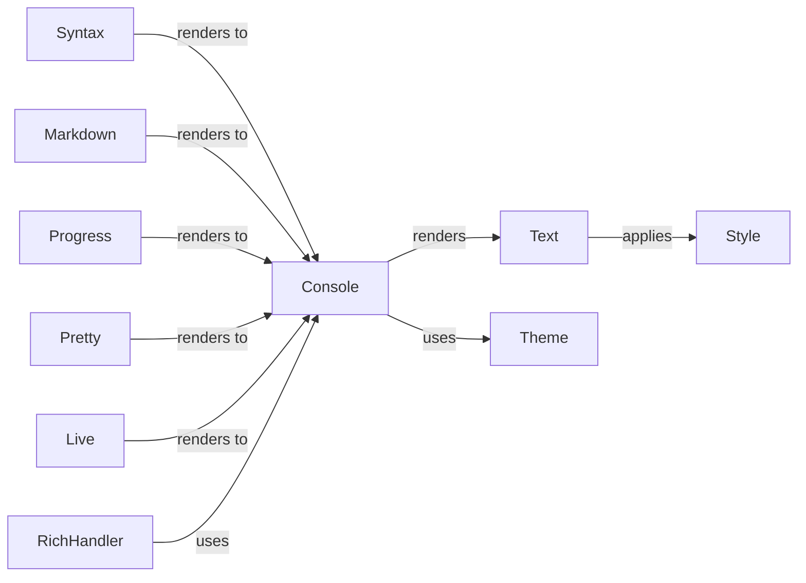

## Component Details

The Content Presentation Services component in Rich focuses on enhancing the visual representation of various content types within a terminal environment. It leverages a central `Console` to render styled text and other visual elements. Key components include `Syntax` for code highlighting, `Progress` for task tracking, `Pretty` for object inspection, `Live` for dynamic updates, `RichHandler` for formatted logging, and `Markdown` for document rendering. These components rely on `Text` and `Style` for formatting, and `Theme` for consistent styling. The overall flow involves content-specific classes preparing data for rendering, which is then handled by the `Console` using the specified styles and themes.

### Console
The `Console` class is the central component for managing terminal output. It handles rendering objects, applying styles, and writing to the terminal. It also supports features like themes, capturing output, and managing the cursor.
- **Related Classes/Methods**: `rich.console.Console`, `rich.console.ConsoleOptions`

### Text
The `Text` class represents a string with associated styles. It provides methods for applying styles, splitting text, and rendering to the console.
- **Related Classes/Methods**: `rich.text.Text`

### Style
The `Style` class represents a style that can be applied to text. Styles can include colors, fonts, and other formatting attributes.
- **Related Classes/Methods**: `rich.style.Style`

### Theme
The `Theme` class manages the styles used by the console. It allows for customization of colors and styles.
- **Related Classes/Methods**: `rich.theme.Theme`, `rich.theme.ThemeStack`

### Progress
The `Progress` class displays progress bars and status information for long-running tasks. It allows for tracking the progress of tasks and providing feedback to the user.
- **Related Classes/Methods**: `rich.progress.Progress`, `rich.progress.ProgressColumn`, `rich.progress.Task`

### Syntax
The `Syntax` class highlights source code with syntax highlighting. It supports various programming languages and themes.
- **Related Classes/Methods**: `rich.syntax.Syntax`, `rich.syntax.PygmentsSyntaxTheme`, `rich.syntax.ANSISyntaxTheme`

### Markdown
The `Markdown` class renders Markdown text to the console. It supports basic Markdown syntax and allows for formatting text with headings, lists, and other elements.
- **Related Classes/Methods**: `rich.markdown.Markdown`, `rich.markdown.MarkdownElement`, `rich.markdown.MarkdownContext`

### RichHandler
The `RichHandler` class is a logging handler that formats log messages using Rich. It allows for displaying log messages with colors, styles, and other formatting options.
- **Related Classes/Methods**: `rich.logging.RichHandler`

### Live
The `Live` class enables dynamic updates to the console display, allowing for animations and real-time information. It's useful for creating interactive and dynamic terminal applications.
- **Related Classes/Methods**: `rich.live.Live`

### Pretty
The `Pretty` class renders Python objects in a human-readable format. It's useful for debugging and displaying complex data structures.
- **Related Classes/Methods**: `rich.pretty.Pretty`
