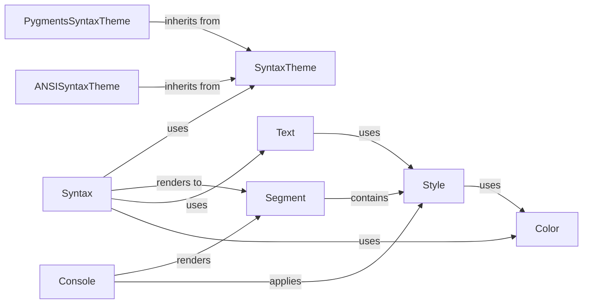

## Component Details

### Syntax
The Syntax component is responsible for highlighting source code. It uses Pygments lexers to tokenize the code and Rich styles to apply formatting. It takes source code as input, along with a lexer name and a theme, and produces a styled Text object as output. This allows for the display of syntax-highlighted code in the console.
- **Related Classes/Methods**: `rich.syntax.Syntax`

### SyntaxTheme
The SyntaxTheme component defines the styles (colors, bold, italic, etc.) to be applied to different token types during syntax highlighting. It provides a mapping between token types (e.g., Keyword, Comment, String) and Style objects. It serves as a configuration for the Syntax component, determining how different parts of the code are visually represented.
- **Related Classes/Methods**: `rich.syntax.SyntaxTheme`

### PygmentsSyntaxTheme
The PygmentsSyntaxTheme component is a subclass of SyntaxTheme that adapts styles from Pygments, a popular syntax highlighting library. It allows Rich to leverage existing Pygments themes for syntax highlighting. It converts Pygments styles into Rich styles, making them compatible with Rich's rendering system.
- **Related Classes/Methods**: `rich.syntax.PygmentsSyntaxTheme`

### ANSISyntaxTheme
The ANSISyntaxTheme component is a subclass of SyntaxTheme that uses ANSI escape codes for styling. This is useful for terminals that don't support true color. It provides a way to apply basic styling to code even in environments with limited color support.
- **Related Classes/Methods**: `rich.syntax.ANSISyntaxTheme`

### Text
The Text component represents a string of text with associated styles. It allows for applying styles to specific portions of the text, splitting the text into segments with different styles, and joining multiple Text objects together. It is a fundamental building block for rendering styled text in Rich.
- **Related Classes/Methods**: `rich.text.Text`

### Style
The Style component defines the visual style of text, including color, background color, and text attributes (bold, italic, underline, etc.). It is used to specify how text should be rendered. Style objects are associated with Text objects and Segments to control their appearance.
- **Related Classes/Methods**: `rich.style.Style`

### Segment
The Segment component represents a single piece of text with a specific style. It is the basic unit of rendering in Rich. A Segment is a tuple containing the text and the Style object that applies to it. The Console component renders a sequence of Segments to the terminal.
- **Related Classes/Methods**: `rich.segment.Segment`

### Console
The Console component is the main interface for writing styled text to the terminal. It handles rendering, styling, and outputting content to the console. It takes Text objects as input, splits them into Segments, and renders those Segments to the terminal using appropriate styling.
- **Related Classes/Methods**: `rich.console.Console`

### Color
The Color component represents a terminal color, which can be defined by name, number, or RGB triplet. It is used by the Style component to specify the color of text and backgrounds. It provides a way to represent colors in a terminal-independent way.
- **Related Classes/Methods**: `rich.color.Color`
