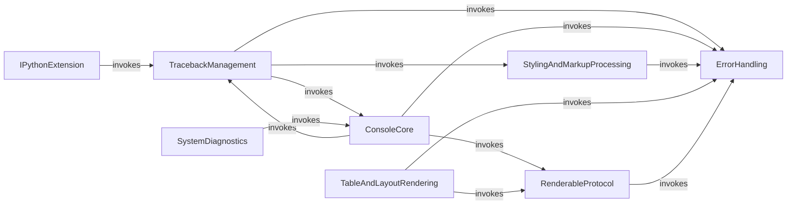

## Component Details

This graph illustrates the structure and interactions of the Error & Diagnostic Reporting subsystem within the Rich library. It focuses on how errors are defined, tracebacks are managed and rendered, and diagnostic information is gathered, highlighting the core components involved in providing enhanced error reporting and debugging capabilities.

### ErrorHandling
This component defines and manages various custom exceptions used throughout the Rich library, such as errors related to rendering, styling, markup, live display, and missing styles.

**Related Classes/Methods**:

- <a href="https://github.com/Textualize/rich/blob/master/rich/errors.py#L1-L2" target="_blank" rel="noopener noreferrer">`rich.errors.ConsoleError` (1:2)</a>
- <a href="https://github.com/Textualize/rich/blob/master/rich/errors.py#L5-L6" target="_blank" rel="noopener noreferrer">`rich.errors.StyleError` (5:6)</a>
- <a href="https://github.com/Textualize/rich/blob/master/rich/errors.py#L9-L10" target="_blank" rel="noopener noreferrer">`rich.errors.StyleSyntaxError` (9:10)</a>
- <a href="https://github.com/Textualize/rich/blob/master/rich/errors.py#L13-L14" target="_blank" rel="noopener noreferrer">`rich.errors.MissingStyle` (13:14)</a>
- <a href="https://github.com/Textualize/rich/blob/master/rich/errors.py#L17-L18" target="_blank" rel="noopener noreferrer">`rich.errors.StyleStackError` (17:18)</a>
- <a href="https://github.com/Textualize/rich/blob/master/rich/errors.py#L21-L22" target="_blank" rel="noopener noreferrer">`rich.errors.NotRenderableError` (21:22)</a>
- <a href="https://github.com/Textualize/rich/blob/master/rich/errors.py#L25-L26" target="_blank" rel="noopener noreferrer">`rich.errors.MarkupError` (25:26)</a>
- <a href="https://github.com/Textualize/rich/blob/master/rich/errors.py#L29-L30" target="_blank" rel="noopener noreferrer">`rich.errors.LiveError` (29:30)</a>
- <a href="https://github.com/Textualize/rich/blob/master/rich/errors.py#L33-L34" target="_blank" rel="noopener noreferrer">`rich.errors.NoAltScreen` (33:34)</a>

### TracebackManagement
This component is responsible for capturing, extracting, and rendering detailed and styled tracebacks, including syntax highlighting, local variable inspection, and integration with console output for improved debugging.

**Related Classes/Methods**:

- <a href="https://github.com/Textualize/rich/blob/master/rich/traceback.py#L252-L855" target="_blank" rel="noopener noreferrer">`rich.traceback.Traceback` (252:855)</a>
- <a href="https://github.com/Textualize/rich/blob/master/rich/traceback.py#L232-L240" target="_blank" rel="noopener noreferrer">`rich.traceback.Stack` (232:240)</a>
- <a href="https://github.com/Textualize/rich/blob/master/rich/traceback.py#L212-L218" target="_blank" rel="noopener noreferrer">`rich.traceback.Frame` (212:218)</a>
- <a href="https://github.com/Textualize/rich/blob/master/rich/traceback.py#L244-L245" target="_blank" rel="noopener noreferrer">`rich.traceback.Trace` (244:245)</a>
- <a href="https://github.com/Textualize/rich/blob/master/rich/traceback.py#L222-L228" target="_blank" rel="noopener noreferrer">`rich.traceback._SyntaxError` (222:228)</a>
- <a href="https://github.com/Textualize/rich/blob/master/rich/traceback.py#L248-L249" target="_blank" rel="noopener noreferrer">`rich.traceback.PathHighlighter` (248:249)</a>
- <a href="https://github.com/Textualize/rich/blob/master/rich/traceback.py#L54-L79" target="_blank" rel="noopener noreferrer">`rich.traceback._iter_syntax_lines` (54:79)</a>
- <a href="https://github.com/Textualize/rich/blob/master/rich/traceback.py#L82-L208" target="_blank" rel="noopener noreferrer">`rich.traceback.install` (82:208)</a>
- <a href="https://github.com/Textualize/rich/blob/master/rich/traceback.py#L283-L334" target="_blank" rel="noopener noreferrer">`rich.traceback.Traceback:__init__` (283:334)</a>
- <a href="https://github.com/Textualize/rich/blob/master/rich/traceback.py#L337-L407" target="_blank" rel="noopener noreferrer">`rich.traceback.Traceback:from_exception` (337:407)</a>
- <a href="https://github.com/Textualize/rich/blob/master/rich/traceback.py#L410-L586" target="_blank" rel="noopener noreferrer">`rich.traceback.Traceback:extract` (410:586)</a>
- <a href="https://github.com/Textualize/rich/blob/master/rich/traceback.py#L588-L688" target="_blank" rel="noopener noreferrer">`rich.traceback.Traceback:__rich_console__` (588:688)</a>
- <a href="https://github.com/Textualize/rich/blob/master/rich/traceback.py#L691-L711" target="_blank" rel="noopener noreferrer">`rich.traceback.Traceback:_render_syntax_error` (691:711)</a>
- <a href="https://github.com/Textualize/rich/blob/master/rich/traceback.py#L730-L855" target="_blank" rel="noopener noreferrer">`rich.traceback.Traceback:_render_stack` (730:855)</a>

### ConsoleCore
This central component manages all aspects of console output, including rendering various Rich renderables, handling styles, updating the screen for live displays, and printing exceptions. It acts as the primary interface for Rich's rendering capabilities.

**Related Classes/Methods**:

- <a href="https://github.com/Textualize/rich/blob/master/rich/console.py#L1295-L1344" target="_blank" rel="noopener noreferrer">`rich.console.Console:render` (1295:1344)</a>
- <a href="https://github.com/Textualize/rich/blob/master/rich/console.py#L826-L838" target="_blank" rel="noopener noreferrer">`rich.console.Console:set_live` (826:838)</a>
- <a href="https://github.com/Textualize/rich/blob/master/rich/console.py#L1471-L1499" target="_blank" rel="noopener noreferrer">`rich.console.Console:get_style` (1471:1499)</a>
- <a href="https://github.com/Textualize/rich/blob/master/rich/console.py#L1803-L1835" target="_blank" rel="noopener noreferrer">`rich.console.Console:update_screen` (1803:1835)</a>
- <a href="https://github.com/Textualize/rich/blob/master/rich/console.py#L1837-L1855" target="_blank" rel="noopener noreferrer">`rich.console.Console:update_screen_lines` (1837:1855)</a>
- <a href="https://github.com/Textualize/rich/blob/master/rich/console.py#L1857-L1890" target="_blank" rel="noopener noreferrer">`rich.console.Console:print_exception` (1857:1890)</a>

### StylingAndMarkupProcessing
This component provides functionalities for parsing and applying styles to text and other renderables, as well as interpreting and rendering Rich's custom markup syntax, ensuring consistent visual presentation.

**Related Classes/Methods**:

- <a href="https://github.com/Textualize/rich/blob/master/rich/style.py#L498-L561" target="_blank" rel="noopener noreferrer">`rich.style.Style:parse` (498:561)</a>
- <a href="https://github.com/Textualize/rich/blob/master/rich/markup.py#L106-L231" target="_blank" rel="noopener noreferrer">`rich.markup.render` (106:231)</a>

### TableAndLayoutRendering
This component is dedicated to constructing and managing structured layouts like tables, allowing for the addition of rows and cells, and ensuring that content within these structures is properly rendered.

**Related Classes/Methods**:

- <a href="https://github.com/Textualize/rich/blob/master/rich/table.py#L423-L468" target="_blank" rel="noopener noreferrer">`rich.table.Table:add_row` (423:468)</a>

### RenderableProtocol
This component defines and implements the protocol for objects that can be rendered by Rich, including methods for casting objects to renderable forms and checking their renderability.

**Related Classes/Methods**:

- <a href="https://github.com/Textualize/rich/blob/master/rich/measure.py#L79-L122" target="_blank" rel="noopener noreferrer">`rich.measure.Measurement:get` (79:122)</a>
- <a href="https://github.com/Textualize/rich/blob/master/rich/protocol.py#L10-L16" target="_blank" rel="noopener noreferrer">`rich.protocol.is_renderable` (10:16)</a>

### SystemDiagnostics
This component is responsible for generating diagnostic reports about the Rich environment, including console features and system information, aiding in debugging and support.

**Related Classes/Methods**:

- <a href="https://github.com/Textualize/rich/blob/master/rich/diagnose.py#L10-L34" target="_blank" rel="noopener noreferrer">`rich.diagnose.report` (10:34)</a>

### IPythonExtension
This component provides specific integration with IPython, enabling Rich's enhanced pretty printing and traceback handling within the IPython interactive environment.

**Related Classes/Methods**:

- <a href="https://github.com/Textualize/rich/blob/master/rich/_extension.py#L4-L10" target="_blank" rel="noopener noreferrer">`rich._extension.load_ipython_extension` (4:10)</a>

### [FAQ](https://github.com/CodeBoarding/GeneratedOnBoardings/tree/main?tab=readme-ov-file#faq)