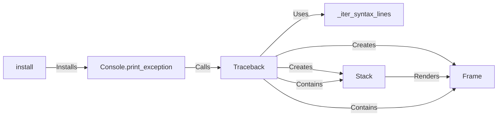

## Component Details

The `rich` traceback system enhances Python's default exception handling by providing richly formatted and more informative tracebacks. When an exception occurs, the `install` function configures `rich` to intercept it. The `Console.print_exception` function is then invoked to format and display the exception. The `Traceback` class is central to this process, responsible for extracting, formatting, and rendering the traceback information. It utilizes `Frame` and `Stack` classes to represent individual frames and the entire stack of frames, respectively. Syntax errors are specially handled by `_iter_syntax_lines` to provide detailed context around the error.

### Console.print_exception
This function is the entry point for printing a formatted exception to the console using `rich`. It receives the exception information and utilizes the `Traceback` class to format and display the traceback.
- **Related Classes/Methods**: `rich.console.Console.print_exception`

### Traceback
The `Traceback` class encapsulates the logic for extracting, formatting, and rendering traceback information from an exception. It provides methods for creating a `Traceback` object from an exception, extracting stack frames, and rendering the traceback to the console. It uses `Frame` and `Stack` to represent the traceback data.
- **Related Classes/Methods**: `rich.traceback.Traceback.__init__`, `rich.traceback.Traceback.from_exception`, `rich.traceback.Traceback.extract`, `rich.traceback.Traceback.__rich_console__`, `rich.traceback.Traceback._render_syntax_error`, `rich.traceback.Traceback._render_stack`

### _iter_syntax_lines
This function iterates through the lines of code in a syntax error, yielding formatted lines for display. It is used by `Traceback` to render syntax errors with detailed context.
- **Related Classes/Methods**: `rich.traceback._iter_syntax_lines`

### install
This function installs `rich`'s traceback handler, replacing the default Python exception handler. This allows `rich` to automatically format and display exceptions using `Console.print_exception`.
- **Related Classes/Methods**: `rich.traceback.install`

### Frame
The `Frame` class represents a single frame in the traceback. It contains information about the code, filename, line number, and other relevant details for that frame. It is contained within `Traceback`.
- **Related Classes/Methods**: `rich.traceback.Frame`

### Stack
The `Stack` class represents the stack of frames in the traceback. It is responsible for formatting and rendering the stack of frames to the console. It is contained within `Traceback`.
- **Related Classes/Methods**: `rich.traceback.Stack`
