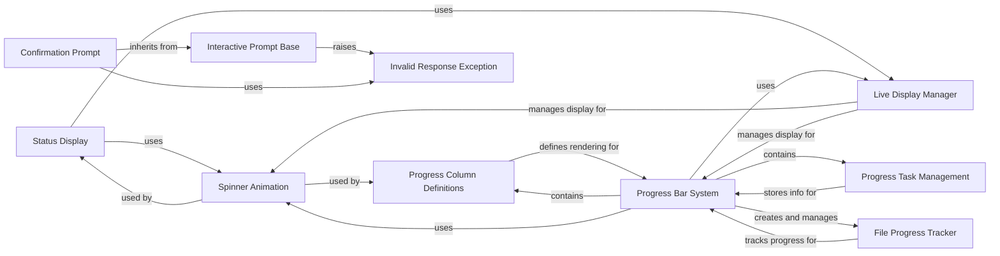

## Component Details

This subsystem provides interactive elements for terminal applications, including dynamic progress bars, status indicators with animated spinners, and user input prompts. It manages the display state of these elements, offers visual feedback for ongoing processes, and handles user interactions.

### Status Display
Manages and displays a status indicator with a spinner animation, providing visual feedback for ongoing operations. It leverages the Live display for real-time updates and a Spinner for the animation.

**Related Classes/Methods**:

- <a href="https://github.com/Textualize/rich/blob/master/rich/status.py#L11-L106" target="_blank" rel="noopener noreferrer">`rich.status.Status` (11:106)</a>

### Spinner Animation
Generates and renders various spinner animations, often used in conjunction with status messages or progress indicators. It handles the animation logic and integrates with Rich's text and table rendering capabilities.

**Related Classes/Methods**:

- <a href="https://github.com/Textualize/rich/blob/master/rich/spinner.py#L13-L114" target="_blank" rel="noopener noreferrer">`rich.spinner.Spinner` (13:114)</a>

### Live Display Manager
Provides a flexible mechanism for rendering and continuously updating dynamic content in the terminal. It acts as a context manager, handling screen clearing, cursor positioning, and I/O redirection to ensure smooth animations and updates.

**Related Classes/Methods**:

- <a href="https://github.com/Textualize/rich/blob/master/rich/live.py#L35-L268" target="_blank" rel="noopener noreferrer">`rich.live.Live` (35:268)</a>

### Progress Bar System
Offers a comprehensive system for displaying and managing multiple progress bars. It tracks individual tasks, calculates progress, and renders customizable columns to provide detailed feedback on long-running operations, including file transfers and iterative processes.

**Related Classes/Methods**:

- <a href="https://github.com/Textualize/rich/blob/master/rich/progress.py#L1063-L1650" target="_blank" rel="noopener noreferrer">`rich.progress.Progress` (1063:1650)</a>
- <a href="https://github.com/Textualize/rich/blob/master/rich/progress.py#L184-L284" target="_blank" rel="noopener noreferrer">`rich.progress._Reader` (184:284)</a>
- <a href="https://github.com/Textualize/rich/blob/master/rich/progress.py#L287-L305" target="_blank" rel="noopener noreferrer">`rich.progress._ReadContext` (287:305)</a>
- <a href="https://github.com/Textualize/rich/blob/master/rich/progress.py#L68-L105" target="_blank" rel="noopener noreferrer">`rich.progress._TrackThread` (68:105)</a>

### Interactive Prompt Base
Serves as the foundational class for creating interactive command-line prompts. It handles the display of prompt text, validation of user input against specified choices or types, and provides error feedback for invalid responses.

**Related Classes/Methods**:

- <a href="https://github.com/Textualize/rich/blob/master/rich/prompt.py#L30-L301" target="_blank" rel="noopener noreferrer">`rich.prompt.PromptBase` (30:301)</a>

### Progress Column Definitions
Defines the structure and rendering logic for individual columns within a Progress bar display. This includes various specialized columns for text, progress bars, spinners, time, and file sizes.

**Related Classes/Methods**:

- <a href="https://github.com/Textualize/rich/blob/master/rich/progress.py#L509-L548" target="_blank" rel="noopener noreferrer">`rich.progress.ProgressColumn` (509:548)</a>
- <a href="https://github.com/Textualize/rich/blob/master/rich/progress.py#L551-L565" target="_blank" rel="noopener noreferrer">`rich.progress.RenderableColumn` (551:565)</a>
- <a href="https://github.com/Textualize/rich/blob/master/rich/progress.py#L568-L615" target="_blank" rel="noopener noreferrer">`rich.progress.SpinnerColumn` (568:615)</a>
- <a href="https://github.com/Textualize/rich/blob/master/rich/progress.py#L618-L645" target="_blank" rel="noopener noreferrer">`rich.progress.TextColumn` (618:645)</a>
- <a href="https://github.com/Textualize/rich/blob/master/rich/progress.py#L648-L687" target="_blank" rel="noopener noreferrer">`rich.progress.BarColumn` (648:687)</a>
- <a href="https://github.com/Textualize/rich/blob/master/rich/progress.py#L690-L699" target="_blank" rel="noopener noreferrer">`rich.progress.TimeElapsedColumn` (690:699)</a>
- <a href="https://github.com/Textualize/rich/blob/master/rich/progress.py#L702-L771" target="_blank" rel="noopener noreferrer">`rich.progress.TaskProgressColumn` (702:771)</a>
- <a href="https://github.com/Textualize/rich/blob/master/rich/progress.py#L774-L819" target="_blank" rel="noopener noreferrer">`rich.progress.TimeRemainingColumn` (774:819)</a>
- <a href="https://github.com/Textualize/rich/blob/master/rich/progress.py#L822-L828" target="_blank" rel="noopener noreferrer">`rich.progress.FileSizeColumn` (822:828)</a>
- <a href="https://github.com/Textualize/rich/blob/master/rich/progress.py#L831-L837" target="_blank" rel="noopener noreferrer">`rich.progress.TotalFileSizeColumn` (831:837)</a>
- <a href="https://github.com/Textualize/rich/blob/master/rich/progress.py#L840-L864" target="_blank" rel="noopener noreferrer">`rich.progress.MofNCompleteColumn` (840:864)</a>
- <a href="https://github.com/Textualize/rich/blob/master/rich/progress.py#L867-L913" target="_blank" rel="noopener noreferrer">`rich.progress.DownloadColumn` (867:913)</a>
- <a href="https://github.com/Textualize/rich/blob/master/rich/progress.py#L916-L925" target="_blank" rel="noopener noreferrer">`rich.progress.TransferSpeedColumn` (916:925)</a>

### Progress Task Management
Represents a single task being tracked by the Progress bar system, storing its state, progress, and timing information.

**Related Classes/Methods**:

- <a href="https://github.com/Textualize/rich/blob/master/rich/progress.py#L938-L1060" target="_blank" rel="noopener noreferrer">`rich.progress.Task` (938:1060)</a>

### Confirmation Prompt
A specialized interactive prompt for obtaining a yes/no confirmation from the user, building upon the base prompt functionality.

**Related Classes/Methods**:

- <a href="https://github.com/Textualize/rich/blob/master/rich/prompt.py#L340-L363" target="_blank" rel="noopener noreferrer">`rich.prompt.Confirm` (340:363)</a>

### Invalid Response Exception
An exception class used to signal that a user's input to a prompt was invalid, typically including a message explaining the error.

**Related Classes/Methods**:

- <a href="https://github.com/Textualize/rich/blob/master/rich/prompt.py#L15-L27" target="_blank" rel="noopener noreferrer">`rich.prompt.InvalidResponse` (15:27)</a>

### File Progress Tracker
Internal components responsible for tracking progress during file read operations, integrating with the overall Progress bar system.

**Related Classes/Methods**:

- <a href="https://github.com/Textualize/rich/blob/master/rich/progress.py#L184-L284" target="_blank" rel="noopener noreferrer">`rich.progress._Reader` (184:284)</a>
- <a href="https://github.com/Textualize/rich/blob/master/rich/progress.py#L287-L305" target="_blank" rel="noopener noreferrer">`rich.progress._ReadContext` (287:305)</a>

### [FAQ](https://github.com/CodeBoarding/GeneratedOnBoardings/tree/main?tab=readme-ov-file#faq)