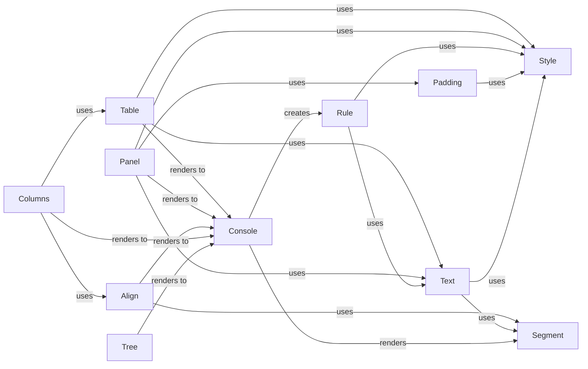

## Component Details

### Table
The Table component is responsible for creating tabular displays with styled columns and rows. It allows for formatting data in a structured manner within the console, including headers, footers, and various styling options for borders, rows, and columns. It interacts with the Console to render the table and uses Text and Style components for cell content and styling.
- **Related Classes/Methods**: `rich.table.Table`

### Panel
The Panel component renders content within a styled box, providing a visual container for other renderables. It's used to group and highlight content, with options for titles, subtitles, borders, and padding. It interacts with the Console to render the panel and uses Text and Style components for titles and styling, and Padding for spacing.
- **Related Classes/Methods**: `rich.panel.Panel`

### Align
The Align component aligns renderables within a given space, allowing for control over the horizontal and vertical alignment of content. It uses the Segment component to represent the aligned content and interacts with the Console to render the alignment.
- **Related Classes/Methods**: `rich.align.Align`

### Columns
The Columns component arranges renderables in a column layout, enabling the display of content in multiple columns. It uses the Table and Align components to structure the columns and interacts with the Console to render the column layout.
- **Related Classes/Methods**: `rich.columns.Columns`

### Tree
The Tree component is used to display hierarchical data in a tree-like structure. It's useful for visualizing file systems, nested data structures, or any other data with a parent-child relationship. It interacts with the Console to render the tree and uses Text and Style components for node labels and styling.
- **Related Classes/Methods**: `rich.tree.Tree`

### Console
The Console component is responsible for rendering rich text and other objects to the terminal. It handles output, styling, and terminal interaction. It renders Segment objects to the terminal and creates Rule objects for horizontal lines.
- **Related Classes/Methods**: `rich.console.Console`

### Text
The Text component represents a string with associated styles. It provides methods for manipulating and rendering styled text. It uses the Style and Segment components to apply styles and render the text.
- **Related Classes/Methods**: `rich.text.Text`

### Style
The Style component encapsulates styling information such as color, bold, italic, etc. It's used by other components to apply styles to text and other renderables. It is used by Text and Console components.
- **Related Classes/Methods**: `rich.style.Style`

### Padding
The Padding component adds padding around renderables, creating visual space between the content and its container. It interacts with the Console to render the padding and uses the Style component for styling the padding characters.
- **Related Classes/Methods**: `rich.padding.Padding`

### Rule
The Rule component draws a horizontal line with optional text, providing a visual separator within the console output. It interacts with the Console to render the rule and uses Text and Style components for the rule's text and styling.
- **Related Classes/Methods**: `rich.rule.Rule`

### Segment
The Segment component represents a single piece of renderable output with associated style information. It's a fundamental unit for rendering styled text. It is used by Console and Text components.
- **Related Classes/Methods**: `rich.segment.Segment`
