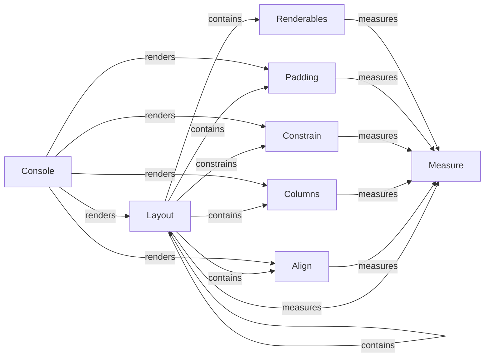

## Component Details

The Layout Management subsystem in Rich handles the arrangement and organization of renderable objects within the console. It provides a flexible structure for creating complex layouts with rows, columns, and adjustable sizing, enabling the structured display of visual elements. The core components work together to measure, align, constrain, and render content within defined regions of the console.

### Console
The Console class manages the terminal and orchestrates the rendering process. It measures renderables, sets up the terminal environment, and outputs the final rendered content.
- **Related Classes/Methods**: `rich.rich.console.Console`

### Layout
The Layout class structures and organizes renderables within the console, splitting it into regions and assigning content to those regions. It allows for nested layouts, creating complex arrangements of content.
- **Related Classes/Methods**: `rich.rich.layout.Layout`

### Align
The Align class aligns renderable content within a specified area, supporting left, center, and right alignment both horizontally and vertically. It wraps a renderable and modifies its rendering to fit within the allocated space.
- **Related Classes/Methods**: `rich.rich.align.Align`

### Constrain
The Constrain class constrains the width of a renderable, preventing it from exceeding a specified maximum width. This is useful for controlling the size of elements within a layout.
- **Related Classes/Methods**: `rich.rich.constrain.Constrain`

### Columns
The Columns class arranges renderables in columns, distributing them horizontally across the available space. It provides a way to create multi-column layouts.
- **Related Classes/Methods**: `rich.rich.columns.Columns`

### Measure
The Measure class calculates the minimum and maximum width required to render a given renderable object. This information is used by the layout system to determine how to allocate space to different elements.
- **Related Classes/Methods**: `rich.rich.measure`

### Renderables
The Renderables class is a container for other renderables, allowing them to be treated as a single unit within the layout system.
- **Related Classes/Methods**: `rich.rich.containers.Renderables`

### Padding
The Padding class adds padding around a renderable, creating visual space between the content and its surrounding elements.
- **Related Classes/Methods**: `rich.rich.padding.Padding`
