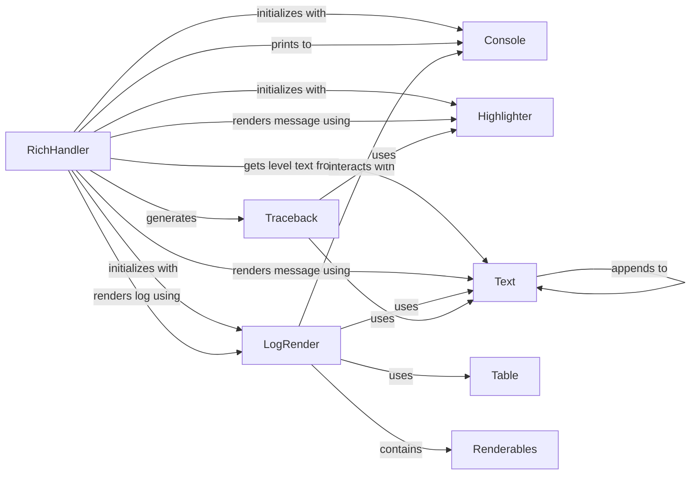

## Component Details

The Logging Integration component provides a custom logging handler, `RichHandler`, that integrates Rich's rendering capabilities with Python's standard logging module. It formats log records with color-coded levels, syntax-highlighted messages, and optional tracebacks for improved readability. The `RichHandler` utilizes other Rich components like `Console` for output, `LogRender` for structuring log messages, `Highlighter` for syntax highlighting, `Text` for styled text, `Traceback` for rich exception display, and `Table` for tabular log output. The overall purpose is to enhance the visual presentation of log messages in the console.

### RichHandler
The `RichHandler` is a logging handler that integrates with the Rich library to provide enhanced console output for log messages. It formats log records with color-coded levels, syntax-highlighted messages, and optional tracebacks, making logs more readable and informative.

**Related Classes/Methods**:

- <a href="https://github.com/Textualize/rich/blob/master/rich/logging.py#L18-L239" target="_blank" rel="noopener noreferrer">`rich.logging.RichHandler` (18:239)</a>
- <a href="https://github.com/Textualize/rich/blob/master/rich/logging.py#L65-L115" target="_blank" rel="noopener noreferrer">`rich.logging.RichHandler:__init__` (65:115)</a>
- <a href="https://github.com/Textualize/rich/blob/master/rich/logging.py#L117-L130" target="_blank" rel="noopener noreferrer">`rich.logging.RichHandler:get_level_text` (117:130)</a>
- <a href="https://github.com/Textualize/rich/blob/master/rich/logging.py#L132-L180" target="_blank" rel="noopener noreferrer">`rich.logging.RichHandler:emit` (132:180)</a>
- <a href="https://github.com/Textualize/rich/blob/master/rich/logging.py#L182-L205" target="_blank" rel="noopener noreferrer">`rich.logging.RichHandler:render_message` (182:205)</a>
- <a href="https://github.com/Textualize/rich/blob/master/rich/logging.py#L207-L239" target="_blank" rel="noopener noreferrer">`rich.logging.RichHandler:render` (207:239)</a>

### LogRender
The `LogRender` component is responsible for rendering the visual structure of log messages, typically as a table. It arranges elements like time, level, path, and the log message itself into a coherent and formatted output.

**Related Classes/Methods**:

- <a href="https://github.com/Textualize/rich/blob/master/rich/_log_render.py#L14-L86" target="_blank" rel="noopener noreferrer">`rich._log_render.LogRender` (14:86)</a>
- <a href="https://github.com/Textualize/rich/blob/master/rich/_log_render.py#L32-L86" target="_blank" rel="noopener noreferrer">`rich._log_render.LogRender:__call__` (32:86)</a>

### Console
The `Console` component provides the core functionality for printing and rendering Rich renderables to the terminal. It manages the output stream and handles the display of various Rich objects, including formatted text and tables.

**Related Classes/Methods**:

- <a href="https://github.com/Textualize/rich/blob/master/rich/console.py#L593-L2607" target="_blank" rel="noopener noreferrer">`rich.console.Console` (593:2607)</a>
- `rich.get_console` (10:10)
- <a href="https://github.com/Textualize/rich/blob/master/rich/console.py#L1643-L1740" target="_blank" rel="noopener noreferrer">`rich.console.Console.print` (1643:1740)</a>

### Highlighter
The `Highlighter` component, specifically `ReprHighlighter`, is used to apply syntax highlighting to log messages. It analyzes the message content and applies appropriate styles to different parts, improving readability.

**Related Classes/Methods**:

- <a href="https://github.com/Textualize/rich/blob/master/rich/highlighter.py#L80-L103" target="_blank" rel="noopener noreferrer">`rich.highlighter.ReprHighlighter` (80:103)</a>

### Text
The `Text` component represents styled text within Rich. It allows for various formatting options, such as colors, styles, and markup, and is used to construct the individual parts of a log message.

**Related Classes/Methods**:

- <a href="https://github.com/Textualize/rich/blob/master/rich/text.py#L118-L1333" target="_blank" rel="noopener noreferrer">`rich.text.Text` (118:1333)</a>
- <a href="https://github.com/Textualize/rich/blob/master/rich/text.py#L332-L354" target="_blank" rel="noopener noreferrer">`rich.text.Text.styled` (332:354)</a>
- <a href="https://github.com/Textualize/rich/blob/master/rich/text.py#L260-L291" target="_blank" rel="noopener noreferrer">`rich.text.Text.from_markup` (260:291)</a>
- <a href="https://github.com/Textualize/rich/blob/master/rich/text.py#L633-L660" target="_blank" rel="noopener noreferrer">`rich.text.Text.highlight_words` (633:660)</a>
- <a href="https://github.com/Textualize/rich/blob/master/rich/text.py#L965-L1007" target="_blank" rel="noopener noreferrer">`rich.text.Text.append` (965:1007)</a>

### Traceback
The `Traceback` component is responsible for generating and formatting rich tracebacks from exception information. It provides detailed and syntax-highlighted representations of errors, including code snippets and local variables.

**Related Classes/Methods**:

- <a href="https://github.com/Textualize/rich/blob/master/rich/traceback.py#L252-L855" target="_blank" rel="noopener noreferrer">`rich.traceback.Traceback` (252:855)</a>
- <a href="https://github.com/Textualize/rich/blob/master/rich/traceback.py#L337-L407" target="_blank" rel="noopener noreferrer">`rich.traceback.Traceback.from_exception` (337:407)</a>

### Table
The `Table` component is used to create tabular layouts for displaying data. In the context of logging, it's used by `LogRender` to structure the log output into columns for time, level, message, and path.

**Related Classes/Methods**:

- <a href="https://github.com/Textualize/rich/blob/master/rich/table.py#L154-L926" target="_blank" rel="noopener noreferrer">`rich.table.Table` (154:926)</a>
- <a href="https://github.com/Textualize/rich/blob/master/rich/table.py#L254-L284" target="_blank" rel="noopener noreferrer">`rich.table.Table.grid` (254:284)</a>
- <a href="https://github.com/Textualize/rich/blob/master/rich/table.py#L365-L421" target="_blank" rel="noopener noreferrer">`rich.table.Table.add_column` (365:421)</a>
- <a href="https://github.com/Textualize/rich/blob/master/rich/table.py#L423-L468" target="_blank" rel="noopener noreferrer">`rich.table.Table.add_row` (423:468)</a>

### Renderables
The `Renderables` component is a container for multiple Rich renderable objects. It allows for grouping and displaying various Rich elements together, such as text and tracebacks, within a single log entry.

**Related Classes/Methods**:

- <a href="https://github.com/Textualize/rich/blob/master/rich/containers.py#L30-L63" target="_blank" rel="noopener noreferrer">`rich.containers.Renderables` (30:63)</a>

### [FAQ](https://github.com/CodeBoarding/GeneratedOnBoardings/tree/main?tab=readme-ov-file#faq)