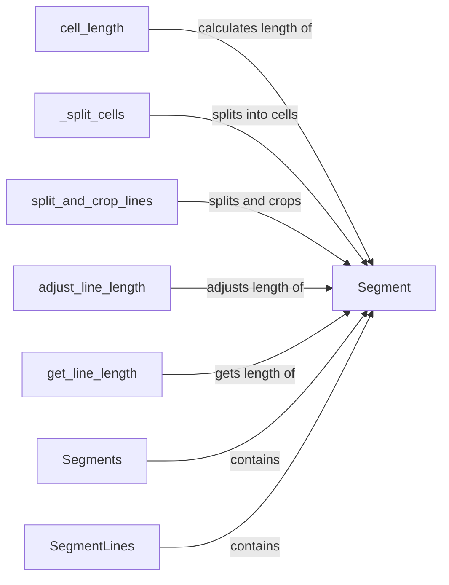

## Component Details

The Low-Level Rendering Engine in Rich is responsible for converting styled text into a renderable format for the console. It revolves around the concept of segments, which are strings associated with a particular style. These segments are then composed and manipulated to fit within the console's dimensions, handling text wrapping, alignment, and other formatting concerns. The engine provides the fundamental building blocks for displaying rich text in the console.

### Segment
Represents a single, styled portion of text. It stores the text content and the style applied to it. It also provides methods for measuring the length of the segment, splitting it into cells, and cropping it to fit within a specified width.
- **Related Classes/Methods**: `rich.segment.Segment`

### Segments
Represents a sequence of `Segment` objects. It implements the `__rich_console__` method, which allows it to be rendered by the Rich console. It essentially aggregates segments to form a renderable unit.
- **Related Classes/Methods**: `rich.segment.Segments`

### SegmentLines
Represents a list of lines, where each line is a list of `Segment` objects. This is used to represent multi-line text with different styles on each line. It also implements `__rich_console__` to enable rendering by the Rich console.
- **Related Classes/Methods**: `rich.segment.SegmentLines`

### cell_length
Calculates the visible length of a cell (character) within a segment, taking into account wide characters and other factors that affect the display width of a character.
- **Related Classes/Methods**: `rich.segment.Segment:cell_length`

### _split_cells
Splits a segment's text into individual cells (characters), handling surrogate pairs and grapheme clusters correctly to ensure proper rendering of complex characters.
- **Related Classes/Methods**: `rich.segment.Segment:_split_cells`

### split_and_crop_lines
Splits a segment into multiple lines and crops them to a specified width. This is essential for wrapping text within a console and ensuring that the output fits within the available space.
- **Related Classes/Methods**: `rich.segment.Segment:split_and_crop_lines`

### adjust_line_length
Adjusts the length of a line of segments, potentially adding padding or truncating the line to fit within a specified width. This is used for alignment and ensuring consistent line lengths.
- **Related Classes/Methods**: `rich.segment.adjust_line_length`

### get_line_length
Calculates the total visible length of a line of segments. This is used to determine the overall width of a line of text before rendering.
- **Related Classes/Methods**: `rich.segment.get_line_length`
