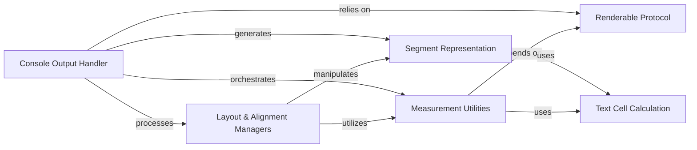

## Component Details

The `Measurement & Layout Utilities` component in Rich is responsible for accurately determining the dimensions of renderable objects and arranging them on the console. It provides foundational services for calculating display metrics and positioning content, working closely with the Console Rendering Engine to ensure proper visual output. This component includes functionalities for measuring content, applying padding and constraints, and aligning elements horizontally and vertically, all built upon a robust segment representation and cell length calculations.

### Measurement Utilities
Provides core functionalities for determining the minimum and maximum width required to render objects, and for measuring sequences of renderables.

**Related Classes/Methods**:

- <a href="https://github.com/Textualize/rich/blob/master/rich/measure.py#L11-L122" target="_blank" rel="noopener noreferrer">`rich.measure.Measurement` (11:122)</a>
- <a href="https://github.com/Textualize/rich/blob/master/rich/measure.py#L125-L151" target="_blank" rel="noopener noreferrer">`rich.measure.measure_renderables` (125:151)</a>

### Layout & Alignment Managers
Handles the positioning and arrangement of renderable content, including horizontal and vertical alignment, padding, and constraining width.

**Related Classes/Methods**:

- <a href="https://github.com/Textualize/rich/blob/master/rich/align.py#L23-L231" target="_blank" rel="noopener noreferrer">`rich.align.Align` (23:231)</a>
- <a href="https://github.com/Textualize/rich/blob/master/rich/align.py#L234-L288" target="_blank" rel="noopener noreferrer">`rich.align.VerticalCenter` (234:288)</a>
- <a href="https://github.com/Textualize/rich/blob/master/rich/padding.py#L19-L135" target="_blank" rel="noopener noreferrer">`rich.padding.Padding` (19:135)</a>
- <a href="https://github.com/Textualize/rich/blob/master/rich/constrain.py#L10-L37" target="_blank" rel="noopener noreferrer">`rich.constrain.Constrain` (10:37)</a>

### Renderable Protocol
Defines the interface for objects that can be rendered by Rich, including methods for checking renderability and casting objects to renderable types.

**Related Classes/Methods**:

- <a href="https://github.com/Textualize/rich/blob/master/rich/protocol.py#L10-L16" target="_blank" rel="noopener noreferrer">`rich.protocol.is_renderable` (10:16)</a>
- <a href="https://github.com/Textualize/rich/blob/master/rich/protocol.py#L19-L42" target="_blank" rel="noopener noreferrer">`rich.protocol.rich_cast` (19:42)</a>

### Console Output Handler
The central component responsible for processing renderable objects, applying console options, and converting them into segments for display. It orchestrates the rendering process.

**Related Classes/Methods**:

- <a href="https://github.com/Textualize/rich/blob/master/rich/console.py#L593-L2607" target="_blank" rel="noopener noreferrer">`rich.console.Console` (593:2607)</a>
- <a href="https://github.com/Textualize/rich/blob/master/rich/console.py#L1278-L1293" target="_blank" rel="noopener noreferrer">`rich.console.Console:measure` (1278:1293)</a>
- <a href="https://github.com/Textualize/rich/blob/master/rich/console.py#L1295-L1344" target="_blank" rel="noopener noreferrer">`rich.console.Console:render` (1295:1344)</a>
- <a href="https://github.com/Textualize/rich/blob/master/rich/console.py#L1410-L1469" target="_blank" rel="noopener noreferrer">`rich.console.Console:render_str` (1410:1469)</a>

### Text Cell Calculation
Provides utilities for calculating the display width of text in terminal cells, handling single and double-width characters.

**Related Classes/Methods**:

- <a href="https://github.com/Textualize/rich/blob/master/rich/cells.py#L51-L64" target="_blank" rel="noopener noreferrer">`rich.cells.cell_len` (51:64)</a>

### Segment Representation
Defines the fundamental unit of rendered output, representing a piece of text with associated style and control codes, and provides methods for manipulating these segments for layout and styling.

**Related Classes/Methods**:

- <a href="https://github.com/Textualize/rich/blob/master/rich/segment.py#L64-L668" target="_blank" rel="noopener noreferrer">`rich.segment.Segment` (64:668)</a>
- <a href="https://github.com/Textualize/rich/blob/master/rich/segment.py#L250-L276" target="_blank" rel="noopener noreferrer">`rich.segment.Segment:split_lines` (250:276)</a>
- <a href="https://github.com/Textualize/rich/blob/master/rich/segment.py#L384-L395" target="_blank" rel="noopener noreferrer">`rich.segment.Segment:get_shape` (384:395)</a>

### [FAQ](https://github.com/CodeBoarding/GeneratedOnBoardings/tree/main?tab=readme-ov-file#faq)