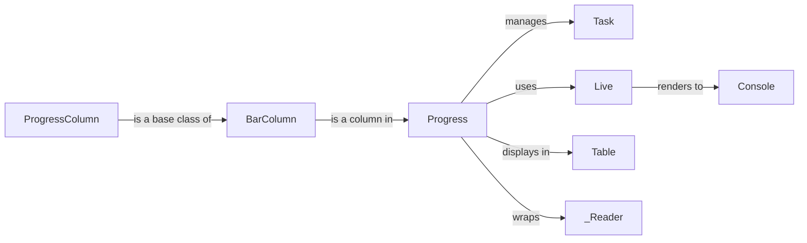

## Component Details

### Progress
The Progress class is the central component for displaying progress bars and status updates in the terminal. It manages tasks, columns, and the overall layout of the progress display. It uses Live to render the progress information to the console, providing a dynamic and informative view of ongoing processes.
- **Related Classes/Methods**: `rich.progress.Progress`

### Task
The Task class represents a single unit of work within a Progress display. It stores information about the task's description, progress, total, and other relevant data. It provides methods for updating the task's status and retrieving its properties, allowing for fine-grained control over individual progress elements.
- **Related Classes/Methods**: `rich.progress.Task`

### Live
The Live class is responsible for rendering dynamic content to the terminal. It provides a context manager that captures the output of the wrapped code and updates the terminal display with the new content. Progress uses Live to update the progress display, enabling real-time updates and a responsive user experience.
- **Related Classes/Methods**: `rich.live.Live`

### ProgressColumn
ProgressColumn is an abstract base class for columns that can be displayed in a progress table. Subclasses implement the render method to generate the content for each cell in the column. This allows for creating custom columns with specific formatting and information display.
- **Related Classes/Methods**: `rich.progress.ProgressColumn`

### Console
The Console class is the main interface for printing rich text and other content to the terminal. Progress uses Console to render the progress display, leveraging its capabilities for styling and formatting text.
- **Related Classes/Methods**: `rich.console.Console`

### Table
The Table class is used to create tabular layouts in the terminal. Progress uses Table to arrange the columns and tasks in the progress display, providing a structured and organized view of the progress information.
- **Related Classes/Methods**: `rich.table.Table`

### BarColumn
A column that displays a progress bar in the progress table. It visually represents the progress of a task, providing an intuitive understanding of its completion status.
- **Related Classes/Methods**: `rich.progress.BarColumn`

### _Reader
The _Reader class is a wrapper around a file object that updates the progress bar as the file is read. It's used by Progress.wrap_file and Progress.open, enabling progress tracking for file operations.
- **Related Classes/Methods**: `rich.progress._Reader`
