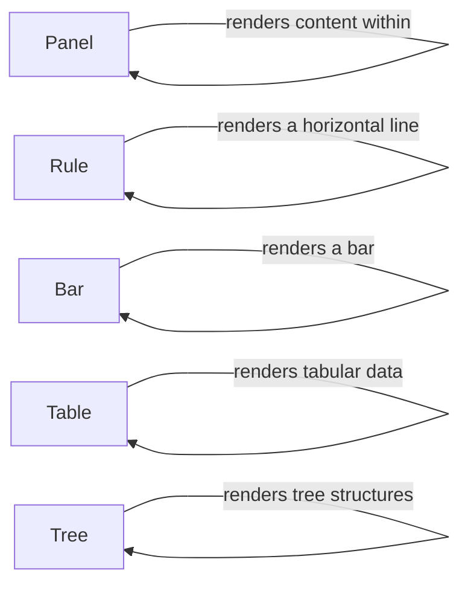

## Component Details

The Renderables Library provides a set of pre-built classes for creating visually appealing console output. These components offer high-level abstractions for rendering common UI elements like panels, tables, trees, rules, and bars, simplifying the process of constructing rich and informative console displays. The library focuses on ease of use and customization, allowing developers to quickly integrate these elements into their applications and tailor their appearance to suit specific needs.

### Panel
The Panel class renders content within a bordered panel, handling content fitting, title/subtitle display, and console output generation. It encapsulates the logic for drawing the panel's border, positioning the title and subtitle, and rendering the content within the panel's boundaries. The Panel component provides a visually distinct container for grouping related information.
- **Related Classes/Methods**: `rich.panel.Panel`

### Rule
The Rule class draws a horizontal line (rule) with optional text, managing the rendering of the line and associated text. It handles the alignment and styling of the text, as well as the drawing of the line itself. The Rule component is useful for visually separating sections of output or highlighting important information.
- **Related Classes/Methods**: `rich.rule.Rule`

### Bar
The Bar class is responsible for rendering a bar, typically used to visualize progress or data ranges. It handles the calculation of the bar's length based on the input value and the styling of the bar's appearance. The Bar component provides a concise and visually intuitive way to represent numerical data.
- **Related Classes/Methods**: `rich.bar.Bar`

### Table
The Table class renders tabular data, handling column/row addition, width calculation, styling, and console output. It manages the layout of the table, including the alignment and formatting of cells, and provides options for adding headers, footers, and borders. The Table component is ideal for displaying structured data in a clear and organized manner.
- **Related Classes/Methods**: `rich.table.Table`

### Tree
The Tree class renders tree-like structures, managing node addition and console output. It handles the indentation and connection of nodes, allowing for the creation of hierarchical displays. The Tree component is useful for visualizing relationships between data elements or representing file system structures.
- **Related Classes/Methods**: `rich.tree.Tree`
