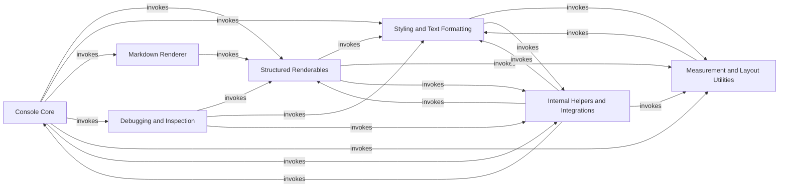

## Component Details

This architecture overview describes the core components of the Rich library, focusing on its capabilities for rendering rich text and structured content in the terminal. The main flow involves the `Console Core` acting as the central orchestrator, utilizing `Styling and Text Formatting` for text presentation, `Structured Renderables` for complex UI elements, and `Measurement and Layout Utilities` for proper content arrangement. `Markdown Renderer` and `Debugging and Inspection` provide specialized rendering, while `Internal Helpers and Integrations` support various functionalities and platform adaptations. The purpose is to provide a robust and flexible system for creating visually appealing and informative command-line interfaces.

### Console Core
The central component responsible for managing terminal output, handling printing, logging, and controlling various display features like alternative screens, themes, and input. It acts as the primary interface for Rich's rendering capabilities.

**Related Classes/Methods**:

- <a href="https://github.com/Textualize/rich/blob/master/rich/console.py#L593-L2607" target="_blank" rel="noopener noreferrer">`rich.rich.console.Console` (593:2607)</a>
- <a href="https://github.com/Textualize/rich/blob/master/rich/console.py#L125-L255" target="_blank" rel="noopener noreferrer">`rich.rich.console.ConsoleOptions` (125:255)</a>
- <a href="https://github.com/Textualize/rich/blob/master/rich/console.py#L292-L301" target="_blank" rel="noopener noreferrer">`rich.rich.console.NewLine` (292:301)</a>
- <a href="https://github.com/Textualize/rich/blob/master/rich/console.py#L304-L319" target="_blank" rel="noopener noreferrer">`rich.rich.console.ScreenUpdate` (304:319)</a>
- <a href="https://github.com/Textualize/rich/blob/master/rich/console.py#L322-L352" target="_blank" rel="noopener noreferrer">`rich.rich.console.Capture` (322:352)</a>
- <a href="https://github.com/Textualize/rich/blob/master/rich/console.py#L355-L373" target="_blank" rel="noopener noreferrer">`rich.rich.console.ThemeContext` (355:373)</a>
- <a href="https://github.com/Textualize/rich/blob/master/rich/console.py#L376-L412" target="_blank" rel="noopener noreferrer">`rich.rich.console.PagerContext` (376:412)</a>
- <a href="https://github.com/Textualize/rich/blob/master/rich/console.py#L415-L459" target="_blank" rel="noopener noreferrer">`rich.rich.console.ScreenContext` (415:459)</a>
- <a href="https://github.com/Textualize/rich/blob/master/rich/console.py#L462-L492" target="_blank" rel="noopener noreferrer">`rich.rich.console.Group` (462:492)</a>
- <a href="https://github.com/Textualize/rich/blob/master/rich/console.py#L495-L514" target="_blank" rel="noopener noreferrer">`rich.rich.console.group` (495:514)</a>
- <a href="https://github.com/Textualize/rich/blob/master/rich/console.py#L548-L553" target="_blank" rel="noopener noreferrer">`rich.rich.console.ConsoleThreadLocals` (548:553)</a>
- <a href="https://github.com/Textualize/rich/blob/master/rich/console.py#L556-L572" target="_blank" rel="noopener noreferrer">`rich.rich.console.RenderHook` (556:572)</a>
- <a href="https://github.com/Textualize/rich/blob/master/rich/console.py#L517-L534" target="_blank" rel="noopener noreferrer">`rich.rich.console._is_jupyter` (517:534)</a>
- <a href="https://github.com/Textualize/rich/blob/master/rich/console.py#L588-L590" target="_blank" rel="noopener noreferrer">`rich.rich.console.detect_legacy_windows` (588:590)</a>
- <a href="https://github.com/Textualize/rich/blob/master/rich/console.py#L578-L585" target="_blank" rel="noopener noreferrer">`rich.rich.console.get_windows_console_features` (578:585)</a>
- `rich.rich.console._caller_frame_info` (full file reference)
- <a href="https://github.com/Textualize/rich/blob/master/rich/console.py#L2610-L2619" target="_blank" rel="noopener noreferrer">`rich.rich.console._svg_hash` (2610:2619)</a>
- `rich.rich.console.RenderableType` (full file reference)
- `rich.rich.console.RenderResult` (full file reference)
- <a href="https://github.com/Textualize/rich/blob/master/rich/console.py#L259-L265" target="_blank" rel="noopener noreferrer">`rich.rich.console.RichCast` (259:265)</a>
- `rich.rich.console.JUPYTER_DEFAULT_COLUMNS` (full file reference)
- `rich.rich.console.JUPYTER_DEFAULT_LINES` (full file reference)
- `rich.rich.console.WINDOWS` (full file reference)
- `rich.rich.console.HighlighterType` (full file reference)
- `rich.rich.console.JustifyMethod` (full file reference)
- `rich.rich.console.OverflowMethod` (full file reference)
- <a href="https://github.com/Textualize/rich/blob/master/rich/console.py#L85-L86" target="_blank" rel="noopener noreferrer">`rich.rich.console.NoChange` (85:86)</a>
- `rich.rich.console.NO_CHANGE` (full file reference)
- `rich.rich.console._STDIN_FILENO` (full file reference)
- `rich.rich.console._STDOUT_FILENO` (full file reference)
- `rich.rich.console._STDERR_FILENO` (full file reference)
- `rich.rich.console._STD_STREAMS` (full file reference)
- `rich.rich.console._STD_STREAMS_OUTPUT` (full file reference)
- `rich.rich.console._TERM_COLORS` (full file reference)
- <a href="https://github.com/Textualize/rich/blob/master/rich/console.py#L115-L121" target="_blank" rel="noopener noreferrer">`rich.rich.console.ConsoleDimensions` (115:121)</a>
- `rich.rich.console.COLOR_SYSTEMS` (full file reference)
- `rich.rich.console._COLOR_SYSTEMS_NAMES` (full file reference)

### Structured Renderables
This component provides a collection of high-level classes for rendering complex, structured content such as tables, panels, columns, rules, and hierarchical trees. It also includes utilities for layout and constraining content width. It encapsulates logic for rendering common UI elements, manages their internal structure and presentation, and adapts them for console display.

**Related Classes/Methods**:

- <a href="https://github.com/Textualize/rich/blob/master/rich/table.py#L154-L926" target="_blank" rel="noopener noreferrer">`rich.table.Table` (154:926)</a>
- <a href="https://github.com/Textualize/rich/blob/master/rich/table.py#L39-L129" target="_blank" rel="noopener noreferrer">`rich.table.Column` (39:129)</a>
- <a href="https://github.com/Textualize/rich/blob/master/rich/table.py#L133-L140" target="_blank" rel="noopener noreferrer">`rich.table.Row` (133:140)</a>
- <a href="https://github.com/Textualize/rich/blob/master/rich/panel.py#L17-L298" target="_blank" rel="noopener noreferrer">`rich.panel.Panel` (17:298)</a>
- <a href="https://github.com/Textualize/rich/blob/master/rich/columns.py#L16-L171" target="_blank" rel="noopener noreferrer">`rich.columns.Columns` (16:171)</a>
- <a href="https://github.com/Textualize/rich/blob/master/rich/rule.py#L12-L114" target="_blank" rel="noopener noreferrer">`rich.rule.Rule` (12:114)</a>
- <a href="https://github.com/Textualize/rich/blob/master/rich/tree.py#L14-L201" target="_blank" rel="noopener noreferrer">`rich.tree.Tree` (14:201)</a>
- <a href="https://github.com/Textualize/rich/blob/master/rich/padding.py#L19-L135" target="_blank" rel="noopener noreferrer">`rich.padding.Padding` (19:135)</a>
- <a href="https://github.com/Textualize/rich/blob/master/rich/constrain.py#L10-L37" target="_blank" rel="noopener noreferrer">`rich.constrain.Constrain` (10:37)</a>
- <a href="https://github.com/Textualize/rich/blob/master/rich/layout.py#L142-L415" target="_blank" rel="noopener noreferrer">`rich.layout.Layout` (142:415)</a>
- <a href="https://github.com/Textualize/rich/blob/master/rich/layout.py#L51-L77" target="_blank" rel="noopener noreferrer">`rich.layout._Placeholder` (51:77)</a>
- <a href="https://github.com/Textualize/rich/blob/master/rich/layout.py#L101-L118" target="_blank" rel="noopener noreferrer">`rich.layout.RowSplitter` (101:118)</a>
- <a href="https://github.com/Textualize/rich/blob/master/rich/layout.py#L121-L138" target="_blank" rel="noopener noreferrer">`rich.layout.ColumnSplitter` (121:138)</a>
- <a href="https://github.com/Textualize/rich/blob/master/rich/layout.py#L47-L48" target="_blank" rel="noopener noreferrer">`rich.layout.NoSplitter` (47:48)</a>
- <a href="https://github.com/Textualize/rich/blob/master/rich/containers.py#L66-L167" target="_blank" rel="noopener noreferrer">`rich.containers.Lines` (66:167)</a>
- <a href="https://github.com/Textualize/rich/blob/master/rich/containers.py#L30-L63" target="_blank" rel="noopener noreferrer">`rich.containers.Renderables` (30:63)</a>

### Styling and Text Formatting
Core components for handling text content, applying styles, managing color systems, and performing syntax highlighting.

**Related Classes/Methods**:

- <a href="https://github.com/Textualize/rich/blob/master/rich/text.py#L118-L1333" target="_blank" rel="noopener noreferrer">`rich.rich.text.Text` (118:1333)</a>
- <a href="https://github.com/Textualize/rich/blob/master/rich/style.py#L31-L759" target="_blank" rel="noopener noreferrer">`rich.rich.style.Style` (31:759)</a>
- <a href="https://github.com/Textualize/rich/blob/master/rich/style.py#L765-L796" target="_blank" rel="noopener noreferrer">`rich.rich.style.StyleStack` (765:796)</a>
- `rich.rich.style.StyleType` (full file reference)
- <a href="https://github.com/Textualize/rich/blob/master/rich/segment.py#L64-L668" target="_blank" rel="noopener noreferrer">`rich.rich.segment.Segment` (64:668)</a>
- <a href="https://github.com/Textualize/rich/blob/master/rich/highlighter.py#L80-L103" target="_blank" rel="noopener noreferrer">`rich.rich.highlighter.ReprHighlighter` (80:103)</a>
- <a href="https://github.com/Textualize/rich/blob/master/rich/highlighter.py#L50-L58" target="_blank" rel="noopener noreferrer">`rich.rich.highlighter.NullHighlighter` (50:58)</a>
- <a href="https://github.com/Textualize/rich/blob/master/rich/styled.py#L11-L34" target="_blank" rel="noopener noreferrer">`rich.rich.styled.Styled` (11:34)</a>
- <a href="https://github.com/Textualize/rich/blob/master/rich/color.py#L303-L568" target="_blank" rel="noopener noreferrer">`rich.rich.color.Color` (303:568)</a>
- <a href="https://github.com/Textualize/rich/blob/master/rich/color.py#L580-L591" target="_blank" rel="noopener noreferrer">`rich.rich.color.blend_rgb` (580:591)</a>
- <a href="https://github.com/Textualize/rich/blob/master/rich/palette.py#L11-L72" target="_blank" rel="noopener noreferrer">`rich.rich.palette.Palette` (11:72)</a>

### Markdown Renderer
Implements the parsing and rendering of Markdown syntax into Rich-compatible renderable objects, supporting various Markdown elements like blockquotes, tables, and headings.

**Related Classes/Methods**:

- <a href="https://github.com/Textualize/rich/blob/master/rich/markdown.py#L192-L215" target="_blank" rel="noopener noreferrer">`rich.rich.markdown.BlockQuote` (192:215)</a>
- <a href="https://github.com/Textualize/rich/blob/master/rich/markdown.py#L218-L227" target="_blank" rel="noopener noreferrer">`rich.rich.markdown.HorizontalRule` (218:227)</a>
- <a href="https://github.com/Textualize/rich/blob/master/rich/markdown.py#L230-L260" target="_blank" rel="noopener noreferrer">`rich.rich.markdown.TableElement` (230:260)</a>
- <a href="https://github.com/Textualize/rich/blob/master/rich/markdown.py#L362-L401" target="_blank" rel="noopener noreferrer">`rich.rich.markdown.ListItem` (362:401)</a>
- <a href="https://github.com/Textualize/rich/blob/master/rich/markdown.py#L132-L164" target="_blank" rel="noopener noreferrer">`rich.rich.markdown.Heading` (132:164)</a>

### Debugging and Inspection
Offers tools for displaying formatted exception tracebacks, inspecting Python objects, and rendering their representations in a readable format.

**Related Classes/Methods**:

- <a href="https://github.com/Textualize/rich/blob/master/rich/traceback.py#L252-L855" target="_blank" rel="noopener noreferrer">`rich.rich.traceback.Traceback` (252:855)</a>
- <a href="https://github.com/Textualize/rich/blob/master/rich/traceback.py#L248-L249" target="_blank" rel="noopener noreferrer">`rich.rich.traceback.PathHighlighter` (248:249)</a>
- <a href="https://github.com/Textualize/rich/blob/master/rich/scope.py#L14-L67" target="_blank" rel="noopener noreferrer">`rich.rich.scope.render_scope` (14:67)</a>
- <a href="https://github.com/Textualize/rich/blob/master/rich/_inspect.py#L21-L233" target="_blank" rel="noopener noreferrer">`rich.rich._inspect.Inspect` (21:233)</a>
- <a href="https://github.com/Textualize/rich/blob/master/rich/pretty.py#L253-L354" target="_blank" rel="noopener noreferrer">`rich.rich.pretty.Pretty` (253:354)</a>

### Measurement and Layout Utilities
Provides essential utilities for calculating the dimensions of renderable content, handling cell lengths, and distributing space based on ratios.

**Related Classes/Methods**:

- <a href="https://github.com/Textualize/rich/blob/master/rich/measure.py#L11-L122" target="_blank" rel="noopener noreferrer">`rich.rich.measure.Measurement` (11:122)</a>
- <a href="https://github.com/Textualize/rich/blob/master/rich/measure.py#L125-L151" target="_blank" rel="noopener noreferrer">`rich.rich.measure.measure_renderables` (125:151)</a>
- <a href="https://github.com/Textualize/rich/blob/master/rich/cells.py#L51-L64" target="_blank" rel="noopener noreferrer">`rich.rich.cells.cell_len` (51:64)</a>
- <a href="https://github.com/Textualize/rich/blob/master/rich/cells.py#L96-L128" target="_blank" rel="noopener noreferrer">`rich.rich.cells.set_cell_size` (96:128)</a>
- <a href="https://github.com/Textualize/rich/blob/master/rich/_ratio.py#L20-L78" target="_blank" rel="noopener noreferrer">`rich.rich._ratio.ratio_resolve` (20:78)</a>
- <a href="https://github.com/Textualize/rich/blob/master/rich/_ratio.py#L113-L146" target="_blank" rel="noopener noreferrer">`rich.rich._ratio.ratio_distribute` (113:146)</a>
- <a href="https://github.com/Textualize/rich/blob/master/rich/_ratio.py#L81-L110" target="_blank" rel="noopener noreferrer">`rich.rich._ratio.ratio_reduce` (81:110)</a>

### Internal Helpers and Integrations
A collection of internal helper functions, error classes, platform-specific integrations (Windows, Jupyter), and specialized renderables like spinners and progress bars, along with main entry point examples.

**Related Classes/Methods**:

- <a href="https://github.com/Textualize/rich/blob/master/rich/_loop.py#L31-L43" target="_blank" rel="noopener noreferrer">`rich.rich._loop.loop_first_last` (31:43)</a>
- <a href="https://github.com/Textualize/rich/blob/master/rich/_loop.py#L18-L28" target="_blank" rel="noopener noreferrer">`rich.rich._loop.loop_last` (18:28)</a>
- <a href="https://github.com/Textualize/rich/blob/master/rich/_loop.py#L6-L15" target="_blank" rel="noopener noreferrer">`rich.rich._loop.loop_first` (6:15)</a>
- <a href="https://github.com/Textualize/rich/blob/master/rich/_pick.py#L4-L17" target="_blank" rel="noopener noreferrer">`rich.rich._pick.pick_bool` (4:17)</a>
- <a href="https://github.com/Textualize/rich/blob/master/rich/_log_render.py#L14-L86" target="_blank" rel="noopener noreferrer">`rich.rich._log_render.LogRender` (14:86)</a>
- <a href="https://github.com/Textualize/rich/blob/master/rich/align.py#L23-L231" target="_blank" rel="noopener noreferrer">`rich.rich.align.Align` (23:231)</a>
- <a href="https://github.com/Textualize/rich/blob/master/rich/box.py#L16-L188" target="_blank" rel="noopener noreferrer">`rich.rich.box.Box` (16:188)</a>
- <a href="https://github.com/Textualize/rich/blob/master/rich/protocol.py#L10-L16" target="_blank" rel="noopener noreferrer">`rich.rich.protocol.is_renderable` (10:16)</a>
- <a href="https://github.com/Textualize/rich/blob/master/rich/errors.py#L21-L22" target="_blank" rel="noopener noreferrer">`rich.rich.errors.NotRenderableError` (21:22)</a>
- <a href="https://github.com/Textualize/rich/blob/master/rich/errors.py#L33-L34" target="_blank" rel="noopener noreferrer">`rich.rich.errors.NoAltScreen` (33:34)</a>
- <a href="https://github.com/Textualize/rich/blob/master/rich/errors.py#L9-L10" target="_blank" rel="noopener noreferrer">`rich.rich.errors.StyleSyntaxError` (9:10)</a>
- <a href="https://github.com/Textualize/rich/blob/master/rich/errors.py#L13-L14" target="_blank" rel="noopener noreferrer">`rich.rich.errors.MissingStyle` (13:14)</a>
- <a href="https://github.com/Textualize/rich/blob/master/rich/errors.py#L29-L30" target="_blank" rel="noopener noreferrer">`rich.rich.errors.LiveError` (29:30)</a>
- <a href="https://github.com/Textualize/rich/blob/master/rich/jupyter.py#L84-L95" target="_blank" rel="noopener noreferrer">`rich.rich.jupyter.display` (84:95)</a>
- <a href="https://github.com/Textualize/rich/blob/master/rich/_fileno.py#L6-L24" target="_blank" rel="noopener noreferrer">`rich.rich._fileno.get_fileno` (6:24)</a>
- <a href="https://github.com/Textualize/rich/blob/master/rich/_windows_renderer.py#L7-L56" target="_blank" rel="noopener noreferrer">`rich._windows_renderer.legacy_windows_render` (7:56)</a>
- <a href="https://github.com/Textualize/rich/blob/master/rich/_win32_console.py#L331-L572" target="_blank" rel="noopener noreferrer">`rich._win32_console.LegacyWindowsTerm` (331:572)</a>
- <a href="https://github.com/Textualize/rich/blob/master/rich/spinner.py#L13-L114" target="_blank" rel="noopener noreferrer">`rich.rich.spinner.Spinner` (13:114)</a>
- <a href="https://github.com/Textualize/rich/blob/master/rich/progress.py#L509-L548" target="_blank" rel="noopener noreferrer">`rich.rich.progress.ProgressColumn` (509:548)</a>
- <a href="https://github.com/Textualize/rich/blob/master/rich/progress.py#L618-L645" target="_blank" rel="noopener noreferrer">`rich.rich.progress.TextColumn` (618:645)</a>
- <a href="https://github.com/Textualize/rich/blob/master/rich/progress.py#L1063-L1650" target="_blank" rel="noopener noreferrer">`rich.rich.progress.Progress` (1063:1650)</a>
- <a href="https://github.com/Textualize/rich/blob/master/rich/__main__.py#L18-L36" target="_blank" rel="noopener noreferrer">`rich.rich.__main__.ColorBox` (18:36)</a>
- <a href="https://github.com/Textualize/rich/blob/master/rich/__main__.py#L39-L206" target="_blank" rel="noopener noreferrer">`rich.rich.__main__.make_test_card` (39:206)</a>
- <a href="https://github.com/Textualize/rich/blob/master/rich/json.py#L9-L102" target="_blank" rel="noopener noreferrer">`rich.json.JSON` (9:102)</a>
- <a href="https://github.com/Textualize/rich/blob/master/rich/syntax.py#L227-L819" target="_blank" rel="noopener noreferrer">`rich.syntax.Syntax` (227:819)</a>
- <a href="https://github.com/Textualize/rich/blob/master/benchmarks/benchmarks.py#L97-L126" target="_blank" rel="noopener noreferrer">`rich.benchmarks.benchmarks.TableSuite` (97:126)</a>

### [FAQ](https://github.com/CodeBoarding/GeneratedOnBoardings/tree/main?tab=readme-ov-file#faq)