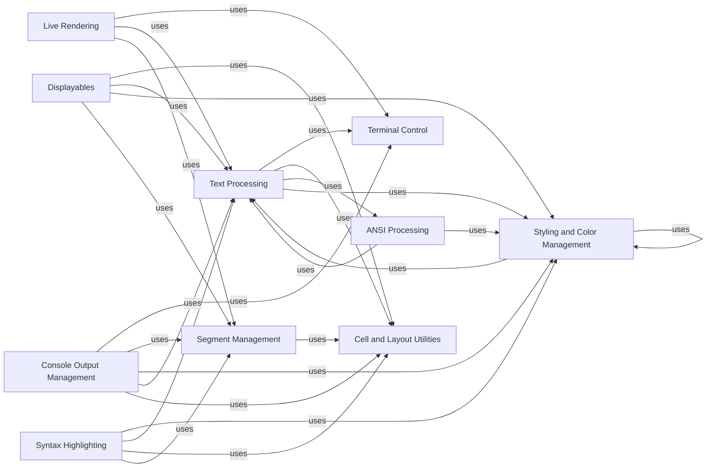

## Component Details

This graph illustrates the core components of Rich responsible for text representation, styling, and low-level terminal interactions. It details how text is processed, styled, and managed for display, including handling ANSI codes, calculating cell lengths, and managing themes and colors.

### Text Processing
This component is responsible for handling text manipulation, including creating, modifying, and rendering styled text. It provides functionalities for adding text, slicing, applying markup, and converting from ANSI.

**Related Classes/Methods**:

- <a href="https://github.com/Textualize/rich/blob/master/rich/text.py#L118-L1333" target="_blank" rel="noopener noreferrer">`rich.text.Text` (118:1333)</a>
- <a href="https://github.com/Textualize/rich/blob/master/rich/markup.py#L48-L70" target="_blank" rel="noopener noreferrer">`rich.markup.escape` (48:70)</a>
- <a href="https://github.com/Textualize/rich/blob/master/rich/markup.py#L106-L231" target="_blank" rel="noopener noreferrer">`rich.markup.render` (106:231)</a>
- <a href="https://github.com/Textualize/rich/blob/master/rich/_wrap.py#L26-L78" target="_blank" rel="noopener noreferrer">`rich._wrap.divide_line` (26:78)</a>
- <a href="https://github.com/Textualize/rich/blob/master/rich/containers.py#L66-L167" target="_blank" rel="noopener noreferrer">`rich.containers.Lines` (66:167)</a>

### Styling and Color Management
This component manages the application and parsing of styles and colors. It includes functionalities for creating styles, parsing color definitions, combining styles, and handling color palettes and terminal themes.

**Related Classes/Methods**:

- <a href="https://github.com/Textualize/rich/blob/master/rich/style.py#L31-L759" target="_blank" rel="noopener noreferrer">`rich.style.Style` (31:759)</a>
- <a href="https://github.com/Textualize/rich/blob/master/rich/color.py#L303-L568" target="_blank" rel="noopener noreferrer">`rich.color.Color` (303:568)</a>
- <a href="https://github.com/Textualize/rich/blob/master/rich/palette.py#L11-L72" target="_blank" rel="noopener noreferrer">`rich.palette.Palette` (11:72)</a>
- <a href="https://github.com/Textualize/rich/blob/master/rich/terminal_theme.py#L9-L29" target="_blank" rel="noopener noreferrer">`rich.terminal_theme.TerminalTheme` (9:29)</a>
- <a href="https://github.com/Textualize/rich/blob/master/rich/theme.py#L8-L73" target="_blank" rel="noopener noreferrer">`rich.theme.Theme` (8:73)</a>
- <a href="https://github.com/Textualize/rich/blob/master/rich/theme.py#L80-L110" target="_blank" rel="noopener noreferrer">`rich.theme.ThemeStack` (80:110)</a>

### Terminal Control
This component provides low-level control over the terminal, including functions for moving the cursor, clearing the screen, showing/hiding the cursor, and setting the window title. It also handles stripping control codes from text.

**Related Classes/Methods**:

- <a href="https://github.com/Textualize/rich/blob/master/rich/control.py#L54-L184" target="_blank" rel="noopener noreferrer">`rich.control.Control` (54:184)</a>
- <a href="https://github.com/Textualize/rich/blob/master/rich/control.py#L187-L198" target="_blank" rel="noopener noreferrer">`rich.control.strip_control_codes` (187:198)</a>

### ANSI Processing
This component is responsible for decoding ANSI escape codes found in text streams into Rich's internal text and style objects. It also includes a file proxy for handling ANSI output.

**Related Classes/Methods**:

- <a href="https://github.com/Textualize/rich/blob/master/rich/ansi.py#L120-L211" target="_blank" rel="noopener noreferrer">`rich.ansi.AnsiDecoder` (120:211)</a>
- <a href="https://github.com/Textualize/rich/blob/master/rich/file_proxy.py#L11-L57" target="_blank" rel="noopener noreferrer">`rich.file_proxy.FileProxy` (11:57)</a>

### Cell and Layout Utilities
This component provides utility functions for calculating the display length of strings (cell length) and adjusting text sizes based on cell dimensions, crucial for proper layout and alignment in the terminal.

**Related Classes/Methods**:

- <a href="https://github.com/Textualize/rich/blob/master/rich/cells.py#L51-L64" target="_blank" rel="noopener noreferrer">`rich.cells.cell_len` (51:64)</a>
- <a href="https://github.com/Textualize/rich/blob/master/rich/cells.py#L96-L128" target="_blank" rel="noopener noreferrer">`rich.cells.set_cell_size` (96:128)</a>
- <a href="https://github.com/Textualize/rich/blob/master/rich/cells.py#L131-L165" target="_blank" rel="noopener noreferrer">`rich.cells.chop_cells` (131:165)</a>

### Console Output Management
This is the central component for managing and rendering output to the console. It handles printing, rendering lines, managing themes, and exporting content to various formats like HTML and SVG.

**Related Classes/Methods**:

- <a href="https://github.com/Textualize/rich/blob/master/rich/console.py#L593-L2607" target="_blank" rel="noopener noreferrer">`rich.console.Console` (593:2607)</a>
- <a href="https://github.com/Textualize/rich/blob/master/rich/console.py#L304-L319" target="_blank" rel="noopener noreferrer">`rich.console.ScreenUpdate` (304:319)</a>
- <a href="https://github.com/Textualize/rich/blob/master/rich/console.py#L376-L412" target="_blank" rel="noopener noreferrer">`rich.console.PagerContext` (376:412)</a>

### Segment Management
This component deals with the internal representation of styled text as segments. It provides functionalities for splitting, cropping, applying styles, and managing lines of segments.

**Related Classes/Methods**:

- <a href="https://github.com/Textualize/rich/blob/master/rich/segment.py#L64-L668" target="_blank" rel="noopener noreferrer">`rich.segment.Segment` (64:668)</a>
- <a href="https://github.com/Textualize/rich/blob/master/rich/segment.py#L671-L693" target="_blank" rel="noopener noreferrer">`rich.segment.Segments` (671:693)</a>
- <a href="https://github.com/Textualize/rich/blob/master/rich/segment.py#L696-L718" target="_blank" rel="noopener noreferrer">`rich.segment.SegmentLines` (696:718)</a>
- <a href="https://github.com/Textualize/rich/blob/master/rich/styled.py#L11-L34" target="_blank" rel="noopener noreferrer">`rich.styled.Styled` (11:34)</a>

### Syntax Highlighting
This component provides functionality for syntax highlighting source code. It integrates with Pygments and handles applying styles to tokens and rendering highlighted code.

**Related Classes/Methods**:

- <a href="https://github.com/Textualize/rich/blob/master/rich/syntax.py#L136-L175" target="_blank" rel="noopener noreferrer">`rich.syntax.PygmentsSyntaxTheme` (136:175)</a>
- <a href="https://github.com/Textualize/rich/blob/master/rich/syntax.py#L178-L208" target="_blank" rel="noopener noreferrer">`rich.syntax.ANSISyntaxTheme` (178:208)</a>
- <a href="https://github.com/Textualize/rich/blob/master/rich/syntax.py#L227-L819" target="_blank" rel="noopener noreferrer">`rich.syntax.Syntax` (227:819)</a>

### Live Rendering
This component enables dynamic and interactive updates to the console output, allowing for progress bars, spinners, and other live displays.

**Related Classes/Methods**:

- <a href="https://github.com/Textualize/rich/blob/master/rich/live_render.py#L20-L112" target="_blank" rel="noopener noreferrer">`rich.live_render.LiveRender` (20:112)</a>

### Displayables
This component represents various renderable objects that can be displayed on the console, such as rules, trees, and progress bars.

**Related Classes/Methods**:

- <a href="https://github.com/Textualize/rich/blob/master/rich/rule.py#L12-L114" target="_blank" rel="noopener noreferrer">`rich.rule.Rule` (12:114)</a>
- <a href="https://github.com/Textualize/rich/blob/master/rich/tree.py#L14-L201" target="_blank" rel="noopener noreferrer">`rich.tree.Tree` (14:201)</a>
- <a href="https://github.com/Textualize/rich/blob/master/rich/bar.py#L17-L93" target="_blank" rel="noopener noreferrer">`rich.bar.Bar` (17:93)</a>

### [FAQ](https://github.com/CodeBoarding/GeneratedOnBoardings/tree/main?tab=readme-ov-file#faq)