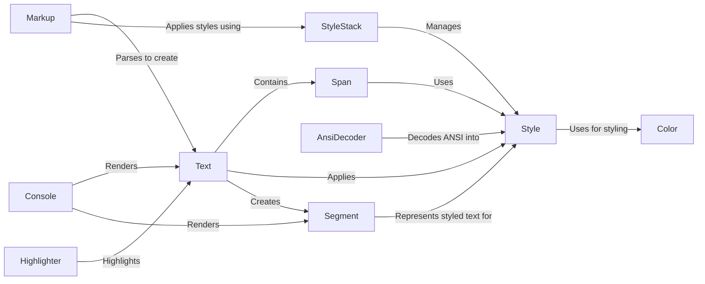

## Component Details

### Text
Represents styled text content. It manages the underlying string data, applies styles to different portions of the text using Span objects, and provides methods for manipulating the text, such as splitting, joining, and applying alignment. The Text class is central to Rich's text rendering capabilities.
- **Related Classes/Methods**: `rich.text.Text`

### Span
Represents a contiguous region of text within a Text object that shares a common style. It defines the start and end offsets of the styled region, allowing for efficient styling of specific parts of the text without creating multiple Text objects.
- **Related Classes/Methods**: `rich.text.Span`

### Style
Represents a combination of formatting attributes (color, bold, italic, etc.) that can be applied to text. It encapsulates the styling information and provides methods for combining styles and resolving style conflicts. The Style class is used extensively by the Text class and other components to manage text styling.
- **Related Classes/Methods**: `rich.style.Style`

### StyleStack
Manages a stack of styles, used for applying nested styles in markup or other contexts where styles can be layered. It allows for pushing and popping styles, resolving the combined style at any given point in the stack. This is particularly useful for handling nested markup tags.
- **Related Classes/Methods**: `rich.style.StyleStack`

### Markup
Parses and renders Rich's markup language into Text objects. It handles the interpretation of style tags and applies the corresponding styles to the text. The Markup component uses StyleStack to manage nested styles and creates Text objects with appropriate Span objects to represent the styled text.
- **Related Classes/Methods**: `rich.markup`

### Console
Manages the output to the terminal. It handles rendering rich content, including Text objects, and provides methods for logging and printing styled text. The Console component is responsible for taking Text objects and converting them into a format suitable for display on the terminal.
- **Related Classes/Methods**: `rich.console.Console`

### AnsiDecoder
Decodes ANSI escape codes in text and converts them into Style objects that can be applied to Text objects. It allows Rich to interpret ANSI codes embedded in text, enabling the display of styled text from external sources or applications that use ANSI codes for formatting.
- **Related Classes/Methods**: `rich.ansi.AnsiDecoder`

### Highlighter
Applies styles to text based on regular expressions. It's used to highlight specific words or patterns in Text objects. The Highlighter component allows for dynamic styling of text based on its content, making it useful for tasks such as syntax highlighting or keyword highlighting.
- **Related Classes/Methods**: `rich.highlighter.Highlighter`

### Color
Represents a color, which can be defined in various ways (e.g., RGB, ANSI code, color name). It's used by the Style class to specify text and background colors. The Color component provides a consistent way to represent and manipulate colors within Rich.
- **Related Classes/Methods**: `rich.color.Color`

### Segment
Represents a single piece of renderable text with a specific style. The console renders a list of segments to the terminal. Segments are created from Text objects during the rendering process.
- **Related Classes/Methods**: `rich.segment.Segment`
