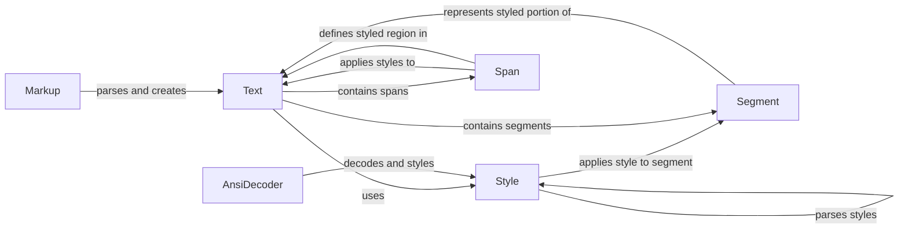

## Component Details

The Text and Style Engine in Rich provides the core functionality for creating, manipulating, and rendering styled text in the console. It encompasses components for representing text with associated styles, parsing and applying styles from various sources (ANSI escape codes, Rich markup), and managing the visual representation of text elements. The engine's primary purpose is to enable developers to easily format and style console output, enhancing the readability and visual appeal of command-line applications.

### Text
The `Text` class represents a string with associated styles. It provides methods for manipulating the text, applying styles, measuring its length, and rendering it to the console. It's the central component for handling styled text, allowing for modification, styling, and measurement of text content.
- **Related Classes/Methods**: `rich.text.Text`

### Style
The `Style` class encapsulates styling information such as color, background color, bold, italic, etc. It provides methods for parsing style strings, applying styles, and rendering styles as HTML. It is responsible for defining and managing the appearance of text.
- **Related Classes/Methods**: `rich.style.Style`

### AnsiDecoder
The `AnsiDecoder` class is responsible for parsing ANSI escape codes within a string and converting them into styled text. It decodes ANSI sequences to apply formatting to the text, enabling the interpretation of ANSI codes for styling.
- **Related Classes/Methods**: `rich.ansi.AnsiDecoder`

### Markup
The `Markup` class handles the parsing of Rich's markup language, converting it into styled text. It interprets tags and attributes within the markup to apply corresponding styles, providing a declarative way to style text.
- **Related Classes/Methods**: `rich.markup`

### Segment
The `Segment` class represents a portion of text with a specific style. It's a fundamental data structure used in the rendering process to store text and its associated styling information, representing the smallest unit of styled text for rendering.
- **Related Classes/Methods**: `rich.segment.Segment`

### Span
The `Span` class represents a region within a Text object that has a specific style applied to it. It defines the start and end indices of the styled region and the style to apply, allowing for targeted styling of specific portions of text.
- **Related Classes/Methods**: `rich.text.Span`
