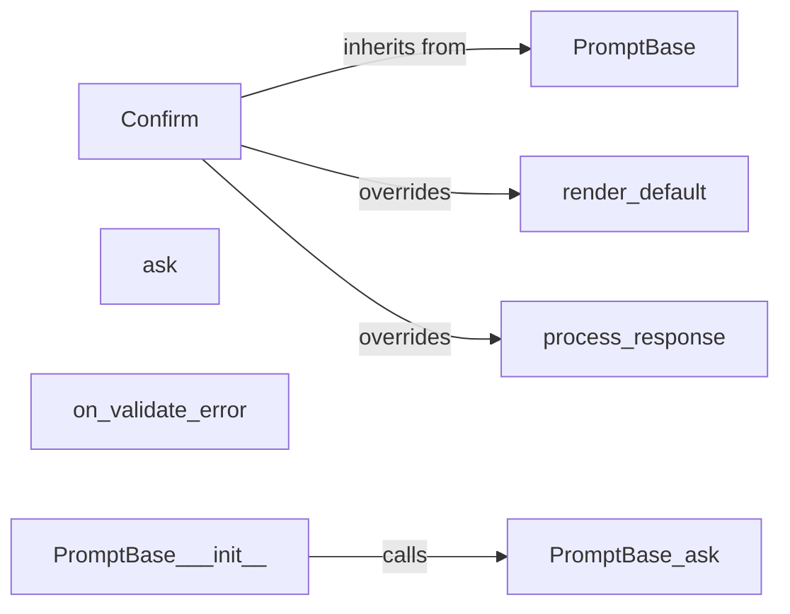

## Component Details

The User Input and Prompting subsystem in `rich` provides a set of classes and methods for creating interactive command-line prompts with rich formatting. It allows developers to easily gather input from users, validate their responses, and display prompts with customized styles and default values. The core functionality revolves around the `PromptBase` class, which defines the basic structure for prompts, and specialized classes like `Confirm` that extend `PromptBase` to handle specific input types. The subsystem uses the `rich` console to render prompts and display messages to the user.

### PromptBase
The `PromptBase` class serves as the foundation for all prompts. It provides common functionality for asking questions, rendering default values, processing responses, and handling validation errors. It defines the core structure and methods for creating interactive prompts, including methods for displaying the prompt, reading user input, validating the response, and handling errors.
- **Related Classes/Methods**: `rich.prompt.PromptBase`

### Confirm
The `Confirm` class is a specialized prompt designed for confirming a choice (yes/no). It inherits from `PromptBase` and overrides methods for rendering the default value and processing the response to handle boolean input. It simplifies the process of creating prompts that require a simple yes/no answer from the user.
- **Related Classes/Methods**: `rich.prompt.Confirm`

### ask
The `ask` method within `PromptBase` is responsible for displaying the prompt to the user and retrieving their input. It uses the rich console to print the prompt and reads the user's response from standard input. It handles the interaction with the user, displaying the prompt and capturing their input.
- **Related Classes/Methods**: `rich.prompt.PromptBase:ask`

### render_default
The `render_default` method within `PromptBase` is responsible for rendering the default value of the prompt. It formats the default value for display in the prompt, providing a visual cue to the user about the default option. The `Confirm` class overrides this method to display boolean defaults.
- **Related Classes/Methods**: `rich.prompt.PromptBase:render_default`, `rich.prompt.Confirm:render_default`

### process_response
The `process_response` method within `PromptBase` is responsible for processing the user's response and validating it. It converts the raw input into the desired data type and checks if it meets any specified validation criteria. The `Confirm` class overrides this method to handle boolean input.
- **Related Classes/Methods**: `rich.prompt.PromptBase:process_response`, `rich.prompt.Confirm:process_response`

### on_validate_error
The `on_validate_error` method within `PromptBase` is responsible for handling validation errors that occur during response processing. It provides a mechanism to display error messages to the user and re-prompt them for input, ensuring that the user provides valid input.
- **Related Classes/Methods**: `rich.prompt.PromptBase:on_validate_error`
