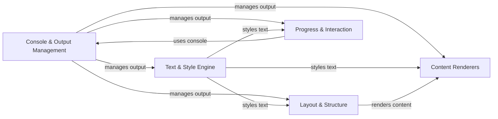

## Component Details

### Console & Output Management
This component is the central hub for managing all terminal output. It handles rendering rich text, applying styles, and interacting directly with the terminal. It provides functionalities for printing, logging, capturing output, and managing themes, ensuring consistent and visually appealing output across different platforms and terminals. It also includes real-time display capabilities and integration with Python's logging module.
- **Related Classes/Methods**: `rich.console.Console`, `rich.console.ConsoleOptions`, `rich.console.ConsoleRenderable`, `rich.console.ConsoleThreadLocals`, `rich.live.Live`, `rich.live_render.LiveRender`, `rich.logging.RichHandler`, `rich._log_render.LogRender`

### Text & Style Engine
This component is responsible for the creation, manipulation, and styling of text. It manages the appearance of text, including color, font, and other attributes. It provides methods for parsing style definitions, combining styles, and rendering styles. It is the core of how text is represented and styled within the rich library, enabling developers to easily create visually rich and expressive text-based output.
- **Related Classes/Methods**: `rich.text.Text`, `rich.text.Span`, `rich.style.Style`, `rich.style.StyleStack`, `rich.style.StyleStackError`, `rich.errors.StyleError`, `rich.errors.MissingStyle`, `rich.errors.StyleSyntaxError`, `rich.color.Color`

### Layout & Structure
This component provides tools for structuring and laying out content in the console. It includes tables, panels, trees and alignment features. It allows for the creation of visually appealing and organized displays, making it easier to present complex information in a clear and structured manner. It offers a range of layout options to suit different types of content and display requirements.
- **Related Classes/Methods**: `rich.table.Table`, `rich.table.Column`, `rich.table.Row`, `rich.panel.Panel`, `rich.tree.Tree`, `rich.align.Align`

### Content Renderers
This component focuses on rendering specific types of content, such as code syntax, markdown, and tracebacks. It converts these formats into rich text that can be displayed in the console. It provides highlighters and formatters for various data types, enabling developers to easily display code, documentation, and error information in a visually appealing and informative way.
- **Related Classes/Methods**: `rich.syntax.Syntax`, `rich.syntax.SyntaxTheme`, `rich.syntax.PygmentsSyntaxTheme`, `rich.syntax.ANSISyntaxTheme`, `rich.markdown.Markdown`, `rich.markdown.MarkdownElement`, `rich.markdown.TextElement`, `rich.markdown.CodeBlock`, `rich.markdown.Heading`, `rich.markdown.ListElement`, `rich.markdown.ListItem`, `rich.traceback.Traceback`

### Progress & Interaction
This component provides tools for displaying progress updates and interacting with the user. It includes progress bars and prompt functionalities. It allows for creating interactive console applications, providing users with feedback on long-running tasks and enabling them to input data and make choices within the console environment.
- **Related Classes/Methods**: `rich.progress.Progress`, `rich.progress.BarColumn`, `rich.progress.TextColumn`, `rich.progress.TaskProgressColumn`, `rich.progress.TimeRemainingColumn`, `rich.progress.DownloadColumn`, `rich.progress.TransferSpeedColumn`, `rich.progress.Task`, `rich.progress_bar.ProgressBar`, `rich.prompt.PromptBase`, `rich.prompt.Confirm`