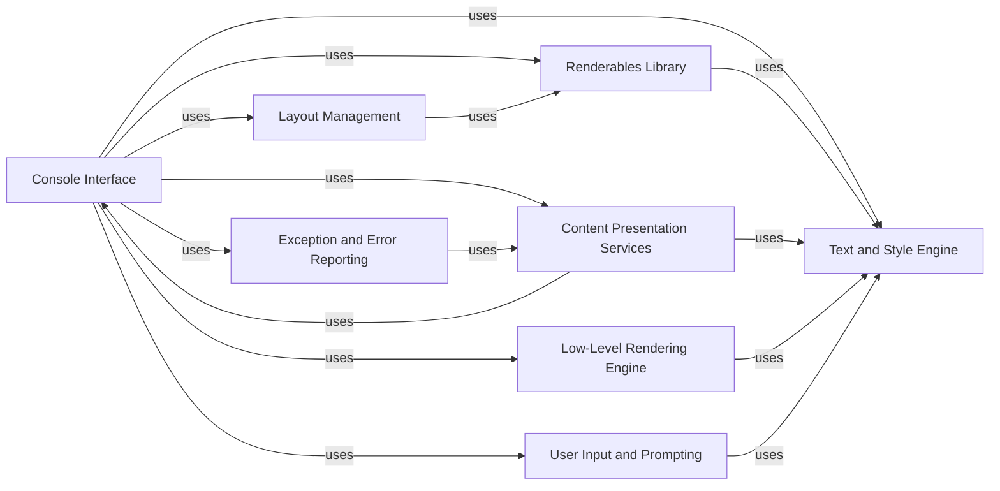

## Component Details

The Rich library provides a comprehensive toolkit for creating visually appealing and informative terminal output. It encompasses functionalities for text styling, layout management, content presentation, and user interaction, all built around a central console interface. The library leverages a low-level rendering engine to translate high-level components into styled segments, enabling developers to produce rich and dynamic console displays.

### Console Interface
The central component responsible for managing the terminal output. It handles rendering, styling, and outputting content to the console, managing themes, capturing output, and interacting with the terminal. It acts as the main entry point for interacting with the Rich library.
- **Related Classes/Methods**: `rich.console.Console`, `rich.console.ConsoleOptions`, `rich.console.Screen`, `rich.console.Group`

### Text and Style Engine
This component provides the foundation for creating and manipulating rich text and styles. It supports styling, applying markup, and converting ANSI escape codes to styled text. It is responsible for managing the appearance of text elements within the console.
- **Related Classes/Methods**: `rich.text.Text`, `rich.style.Style`, `rich.ansi.AnsiDecoder`, `rich.markup`

### Layout Management
Handles the arrangement of renderable objects within the console. It allows for creating complex layouts with rows, columns, and flexible sizing, providing the structure for organizing visual elements.
- **Related Classes/Methods**: `rich.layout.Layout`, `rich.align.Align`, `rich.constrain.Constrain`, `rich.columns.Columns`

### Renderables Library
A collection of pre-built classes that can be rendered to the console, including Panel, Table, Tree, Rule, and more. These components provide high-level abstractions for creating visually appealing output, offering ready-made visual elements for constructing the console display.
- **Related Classes/Methods**: `rich.panel.Panel`, `rich.table.Table`, `rich.tree.Tree`, `rich.rule.Rule`, `rich.bar.Bar`

### Content Presentation Services
This component focuses on presenting specific types of content in a visually appealing manner. It includes Syntax Highlighting for code snippets, Progress Display for tracking tasks, Pretty Printing for Python objects, Live Display for dynamic updates, Logging Integration for formatted log messages, and Markdown Rendering for formatted documents, enhancing the display of diverse content types.
- **Related Classes/Methods**: `rich.syntax.Syntax`, `rich.highlighter.Highlighter`, `rich.theme.Theme`, `rich.terminal_theme.TerminalTheme`, `rich.progress.Progress`, `rich.progress.ProgressColumn`, `rich.progress_bar.ProgressBar`, `rich.spinner.Spinner`, `rich.status.Status`, `rich.pretty.Pretty`, `rich.repr`, `rich.live.Live`, `rich.live_render.LiveRender`, `rich.logging.RichHandler`, `rich.markdown.Markdown`, `rich.markdown.MarkdownElement`

### Exception and Error Reporting
Provides enhanced traceback formatting for exceptions, making it easier to debug errors. It is responsible for presenting error information in a readable and structured format.
- **Related Classes/Methods**: `rich.traceback.Traceback`

### Low-Level Rendering Engine
The lowest level of abstraction for renderable content. Segments are strings with associated styles, which are composed to form the final output. It is responsible for the fundamental building blocks of the console display.
- **Related Classes/Methods**: `rich.segment.Segment`, `rich.segment.Segments`

### User Input and Prompting
Provides classes for prompting the user for input with rich formatting. It is responsible for gathering input from the user in an interactive and visually enhanced manner.
- **Related Classes/Methods**: `rich.prompt.PromptBase`, `rich.prompt.Confirm`