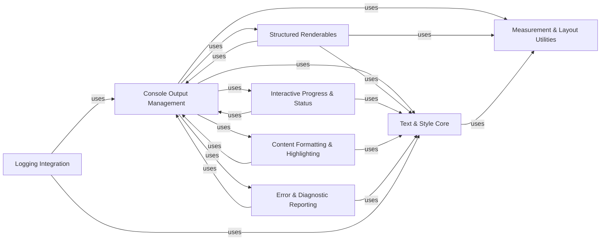

## Component Details

The Rich library provides a comprehensive set of tools for rendering rich text and complex layouts in the terminal. The main flow involves various components preparing content (Text & Style Core, Structured Renderables, Content Formatting & Highlighting, Interactive Progress & Status, Error & Diagnostic Reporting) which is then consumed and displayed by the Console Output Management component. Measurement & Layout Utilities provide foundational services for accurate rendering, and Logging Integration allows Rich to enhance standard Python logging.

### Text & Style Core
This foundational component provides the core mechanisms for representing, manipulating, and styling text within Rich. It includes classes for rich text objects, style definitions, color management, and utilities for parsing markup and ANSI codes, and calculating display cell lengths. It defines the basic data structures for styled text, manages style application and combination, handles color conversions, and provides low-level text processing (markup, ANSI, cell length).

**Related Classes/Methods**:

- <a href="https://github.com/Textualize/rich/blob/master/rich/text.py#L118-L1333" target="_blank" rel="noopener noreferrer">`rich.text.Text` (118:1333)</a>
- <a href="https://github.com/Textualize/rich/blob/master/rich/style.py#L31-L759" target="_blank" rel="noopener noreferrer">`rich.style.Style` (31:759)</a>
- <a href="https://github.com/Textualize/rich/blob/master/rich/color.py#L303-L568" target="_blank" rel="noopener noreferrer">`rich.color.Color` (303:568)</a>
- `rich.markup` (full file reference)
- `rich.ansi` (full file reference)
- `rich.cells` (full file reference)
- `rich.control` (full file reference)
- <a href="https://github.com/Textualize/rich/blob/master/rich/terminal_theme.py#L9-L29" target="_blank" rel="noopener noreferrer">`rich.terminal_theme.TerminalTheme` (9:29)</a>
- <a href="https://github.com/Textualize/rich/blob/master/rich/theme.py#L8-L73" target="_blank" rel="noopener noreferrer">`rich.theme.Theme` (8:73)</a>
- <a href="https://github.com/Textualize/rich/blob/master/rich/theme.py#L80-L110" target="_blank" rel="noopener noreferrer">`rich.theme.ThemeStack` (80:110)</a>
- <a href="https://github.com/Textualize/rich/blob/master/rich/styled.py#L11-L34" target="_blank" rel="noopener noreferrer">`rich.styled.Styled` (11:34)</a>
- <a href="https://github.com/Textualize/rich/blob/master/rich/palette.py#L11-L72" target="_blank" rel="noopener noreferrer">`rich.palette.Palette` (11:72)</a>

### Console Output Management
This central component manages all interactions with the terminal, including rendering various Rich objects, handling live updates, and managing screen buffers and cursor positions. It serves as the primary interface for displaying all Rich content. It orchestrates the rendering process, manages terminal state, handles output streams, and provides mechanisms for dynamic and interactive displays.

**Related Classes/Methods**:

- <a href="https://github.com/Textualize/rich/blob/master/rich/console.py#L593-L2607" target="_blank" rel="noopener noreferrer">`rich.console.Console` (593:2607)</a>
- <a href="https://github.com/Textualize/rich/blob/master/rich/segment.py#L64-L668" target="_blank" rel="noopener noreferrer">`rich.segment.Segment` (64:668)</a>
- <a href="https://github.com/Textualize/rich/blob/master/rich/segment.py#L671-L693" target="_blank" rel="noopener noreferrer">`rich.segment.Segments` (671:693)</a>
- <a href="https://github.com/Textualize/rich/blob/master/rich/segment.py#L696-L718" target="_blank" rel="noopener noreferrer">`rich.segment.SegmentLines` (696:718)</a>
- `rich.jupyter` (full file reference)
- <a href="https://github.com/Textualize/rich/blob/master/rich/file_proxy.py#L11-L57" target="_blank" rel="noopener noreferrer">`rich.file_proxy.FileProxy` (11:57)</a>
- <a href="https://github.com/Textualize/rich/blob/master/rich/screen.py#L18-L54" target="_blank" rel="noopener noreferrer">`rich.screen.Screen` (18:54)</a>
- <a href="https://github.com/Textualize/rich/blob/master/rich/live.py#L35-L268" target="_blank" rel="noopener noreferrer">`rich.live.Live` (35:268)</a>
- <a href="https://github.com/Textualize/rich/blob/master/rich/live_render.py#L20-L112" target="_blank" rel="noopener noreferrer">`rich.live_render.LiveRender` (20:112)</a>
- <a href="https://github.com/Textualize/rich/blob/master/rich/pager.py#L17-L25" target="_blank" rel="noopener noreferrer">`rich.pager.SystemPager` (17:25)</a>
- <a href="https://github.com/Textualize/rich/blob/master/rich/_win32_console.py#L331-L572" target="_blank" rel="noopener noreferrer">`rich._win32_console.LegacyWindowsTerm` (331:572)</a>
- <a href="https://github.com/Textualize/rich/blob/master/rich/console.py#L125-L255" target="_blank" rel="noopener noreferrer">`rich.console.ConsoleOptions` (125:255)</a>
- <a href="https://github.com/Textualize/rich/blob/master/rich/console.py#L304-L319" target="_blank" rel="noopener noreferrer">`rich.console.ScreenUpdate` (304:319)</a>
- <a href="https://github.com/Textualize/rich/blob/master/rich/console.py#L322-L352" target="_blank" rel="noopener noreferrer">`rich.console.Capture` (322:352)</a>
- <a href="https://github.com/Textualize/rich/blob/master/rich/console.py#L376-L412" target="_blank" rel="noopener noreferrer">`rich.console.PagerContext` (376:412)</a>
- <a href="https://github.com/Textualize/rich/blob/master/rich/console.py#L415-L459" target="_blank" rel="noopener noreferrer">`rich.console.ScreenContext` (415:459)</a>
- <a href="https://github.com/Textualize/rich/blob/master/rich/console.py#L462-L492" target="_blank" rel="noopener noreferrer">`rich.console.Group` (462:492)</a>
- <a href="https://github.com/Textualize/rich/blob/master/rich/console.py#L292-L301" target="_blank" rel="noopener noreferrer">`rich.console.NewLine` (292:301)</a>

### Structured Renderables
This component provides a collection of high-level classes for rendering complex, structured content such as tables, panels, columns, rules, and hierarchical trees. It also includes utilities for layout and constraining content width. It encapsulates logic for rendering common UI elements, manages their internal structure and presentation, and adapts them for console display.

**Related Classes/Methods**:

- <a href="https://github.com/Textualize/rich/blob/master/rich/table.py#L154-L926" target="_blank" rel="noopener noreferrer">`rich.table.Table` (154:926)</a>
- <a href="https://github.com/Textualize/rich/blob/master/rich/table.py#L39-L129" target="_blank" rel="noopener noreferrer">`rich.table.Column` (39:129)</a>
- <a href="https://github.com/Textualize/rich/blob/master/rich/table.py#L133-L140" target="_blank" rel="noopener noreferrer">`rich.table.Row` (133:140)</a>
- <a href="https://github.com/Textualize/rich/blob/master/rich/panel.py#L17-L298" target="_blank" rel="noopener noreferrer">`rich.panel.Panel` (17:298)</a>
- <a href="https://github.com/Textualize/rich/blob/master/rich/columns.py#L16-L171" target="_blank" rel="noopener noreferrer">`rich.columns.Columns` (16:171)</a>
- <a href="https://github.com/Textualize/rich/blob/master/rich/rule.py#L12-L114" target="_blank" rel="noopener noreferrer">`rich.rule.Rule` (12:114)</a>
- <a href="https://github.com/Textualize/rich/blob/master/rich/tree.py#L14-L201" target="_blank" rel="noopener noreferrer">`rich.tree.Tree` (14:201)</a>
- <a href="https://github.com/Textualize/rich/blob/master/rich/padding.py#L19-L135" target="_blank" rel="noopener noreferrer">`rich.padding.Padding` (19:135)</a>
- <a href="https://github.com/Textualize/rich/blob/master/rich/constrain.py#L10-L37" target="_blank" rel="noopener noreferrer">`rich.constrain.Constrain` (10:37)</a>
- <a href="https://github.com/Textualize/rich/blob/master/rich/layout.py#L142-L415" target="_blank" rel="noopener noreferrer">`rich.layout.Layout` (142:415)</a>
- <a href="https://github.com/Textualize/rich/blob/master/rich/layout.py#L51-L77" target="_blank" rel="noopener noreferrer">`rich.layout._Placeholder` (51:77)</a>
- <a href="https://github.com/Textualize/rich/blob/master/rich/layout.py#L101-L118" target="_blank" rel="noopener noreferrer">`rich.layout.RowSplitter` (101:118)</a>
- <a href="https://github.com/Textualize/rich/blob/master/rich/layout.py#L121-L138" target="_blank" rel="noopener noreferrer">`rich.layout.ColumnSplitter` (121:138)</a>
- <a href="https://github.com/Textualize/rich/blob/master/rich/layout.py#L47-L48" target="_blank" rel="noopener noreferrer">`rich.layout.NoSplitter` (47:48)</a>
- <a href="https://github.com/Textualize/rich/blob/master/rich/containers.py#L66-L167" target="_blank" rel="noopener noreferrer">`rich.containers.Lines` (66:167)</a>
- <a href="https://github.com/Textualize/rich/blob/master/rich/containers.py#L30-L63" target="_blank" rel="noopener noreferrer">`rich.containers.Renderables` (30:63)</a>

### Interactive Progress & Status
This component facilitates user interaction and provides visual feedback mechanisms within the terminal. This includes displaying dynamic progress bars for long-running tasks, showing status indicators with animated spinners, and handling interactive user input prompts. It manages the state and display of interactive elements, provides visual cues for ongoing processes, and handles user input.

**Related Classes/Methods**:

- <a href="https://github.com/Textualize/rich/blob/master/rich/progress.py#L1063-L1650" target="_blank" rel="noopener noreferrer">`rich.progress.Progress` (1063:1650)</a>
- <a href="https://github.com/Textualize/rich/blob/master/rich/progress.py#L509-L548" target="_blank" rel="noopener noreferrer">`rich.progress.ProgressColumn` (509:548)</a>
- <a href="https://github.com/Textualize/rich/blob/master/rich/progress.py#L551-L565" target="_blank" rel="noopener noreferrer">`rich.progress.RenderableColumn` (551:565)</a>
- <a href="https://github.com/Textualize/rich/blob/master/rich/progress.py#L568-L615" target="_blank" rel="noopener noreferrer">`rich.progress.SpinnerColumn` (568:615)</a>
- <a href="https://github.com/Textualize/rich/blob/master/rich/progress.py#L618-L645" target="_blank" rel="noopener noreferrer">`rich.progress.TextColumn` (618:645)</a>
- <a href="https://github.com/Textualize/rich/blob/master/rich/progress.py#L648-L687" target="_blank" rel="noopener noreferrer">`rich.progress.BarColumn` (648:687)</a>
- <a href="https://github.com/Textualize/rich/blob/master/rich/progress.py#L690-L699" target="_blank" rel="noopener noreferrer">`rich.progress.TimeElapsedColumn` (690:699)</a>
- <a href="https://github.com/Textualize/rich/blob/master/rich/progress.py#L702-L771" target="_blank" rel="noopener noreferrer">`rich.progress.TaskProgressColumn` (702:771)</a>
- <a href="https://github.com/Textualize/rich/blob/master/rich/progress.py#L774-L819" target="_blank" rel="noopener noreferrer">`rich.progress.TimeRemainingColumn` (774:819)</a>
- <a href="https://github.com/Textualize/rich/blob/master/rich/progress.py#L822-L828" target="_blank" rel="noopener noreferrer">`rich.progress.FileSizeColumn` (822:828)</a>
- <a href="https://github.com/Textualize/rich/blob/master/rich/progress.py#L831-L837" target="_blank" rel="noopener noreferrer">`rich.progress.TotalFileSizeColumn` (831:837)</a>
- <a href="https://github.com/Textualize/rich/blob/master/rich/progress.py#L840-L864" target="_blank" rel="noopener noreferrer">`rich.progress.MofNCompleteColumn` (840:864)</a>
- <a href="https://github.com/Textualize/rich/blob/master/rich/progress.py#L867-L913" target="_blank" rel="noopener noreferrer">`rich.progress.DownloadColumn` (867:913)</a>
- <a href="https://github.com/Textualize/rich/blob/master/rich/progress.py#L916-L925" target="_blank" rel="noopener noreferrer">`rich.progress.TransferSpeedColumn` (916:925)</a>
- <a href="https://github.com/Textualize/rich/blob/master/rich/progress.py#L938-L1060" target="_blank" rel="noopener noreferrer">`rich.progress.Task` (938:1060)</a>
- <a href="https://github.com/Textualize/rich/blob/master/rich/progress.py#L184-L284" target="_blank" rel="noopener noreferrer">`rich.progress._Reader` (184:284)</a>
- <a href="https://github.com/Textualize/rich/blob/master/rich/progress.py#L287-L305" target="_blank" rel="noopener noreferrer">`rich.progress._ReadContext` (287:305)</a>
- <a href="https://github.com/Textualize/rich/blob/master/rich/progress.py#L68-L105" target="_blank" rel="noopener noreferrer">`rich.progress._TrackThread` (68:105)</a>
- <a href="https://github.com/Textualize/rich/blob/master/rich/status.py#L11-L106" target="_blank" rel="noopener noreferrer">`rich.status.Status` (11:106)</a>
- <a href="https://github.com/Textualize/rich/blob/master/rich/spinner.py#L13-L114" target="_blank" rel="noopener noreferrer">`rich.spinner.Spinner` (13:114)</a>
- <a href="https://github.com/Textualize/rich/blob/master/rich/prompt.py#L30-L301" target="_blank" rel="noopener noreferrer">`rich.prompt.PromptBase` (30:301)</a>
- <a href="https://github.com/Textualize/rich/blob/master/rich/prompt.py#L340-L363" target="_blank" rel="noopener noreferrer">`rich.prompt.Confirm` (340:363)</a>
- <a href="https://github.com/Textualize/rich/blob/master/rich/prompt.py#L15-L27" target="_blank" rel="noopener noreferrer">`rich.prompt.InvalidResponse` (15:27)</a>

### Content Formatting & Highlighting
This component offers specialized tools for formatting and highlighting various types of content, including pretty-printing Python objects, applying syntax highlighting to code, rendering Markdown text, displaying local variables, and handling emoji rendering. It parses and transforms raw content into richly formatted and styled output suitable for console display.

**Related Classes/Methods**:

- <a href="https://github.com/Textualize/rich/blob/master/rich/pretty.py#L253-L354" target="_blank" rel="noopener noreferrer">`rich.pretty.Pretty` (253:354)</a>
- <a href="https://github.com/Textualize/rich/blob/master/rich/pretty.py#L409-L490" target="_blank" rel="noopener noreferrer">`rich.pretty.Node` (409:490)</a>
- <a href="https://github.com/Textualize/rich/blob/master/rich/pretty.py#L494-L558" target="_blank" rel="noopener noreferrer">`rich.pretty._Line` (494:558)</a>
- <a href="https://github.com/Textualize/rich/blob/master/rich/syntax.py#L227-L819" target="_blank" rel="noopener noreferrer">`rich.syntax.Syntax` (227:819)</a>
- <a href="https://github.com/Textualize/rich/blob/master/rich/syntax.py#L136-L175" target="_blank" rel="noopener noreferrer">`rich.syntax.PygmentsSyntaxTheme` (136:175)</a>
- <a href="https://github.com/Textualize/rich/blob/master/rich/syntax.py#L178-L208" target="_blank" rel="noopener noreferrer">`rich.syntax.ANSISyntaxTheme` (178:208)</a>
- <a href="https://github.com/Textualize/rich/blob/master/rich/markdown.py#L503-L686" target="_blank" rel="noopener noreferrer">`rich.markdown.Markdown` (503:686)</a>
- <a href="https://github.com/Textualize/rich/blob/master/rich/markdown.py#L30-L84" target="_blank" rel="noopener noreferrer">`rich.markdown.MarkdownElement` (30:84)</a>
- <a href="https://github.com/Textualize/rich/blob/master/rich/markdown.py#L96-L109" target="_blank" rel="noopener noreferrer">`rich.markdown.TextElement` (96:109)</a>
- <a href="https://github.com/Textualize/rich/blob/master/rich/markdown.py#L112-L129" target="_blank" rel="noopener noreferrer">`rich.markdown.Paragraph` (112:129)</a>
- <a href="https://github.com/Textualize/rich/blob/master/rich/markdown.py#L132-L164" target="_blank" rel="noopener noreferrer">`rich.markdown.Heading` (132:164)</a>
- <a href="https://github.com/Textualize/rich/blob/master/rich/markdown.py#L167-L189" target="_blank" rel="noopener noreferrer">`rich.markdown.CodeBlock` (167:189)</a>
- <a href="https://github.com/Textualize/rich/blob/master/rich/markdown.py#L192-L215" target="_blank" rel="noopener noreferrer">`rich.markdown.BlockQuote` (192:215)</a>
- <a href="https://github.com/Textualize/rich/blob/master/rich/markdown.py#L218-L227" target="_blank" rel="noopener noreferrer">`rich.markdown.HorizontalRule` (218:227)</a>
- <a href="https://github.com/Textualize/rich/blob/master/rich/markdown.py#L230-L260" target="_blank" rel="noopener noreferrer">`rich.markdown.TableElement` (230:260)</a>
- <a href="https://github.com/Textualize/rich/blob/master/rich/markdown.py#L299-L327" target="_blank" rel="noopener noreferrer">`rich.markdown.TableDataElement` (299:327)</a>
- <a href="https://github.com/Textualize/rich/blob/master/rich/markdown.py#L330-L359" target="_blank" rel="noopener noreferrer">`rich.markdown.ListElement` (330:359)</a>
- <a href="https://github.com/Textualize/rich/blob/master/rich/markdown.py#L362-L401" target="_blank" rel="noopener noreferrer">`rich.markdown.ListItem` (362:401)</a>
- <a href="https://github.com/Textualize/rich/blob/master/rich/markdown.py#L404-L412" target="_blank" rel="noopener noreferrer">`rich.markdown.Link` (404:412)</a>
- <a href="https://github.com/Textualize/rich/blob/master/rich/markdown.py#L415-L452" target="_blank" rel="noopener noreferrer">`rich.markdown.ImageItem` (415:452)</a>
- <a href="https://github.com/Textualize/rich/blob/master/rich/markdown.py#L455-L500" target="_blank" rel="noopener noreferrer">`rich.markdown.MarkdownContext` (455:500)</a>
- <a href="https://github.com/Textualize/rich/blob/master/rich/scope.py#L14-L67" target="_blank" rel="noopener noreferrer">`rich.scope.render_scope` (14:67)</a>
- <a href="https://github.com/Textualize/rich/blob/master/rich/emoji.py#L27-L78" target="_blank" rel="noopener noreferrer">`rich.emoji.Emoji` (27:78)</a>
- `rich.filesize` (full file reference)
- <a href="https://github.com/Textualize/rich/blob/master/rich/highlighter.py#L17-L47" target="_blank" rel="noopener noreferrer">`rich.highlighter.Highlighter` (17:47)</a>
- <a href="https://github.com/Textualize/rich/blob/master/rich/highlighter.py#L106-L140" target="_blank" rel="noopener noreferrer">`rich.highlighter.JSONHighlighter` (106:140)</a>
- <a href="https://github.com/Textualize/rich/blob/master/rich/highlighter.py#L80-L103" target="_blank" rel="noopener noreferrer">`rich.highlighter.ReprHighlighter` (80:103)</a>
- <a href="https://github.com/Textualize/rich/blob/master/rich/highlighter.py#L50-L58" target="_blank" rel="noopener noreferrer">`rich.highlighter.NullHighlighter` (50:58)</a>
- <a href="https://github.com/Textualize/rich/blob/master/rich/json.py#L9-L102" target="_blank" rel="noopener noreferrer">`rich.json.JSON` (9:102)</a>
- <a href="https://github.com/Textualize/rich/blob/master/rich/_inspect.py#L21-L233" target="_blank" rel="noopener noreferrer">`rich._inspect.Inspect` (21:233)</a>

### Error & Diagnostic Reporting
This component provides enhanced error reporting capabilities, specifically for rendering rich and readable tracebacks. It also includes tools for gathering diagnostic information about the Rich environment and defining custom exceptions used throughout the library. It formats error information for clarity, provides debugging utilities, and defines library-specific error types.

**Related Classes/Methods**:

- <a href="https://github.com/Textualize/rich/blob/master/rich/traceback.py#L252-L855" target="_blank" rel="noopener noreferrer">`rich.traceback.Traceback` (252:855)</a>
- <a href="https://github.com/Textualize/rich/blob/master/rich/traceback.py#L232-L240" target="_blank" rel="noopener noreferrer">`rich.traceback.Stack` (232:240)</a>
- <a href="https://github.com/Textualize/rich/blob/master/rich/traceback.py#L212-L218" target="_blank" rel="noopener noreferrer">`rich.traceback.Frame` (212:218)</a>
- <a href="https://github.com/Textualize/rich/blob/master/rich/traceback.py#L244-L245" target="_blank" rel="noopener noreferrer">`rich.traceback.Trace` (244:245)</a>
- <a href="https://github.com/Textualize/rich/blob/master/rich/traceback.py#L222-L228" target="_blank" rel="noopener noreferrer">`rich.traceback._SyntaxError` (222:228)</a>
- <a href="https://github.com/Textualize/rich/blob/master/rich/traceback.py#L248-L249" target="_blank" rel="noopener noreferrer">`rich.traceback.PathHighlighter` (248:249)</a>
- `rich.diagnose` (full file reference)
- `rich.errors` (full file reference)

### Measurement & Layout Utilities
This component contains utilities for measuring the dimensions and characteristics of renderable objects, and for aligning content horizontally and vertically. These measurements and alignment functions are crucial for accurate layout and rendering calculations across various Rich components. It provides foundational services for calculating display metrics and positioning content.

**Related Classes/Methods**:

- <a href="https://github.com/Textualize/rich/blob/master/rich/measure.py#L11-L122" target="_blank" rel="noopener noreferrer">`rich.measure.Measurement` (11:122)</a>
- <a href="https://github.com/Textualize/rich/blob/master/rich/measure.py#L125-L151" target="_blank" rel="noopener noreferrer">`rich.measure.measure_renderables` (125:151)</a>
- <a href="https://github.com/Textualize/rich/blob/master/rich/protocol.py#L10-L16" target="_blank" rel="noopener noreferrer">`rich.protocol.is_renderable` (10:16)</a>
- <a href="https://github.com/Textualize/rich/blob/master/rich/protocol.py#L19-L42" target="_blank" rel="noopener noreferrer">`rich.protocol.rich_cast` (19:42)</a>
- <a href="https://github.com/Textualize/rich/blob/master/rich/align.py#L23-L231" target="_blank" rel="noopener noreferrer">`rich.align.Align` (23:231)</a>
- <a href="https://github.com/Textualize/rich/blob/master/rich/align.py#L234-L288" target="_blank" rel="noopener noreferrer">`rich.align.VerticalCenter` (234:288)</a>

### Logging Integration
This component offers a custom logging handler that seamlessly integrates Rich's powerful rendering capabilities into Python's standard logging module, allowing for richly formatted and styled log output directly to the console. It adapts standard Python logging to leverage Rich's display features.

**Related Classes/Methods**:

- <a href="https://github.com/Textualize/rich/blob/master/rich/logging.py#L18-L239" target="_blank" rel="noopener noreferrer">`rich.logging.RichHandler` (18:239)</a>
- <a href="https://github.com/Textualize/rich/blob/master/rich/_log_render.py#L14-L86" target="_blank" rel="noopener noreferrer">`rich._log_render.LogRender` (14:86)</a>

### [FAQ](https://github.com/CodeBoarding/GeneratedOnBoardings/tree/main?tab=readme-ov-file#faq)