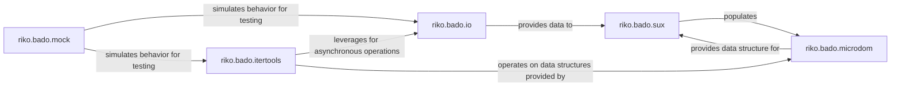

## Details

The `Asynchronous I/O & Concurrency Layer (BADO)` subsystem provides the foundational infrastructure for non-blocking I/O and concurrent data processing within `riko`, leveraging the Twisted framework. It is essential for handling network requests and efficient stream processing in a data-flow oriented architecture.

### riko.bado.io
Manages non-blocking network operations, primarily for opening and reading from URLs. It handles the lifecycle of asynchronous connections, including establishment, data reception, and cleanup. This component is crucial for a Stream Processing Engine, enabling it to ingest data from various sources asynchronously.

**Related Classes/Methods**:

- <a href="https://github.com/nerevu/riko/blob/master/riko/bado/io.py" target="_blank" rel="noopener noreferrer">`riko.bado.io`</a>

### riko.bado.itertools
Provides asynchronous primitives for data processing, such as `map`, `reduce`, `dispatch`, and `broadcast`. These utilities enable concurrent execution of tasks, which is fundamental for a Data Processing Library and Stream Processing Engine to handle high throughput and parallel operations efficiently.

**Related Classes/Methods**:

- <a href="https://github.com/nerevu/riko/blob/master/riko/bado/itertools.py" target="_blank" rel="noopener noreferrer">`riko.bado.itertools`</a>

### riko.bado.sux
Performs incremental parsing of XML/HTML data streams. It processes incoming data chunk by chunk, identifying structural elements (tags, attributes, text) and managing the parsing state. This component is vital for a Stream Processing Engine that needs to process structured web data on the fly without loading entire documents into memory.

**Related Classes/Methods**:

- <a href="https://github.com/nerevu/riko/blob/master/riko/bado/sux.py" target="_blank" rel="noopener noreferrer">`riko.bado.sux`</a>

### riko.bado.microdom
Offers a lightweight, in-memory representation of XML/HTML documents. It allows for the programmatic creation, manipulation, and serialization of DOM nodes and provides methods for querying the document structure. This component supports the `riko.bado.sux` parser by providing the data structure for the parsed output, essential for a Data Processing Library dealing with structured data.

**Related Classes/Methods**:

- <a href="https://github.com/nerevu/riko/blob/master/riko/bado/microdom.py" target="_blank" rel="noopener noreferrer">`riko.bado.microdom`</a>

### riko.bado.mock
Provides utilities for testing asynchronous code, specifically for simulating delayed function calls and network operations. While not a core functional component of the data processing pipeline, it is a critical support component for developing and testing the robustness and reliability of the Asynchronous I/O and Concurrency Layer.

**Related Classes/Methods**:

- <a href="https://github.com/nerevu/riko/blob/master/riko/bado/mock.py" target="_blank" rel="noopener noreferrer">`riko.bado.mock`</a>

### [FAQ](https://github.com/CodeBoarding/GeneratedOnBoardings/tree/main?tab=readme-ov-file#faq)