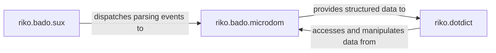

## Details

The `Data Structuring & Parsing Utilities` subsystem encompasses the core functionalities for ingesting raw data (XML, HTML, plain text), parsing it into an event stream, constructing an in-memory hierarchical representation, and providing a user-friendly interface for accessing and manipulating this structured data. This subsystem acts as the initial data transformation layer within the `riko` project, preparing raw input for further processing by other components.

### riko.bado.sux
This component is the primary entry point for raw, unstructured data. It efficiently performs low-level parsing and tokenization of various structured text formats (e.g., XML, HTML). Its core responsibility is to transform the raw input into a stream of parsing events, adhering to the "Stream Processing Engine" and "Iterator Pattern" architectural biases by emitting events as data flows.

**Related Classes/Methods**:

- <a href="https://github.com/nerevu/riko/blob/master/riko/bado/sux.py" target="_blank" rel="noopener noreferrer">`riko.bado.sux`</a>

### riko.bado.microdom
Acting as an intermediary, this component consumes the parsing events generated by `riko.bado.sux`. It then constructs a lightweight, hierarchical in-memory Document Object Model (DOM) tree. This micro-DOM provides a structured, traversable representation of the parsed data, embodying the "Data Model" aspect of the project's expected components. It's crucial for transforming event streams into a coherent data structure.

**Related Classes/Methods**:

- <a href="https://github.com/nerevu/riko/blob/master/riko/bado/microdom.py" target="_blank" rel="noopener noreferrer">`riko.bado.microdom`</a>

### riko.dotdict
This component offers a convenient and Pythonic `DotDict` interface. Its purpose is to simplify programmatic access and manipulation of nested data structures, typically the micro-DOM tree produced by `riko.bado.microdom`. It enhances the usability of the parsed data, aligning with the "Modular and Composable" and "Separation of Concerns" architectural patterns by providing a clean abstraction over the underlying data structure.

**Related Classes/Methods**:

- <a href="https://github.com/nerevu/riko/blob/master/riko/dotdict.py" target="_blank" rel="noopener noreferrer">`riko.dotdict`</a>

### [FAQ](https://github.com/CodeBoarding/GeneratedOnBoardings/tree/main?tab=readme-ov-file#faq)