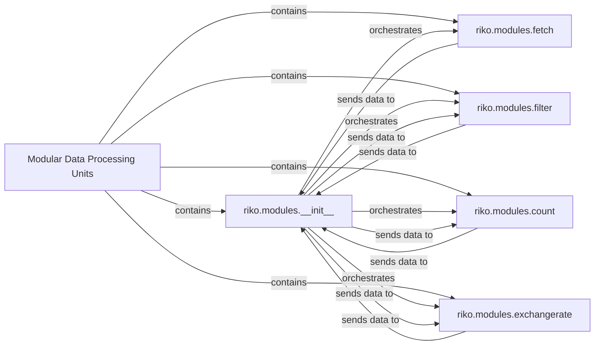

## Details

The riko.modules subsystem provides a modular and extensible framework for constructing data processing pipelines. At its core, riko.modules.__init__ acts as the central orchestrator, defining the processor and operator decorators that transform functions into reusable data "pipes." These pipes, exemplified by modules such as riko.modules.fetch (for data acquisition), riko.modules.filter (for data refinement), riko.modules.count (for data aggregation), and riko.modules.exchangerate (for specialized data transformation), interact by sending data streams through the central orchestration layer provided by riko.modules.__init__. This architecture enables flexible construction of data pipelines where modules can be chained together to perform complex data transformations.

### Modular Data Processing Units [[Expand]](./Modular_Data_Processing_Units.md)
The overarching logical container for all individual data processing modules within `riko`. It embodies the modular and plugin architecture, allowing for extensible data pipeline construction.

**Related Classes/Methods**:

- <a href="https://github.com/nerevu/riko/blob/master/riko/modules/__init__.py" target="_blank" rel="noopener noreferrer">`riko.modules`</a>

### riko.modules.__init__
This component serves as the central dispatcher and orchestrator for the entire module system. Its `processor` class acts as a decorator, transforming functions into data processing "pipes." It also categorizes and registers different module types (sources, aggregators, composers, transformers), effectively controlling how data moves through the pipeline by applying these decorated functions. It is the embodiment of the "Core Engine / Flow Orchestrator" pattern within this subsystem.

**Related Classes/Methods**:

- <a href="https://github.com/nerevu/riko/blob/master/riko/modules/__init__.py#L126-L374" target="_blank" rel="noopener noreferrer">`riko.modules.__init__.processor`:126-374</a>
- <a href="https://github.com/nerevu/riko/blob/master/riko/modules/__init__.py#L90-L116" target="_blank" rel="noopener noreferrer">`riko.modules.__init__.get_assignment`:90-116</a>
- <a href="https://github.com/nerevu/riko/blob/master/riko/modules/__init__.py#L119-L123" target="_blank" rel="noopener noreferrer">`riko.modules.__init__.assign`:119-123</a>

### riko.modules.fetch
Responsible for handling general data fetching operations from various external or internal sources. This component aligns with the "Data Sources / Connectors" aspect, providing the initial data for processing pipelines through its `pipe` (and `async_pipe`) functions, which are decorated by `riko.modules.__init__.processor`.

**Related Classes/Methods**:

- <a href="https://github.com/nerevu/riko/blob/master/riko/modules/fetch.py#L175-L206" target="_blank" rel="noopener noreferrer">`riko.modules.fetch.pipe`:175-206</a>
- <a href="https://github.com/nerevu/riko/blob/master/riko/modules/fetch.py#L132-L172" target="_blank" rel="noopener noreferrer">`riko.modules.fetch.async_pipe`:132-172</a>
- <a href="https://github.com/nerevu/riko/blob/master/riko/modules/fetch.py#L98-L129" target="_blank" rel="noopener noreferrer">`riko.modules.fetch.parser`:98-129</a>
- <a href="https://github.com/nerevu/riko/blob/master/riko/modules/fetch.py#L51-L95" target="_blank" rel="noopener noreferrer">`riko.modules.fetch.async_parser`:51-95</a>

### riko.modules.filter
Applies filtering rules and logic to incoming data streams. This is a fundamental "Data Transformation" unit, allowing pipelines to refine data based on specific criteria. Its `pipe` (and `async_pipe`) functions are decorated by `riko.modules.operator` (which is conceptually similar to `processor` for transformation modules).

**Related Classes/Methods**:

- <a href="https://github.com/nerevu/riko/blob/master/riko/modules/filter.py#L225-L278" target="_blank" rel="noopener noreferrer">`riko.modules.filter.pipe`:225-278</a>
- <a href="https://github.com/nerevu/riko/blob/master/riko/modules/filter.py#L167-L222" target="_blank" rel="noopener noreferrer">`riko.modules.filter.async_pipe`:167-222</a>
- <a href="https://github.com/nerevu/riko/blob/master/riko/modules/filter.py#L108-L164" target="_blank" rel="noopener noreferrer">`riko.modules.filter.parser`:108-164</a>
- <a href="https://github.com/nerevu/riko/blob/master/riko/modules/filter.py#L82-L105" target="_blank" rel="noopener noreferrer">`riko.modules.filter.parse_rule`:82-105</a>

### riko.modules.count
Performs counting and aggregation operations on data streams. As a specialized "Data Transformation" unit, it exemplifies how `riko` modules can perform specific analytical tasks within a pipeline. Its `pipe` (and `async_pipe`) functions are decorated by `riko.modules.operator`.

**Related Classes/Methods**:

- <a href="https://github.com/nerevu/riko/blob/master/riko/modules/count.py#L126-L160" target="_blank" rel="noopener noreferrer">`riko.modules.count.pipe`:126-160</a>
- <a href="https://github.com/nerevu/riko/blob/master/riko/modules/count.py#L82-L123" target="_blank" rel="noopener noreferrer">`riko.modules.count.async_pipe`:82-123</a>
- <a href="https://github.com/nerevu/riko/blob/master/riko/modules/count.py#L32-L79" target="_blank" rel="noopener noreferrer">`riko.modules.count.parser`:32-79</a>

### riko.modules.exchangerate
A specialized module for fetching and calculating currency exchange rates. It demonstrates the extensibility of the `Modular Data Processing Units` by providing domain-specific data transformation capabilities through its `pipe` (and `async_pipe`) functions, which are decorated by `riko.modules.__init__.processor`.

**Related Classes/Methods**:

- <a href="https://github.com/nerevu/riko/blob/master/riko/modules/exchangerate.py#L261-L313" target="_blank" rel="noopener noreferrer">`riko.modules.exchangerate.pipe`:261-313</a>
- <a href="https://github.com/nerevu/riko/blob/master/riko/modules/exchangerate.py#L205-L258" target="_blank" rel="noopener noreferrer">`riko.modules.exchangerate.async_pipe`:205-258</a>
- <a href="https://github.com/nerevu/riko/blob/master/riko/modules/exchangerate.py#L148-L202" target="_blank" rel="noopener noreferrer">`riko.modules.exchangerate.parser`:148-202</a>
- <a href="https://github.com/nerevu/riko/blob/master/riko/modules/exchangerate.py#L86-L145" target="_blank" rel="noopener noreferrer">`riko.modules.exchangerate.async_parser`:86-145</a>

### [FAQ](https://github.com/CodeBoarding/GeneratedOnBoardings/tree/main?tab=readme-ov-file#faq)