```mermaid
graph LR
    riko_collections_Pipeline_Orchestrator_["riko.collections (Pipeline Orchestrator)"]
    riko_collections_SyncPipe_Synchronous_Pipeline_Executor_["riko.collections.SyncPipe (Synchronous Pipeline Executor)"]
    riko_collections_AsyncPipe_Asynchronous_Pipeline_Executor_["riko.collections.AsyncPipe (Asynchronous Pipeline Executor)"]
    riko_collections_fetch_Synchronous_Data_Source_["riko.collections.fetch (Synchronous Data Source)"]
    riko_collections_async_fetch_Asynchronous_Data_Source_["riko.collections.async_fetch (Asynchronous Data Source)"]
    riko_collections_output_Data_Sink_Result_Handler_["riko.collections.output (Data Sink/Result Handler)"]
    riko_collections_Pipeline_Orchestrator_ -- "Initiates & Orchestrates" --> riko_collections_SyncPipe_Synchronous_Pipeline_Executor_
    riko_collections_Pipeline_Orchestrator_ -- "Initiates & Orchestrates" --> riko_collections_AsyncPipe_Asynchronous_Pipeline_Executor_
    riko_collections_Pipeline_Orchestrator_ -- "Calls" --> riko_collections_fetch_Synchronous_Data_Source_
    riko_collections_Pipeline_Orchestrator_ -- "Calls" --> riko_collections_async_fetch_Asynchronous_Data_Source_
    riko_collections_SyncPipe_Synchronous_Pipeline_Executor_ -- "Sends Processed Data To" --> riko_collections_output_Data_Sink_Result_Handler_
    riko_collections_AsyncPipe_Asynchronous_Pipeline_Executor_ -- "Sends Processed Data To" --> riko_collections_output_Data_Sink_Result_Handler_
    riko_collections_fetch_Synchronous_Data_Source_ -- "Provides Data To" --> riko_collections_SyncPipe_Synchronous_Pipeline_Executor_
    riko_collections_async_fetch_Asynchronous_Data_Source_ -- "Provides Data To" --> riko_collections_AsyncPipe_Asynchronous_Pipeline_Executor_
    riko_collections_output_Data_Sink_Result_Handler_ -- "Receives Data From" --> riko_collections_SyncPipe_Synchronous_Pipeline_Executor_
    riko_collections_output_Data_Sink_Result_Handler_ -- "Receives Data From" --> riko_collections_AsyncPipe_Asynchronous_Pipeline_Executor_
```

## Details

The Pipeline Orchestration Core subsystem is the central nervous system for defining, managing, and executing data processing pipelines within the riko project. It controls the flow of data and orchestrates the execution of various processing units, aligning with the project's nature as a Data Processing Library and Stream Processing Engine.

### riko.collections (Pipeline Orchestrator)
The core engine responsible for defining, configuring, and initiating data pipelines. It manages global pipeline settings and delegates execution to specific pipeline executors. This aligns with the "Core Engine / Flow Orchestrator" pattern.

**Related Classes/Methods**:

- <a href="https://github.com/nerevu/riko/blob/master/riko/collections.py" target="_blank" rel="noopener noreferrer">`riko.collections`</a>

### riko.collections.SyncPipe (Synchronous Pipeline Executor)
Handles the sequential and synchronous execution of pipeline stages, ensuring ordered processing. This component embodies the "Pipeline / Chain of Responsibility" pattern for synchronous flows.

**Related Classes/Methods**:

- <a href="https://github.com/nerevu/riko/blob/master/riko/collections.py#L116-L180" target="_blank" rel="noopener noreferrer">`riko.collections.SyncPipe`:116-180</a>

### riko.collections.AsyncPipe (Asynchronous Pipeline Executor)
Manages concurrent and asynchronous execution of pipeline stages, optimized for I/O-bound operations and higher throughput, crucial for a "Stream Processing Engine".

**Related Classes/Methods**:

- <a href="https://github.com/nerevu/riko/blob/master/riko/collections.py#L227-L267" target="_blank" rel="noopener noreferrer">`riko.collections.AsyncPipe`:227-267</a>

### riko.collections.fetch (Synchronous Data Source)
Acts as the entry point for data into synchronous pipelines, retrieving data from various sources. This component aligns with the "Data Sources / Connectors" pattern.

**Related Classes/Methods**:

- <a href="https://github.com/nerevu/riko/blob/master/riko/collections.py#L212-L216" target="_blank" rel="noopener noreferrer">`riko.collections.fetch`:212-216</a>

### riko.collections.async_fetch (Asynchronous Data Source)
Retrieves data asynchronously, designed for efficient data ingestion into asynchronous pipelines. This also aligns with the "Data Sources / Connectors" pattern.

**Related Classes/Methods**:

- <a href="https://github.com/nerevu/riko/blob/master/riko/collections.py#L277-L282" target="_blank" rel="noopener noreferrer">`riko.collections.async_fetch`:277-282</a>

### riko.collections.output (Data Sink/Result Handler)
Manages the final disposition of processed data, including writing to destinations or returning results, serving as the "Data Sink" for pipelines.

**Related Classes/Methods**:

- <a href="https://github.com/nerevu/riko/blob/master/riko/collections.py" target="_blank" rel="noopener noreferrer">`riko.collections.output`</a>

### [FAQ](https://github.com/CodeBoarding/GeneratedOnBoardings/tree/main?tab=readme-ov-file#faq)