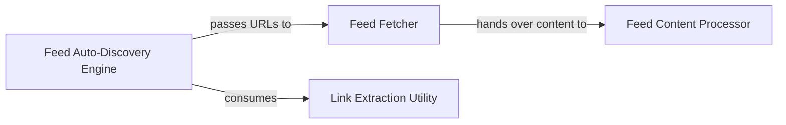

## Details

The `riko` feed processing subsystem is designed as a streamlined pipeline for discovering, fetching, and transforming RSS/Atom feed data. The **Feed Auto-Discovery Engine** initiates the process by identifying feed URLs from web sources, leveraging the **Link Extraction Utility** for efficient parsing. Discovered URLs are then passed to the **Feed Fetcher**, which is responsible for retrieving the raw feed content from various sources, including network and local files. Finally, the raw content is handed off to the **Feed Content Processor**, which transforms it into structured feed entries, making the data ready for further consumption or analysis. This architecture emphasizes modularity and clear separation of concerns, facilitating efficient and scalable feed processing.

### Feed Auto-Discovery Engine
This component is the entry point for automatic feed identification. It scans web pages or documents to discover potential RSS/Atom feed URLs, acting as a crucial initial stage in the data processing pipeline. It embodies the "Stream Processing Engine" and "Pipeline" patterns by identifying data sources for subsequent processing.

**Related Classes/Methods**:

- <a href="https://github.com/nerevu/riko/blob/master/riko/modules/feedautodiscovery.py#L160-L182" target="_blank" rel="noopener noreferrer">`riko.modules.feedautodiscovery.pipe`:160-182</a>
- <a href="https://github.com/nerevu/riko/blob/master/riko/modules/feedautodiscovery.py#L123-L157" target="_blank" rel="noopener noreferrer">`riko.modules.feedautodiscovery.async_pipe`:123-157</a>

### Feed Fetcher
Responsible for orchestrating the retrieval of raw RSS/Atom feed content. It supports fetching from both network URLs (HTTP/HTTPS) and local files, serving as the primary data source connector for the feed processing pipeline. This component aligns with the "Data Sources / Connectors" pattern.

**Related Classes/Methods**:

- <a href="https://github.com/nerevu/riko/blob/master/riko/autorss.py#L65-L73" target="_blank" rel="noopener noreferrer">`riko.autorss.async_get_rss`:65-73</a>
- <a href="https://github.com/nerevu/riko/blob/master/riko/autorss.py#L76-L87" target="_blank" rel="noopener noreferrer">`riko.autorss.get_rss`:76-87</a>
- <a href="https://github.com/nerevu/riko/blob/master/riko/autorss.py#L38-L43" target="_blank" rel="noopener noreferrer">`riko.autorss.file2entries`:38-43</a>

### Feed Content Processor
Transforms raw document content (e.g., XML, HTML) into structured feed entries. This component handles the detailed parsing logic, extracting relevant information such as titles, links, descriptions, and publication dates. It represents the core "Data Transformation" aspect of the library, fitting the "Pipe Library / Modules" pattern.

**Related Classes/Methods**:

- <a href="https://github.com/nerevu/riko/blob/master/riko/autorss.py#L46-L62" target="_blank" rel="noopener noreferrer">`riko.autorss.doc2entries`:46-62</a>

### Link Extraction Utility
A foundational parsing tool specifically used to identify and extract potential feed URLs from various document types. It exemplifies the "Modular / Plugin Architecture" by providing a reusable parsing capability.

**Related Classes/Methods**:

- <a href="https://github.com/nerevu/riko/blob/master/riko/autorss.py#L22-L35" target="_blank" rel="noopener noreferrer">`riko.autorss.LinkParser`:22-35</a>

### [FAQ](https://github.com/CodeBoarding/GeneratedOnBoardings/tree/main?tab=readme-ov-file#faq)