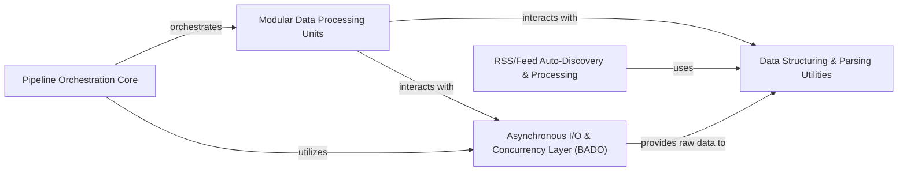

## Details

The `riko` project functions as a robust data processing library, enabling the creation and execution of data pipelines. Its core strength lies in its modular design, where the `Pipeline Orchestration Core` manages the flow of data through various `Modular Data Processing Units`. These units, which perform specific transformations and filtering, leverage the `Asynchronous I/O & Concurrency Layer (BADO)` for efficient, non-blocking data fetching and stream processing. Raw data is then channeled to the `Data Structuring & Parsing Utilities` for conversion into a structured format, with a specialized `RSS/Feed Auto-Discovery & Processing` component handling syndicated content. This architecture facilitates a clear data flow, from ingestion and parsing to transformation and output, making it ideal for both batch and stream-based data processing.

### Pipeline Orchestration Core [[Expand]](./Pipeline_Orchestration_Core.md)
The central component for defining, managing, and executing data processing pipelines. It controls the flow of data and orchestrates the execution of processing units.

**Related Classes/Methods**:

- <a href="https://github.com/nerevu/riko/blob/master/riko/collections.py" target="_blank" rel="noopener noreferrer">`riko.collections`</a>

### Modular Data Processing Units [[Expand]](./Modular_Data_Processing_Units.md)
A collection of independent, pluggable modules for data transformation, filtering, and manipulation. These are the building blocks of `riko` pipelines.

**Related Classes/Methods**:

- <a href="https://github.com/nerevu/riko/blob/master/riko/modules/" target="_blank" rel="noopener noreferrer">`riko.modules`</a>

### Asynchronous I/O & Concurrency Layer (BADO) [[Expand]](./Asynchronous_I_O_Concurrency_Layer_BADO_.md)
Provides the underlying infrastructure for asynchronous I/O and concurrent data processing, leveraging Twisted. Essential for non-blocking network requests and efficient stream processing.

**Related Classes/Methods**:

- <a href="https://github.com/nerevu/riko/blob/master/riko/bado/" target="_blank" rel="noopener noreferrer">`riko.bado`</a>

### Data Structuring & Parsing Utilities [[Expand]](./Data_Structuring_Parsing_Utilities.md)
Core utilities for parsing raw data formats (XML, HTML, text) and transforming them into a structured, traversable format (e.g., `DotDict`).

**Related Classes/Methods**:

- <a href="https://github.com/nerevu/riko/blob/master/riko/dotdict.py" target="_blank" rel="noopener noreferrer">`riko.dotdict`</a>
- <a href="https://github.com/nerevu/riko/blob/master/riko/bado/microdom.py" target="_blank" rel="noopener noreferrer">`riko.bado.microdom`</a>
- <a href="https://github.com/nerevu/riko/blob/master/riko/bado/sux.py" target="_blank" rel="noopener noreferrer">`riko.bado.sux`</a>

### RSS/Feed Auto-Discovery & Processing [[Expand]](./RSS_Feed_Auto_Discovery_Processing.md)
Specialized component for automatic discovery, fetching, and parsing of RSS and Atom feeds, integrating with general parsing utilities.

**Related Classes/Methods**:

- <a href="https://github.com/nerevu/riko/blob/master/riko/autorss.py" target="_blank" rel="noopener noreferrer">`riko.autorss`</a>

### [FAQ](https://github.com/CodeBoarding/GeneratedOnBoardings/tree/main?tab=readme-ov-file#faq)