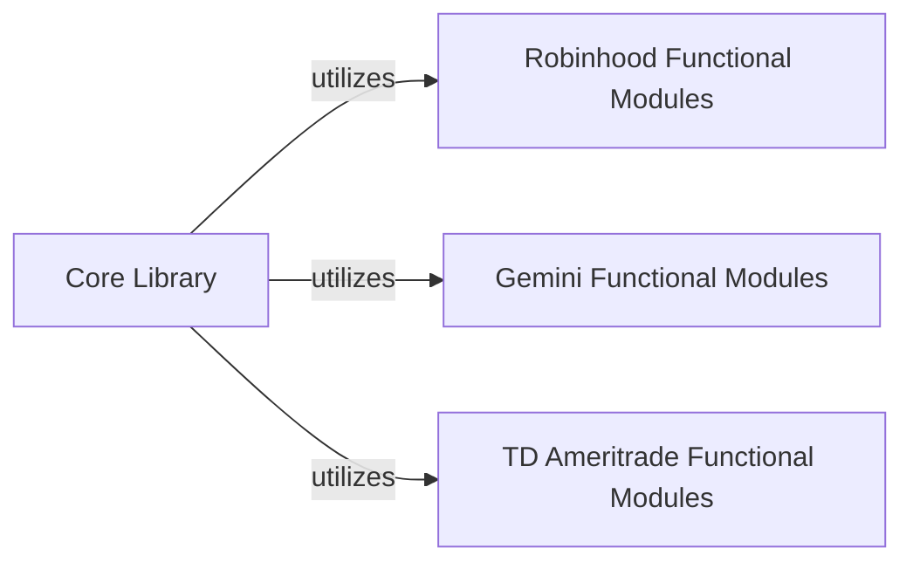

## Details

The `Core Library` subsystem is primarily defined by the `robin_stocks` package, serving as the central entry point and facade for the entire library. It orchestrates interactions with various financial API clients. The primary internal relationship within this subsystem is the `Core Library` acting as a central orchestrator that delegates tasks to the specialized functional modules (`Robinhood Functional Modules`, `Gemini Functional Modules`, `TD Ameritrade Functional Modules`). This "utilizes" relationship signifies that the `Core Library` depends on these modules to fulfill specific API requests, while the functional modules provide the concrete implementations for interacting with their respective external financial services. This structure adheres to the Facade and Module/Layered Architecture patterns, promoting clear separation of concerns and maintainability.

### Core Library [[Expand]](./Core_Library.md)
The main entry point and facade for the `robin_stocks` library. It provides a unified interface to various financial APIs, abstracting the underlying complexities. It orchestrates and delegates requests to specific API client modules.

**Related Classes/Methods**:

- <a href="https://github.com/jmfernandes/robin_stocks/blob/master/robin_stocks/__init__.py" target="_blank" rel="noopener noreferrer">`robin_stocks`</a>

### Robinhood Functional Modules
Encapsulates all specific API operations and functionalities related to the Robinhood platform. This includes authentication, data retrieval, and trading operations for Robinhood.

**Related Classes/Methods**:

- <a href="https://github.com/jmfernandes/robin_stocks/blob/master/robin_stocks/robinhood/__init__.py" target="_blank" rel="noopener noreferrer">`robin_stocks.robinhood`</a>

### Gemini Functional Modules
Manages all specific API operations and functionalities for the Gemini cryptocurrency exchange. This module handles Gemini-specific authentication, market data, and trading functionalities.

**Related Classes/Methods**:

- <a href="https://github.com/jmfernandes/robin_stocks/blob/master/robin_stocks/gemini/__init__.py" target="_blank" rel="noopener noreferrer">`robin_stocks.gemini`</a>

### TD Ameritrade Functional Modules
Handles all specific API operations and functionalities for the TD Ameritrade platform. This includes authentication, account management, and trading operations specific to TD Ameritrade.

**Related Classes/Methods**:

- <a href="https://github.com/jmfernandes/robin_stocks/blob/master/robin_stocks/tda/__init__.py" target="_blank" rel="noopener noreferrer">`robin_stocks.tda`</a>

### [FAQ](https://github.com/CodeBoarding/GeneratedOnBoardings/tree/main?tab=readme-ov-file#faq)