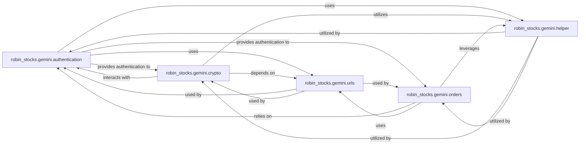

## Details

The Gemini API Client subsystem is encapsulated within the `robin_stocks.gemini` package.

### robin_stocks.gemini.authentication
Manages the secure authentication process with the Gemini API, including generating cryptographic signatures for authenticated requests and maintaining session integrity.

**Related Classes/Methods**:

- <a href="https://github.com/jmfernandes/robin_stocks/blob/master/robin_stocks/gemini/authentication.py" target="_blank" rel="noopener noreferrer">`robin_stocks.gemini.authentication`</a>

### robin_stocks.gemini.urls
Centralizes the definition and construction of all Gemini API endpoints, ensuring that all API requests are directed to the correct and properly formatted URLs.

**Related Classes/Methods**:

- <a href="https://github.com/jmfernandes/robin_stocks/blob/master/robin_stocks/gemini/urls.py" target="_blank" rel="noopener noreferrer">`robin_stocks.gemini.urls`</a>

### robin_stocks.gemini.helper
Offers a collection of utility functions that support various operations within the Gemini API client, including data formatting, configuration management, and other auxiliary tasks that streamline API interactions.

**Related Classes/Methods**:

- <a href="https://github.com/jmfernandes/robin_stocks/blob/master/robin_stocks/gemini/helper.py" target="_blank" rel="noopener noreferrer">`robin_stocks.gemini.helper`</a>

### robin_stocks.gemini.crypto
Provides functionalities for retrieving public and private cryptocurrency market data from the Gemini platform, acting as the primary interface for fetching real-time and historical crypto information.

**Related Classes/Methods**:

- <a href="https://github.com/jmfernandes/robin_stocks/blob/master/robin_stocks/gemini/crypto.py" target="_blank" rel="noopener noreferrer">`robin_stocks.gemini.crypto`</a>

### robin_stocks.gemini.orders
Handles the complete lifecycle of trading orders on the Gemini exchange, including placing new orders (market, limit, etc.), canceling existing orders, and retrieving order status.

**Related Classes/Methods**:

- <a href="https://github.com/jmfernandes/robin_stocks/blob/master/robin_stocks/gemini/orders.py" target="_blank" rel="noopener noreferrer">`robin_stocks.gemini.orders`</a>

### [FAQ](https://github.com/CodeBoarding/GeneratedOnBoardings/tree/main?tab=readme-ov-file#faq)