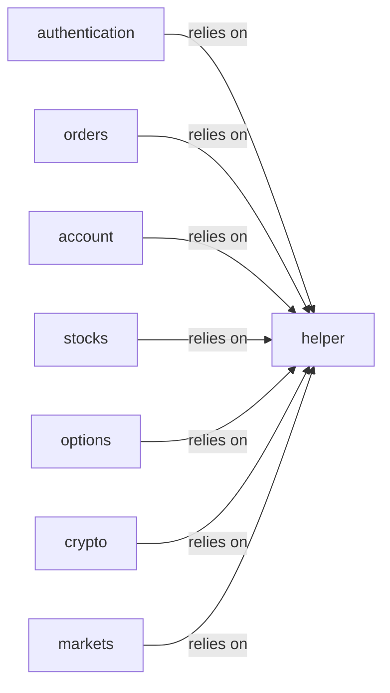

## Details

The Robinhood API Client subsystem, rooted in robin_stocks.robinhood, serves as the dedicated interface for all Robinhood API interactions. It encapsulates functionalities ranging from secure authentication and diverse order management to comprehensive data retrieval across various asset classes.

### authentication
Manages user login, device token generation, and validation of sheriff IDs to establish and maintain secure sessions with the Robinhood API.

**Related Classes/Methods**:

- <a href="https://github.com/jmfernandes/robin_stocks/blob/master/robin_stocks/robinhood/authentication.py" target="_blank" rel="noopener noreferrer">`robin_stocks.robinhood.authentication`</a>

### orders
Handles the creation and execution of various trade orders (stocks, options, cryptocurrencies), including market, limit, stop-loss, and trailing stop orders, as well as option spreads.

**Related Classes/Methods**:

- <a href="https://github.com/jmfernandes/robin_stocks/blob/master/robin_stocks/robinhood/orders.py" target="_blank" rel="noopener noreferrer">`robin_stocks.robinhood.orders`</a>

### account
Provides functionalities related to user accounts, such as downloading documents, managing watchlists, building holdings summaries, and retrieving user profile information.

**Related Classes/Methods**:

- <a href="https://github.com/jmfernandes/robin_stocks/blob/master/robin_stocks/robinhood/account.py" target="_blank" rel="noopener noreferrer">`robin_stocks.robinhood.account`</a>

### stocks
Focuses on retrieving stock-related data, including latest prices, quotes by symbol or ID, and price book information.

**Related Classes/Methods**:

- <a href="https://github.com/jmfernandes/robin_stocks/blob/master/robin_stocks/robinhood/stocks.py" target="_blank" rel="noopener noreferrer">`robin_stocks.robinhood.stocks`</a>

### options
Deals with options trading, enabling the finding of options by expiration, strike, or profitability, and retrieving option market and instrument data.

**Related Classes/Methods**:

- <a href="https://github.com/jmfernandes/robin_stocks/blob/master/robin_stocks/robinhood/options.py" target="_blank" rel="noopener noreferrer">`robin_stocks.robinhood.options`</a>

### crypto
Manages cryptocurrency-related operations, including retrieving crypto IDs, quotes, and historical data.

**Related Classes/Methods**:

- <a href="https://github.com/jmfernandes/robin_stocks/blob/master/robin_stocks/robinhood/crypto.py" target="_blank" rel="noopener noreferrer">`robin_stocks.robinhood.crypto`</a>

### markets
Provides information about market hours, including today's hours, next open hours, and specific market hours after a given date.

**Related Classes/Methods**:

- <a href="https://github.com/jmfernandes/robin_stocks/blob/master/robin_stocks/robinhood/markets.py" target="_blank" rel="noopener noreferrer">`robin_stocks.robinhood.markets`</a>

### helper
A foundational utility component that provides common helper functions for data filtering, ID retrieval for various instruments, and handling core HTTP requests (GET, POST, DELETE) to the Robinhood API. It also manages session updates and output formatting.

**Related Classes/Methods**:

- <a href="https://github.com/jmfernandes/robin_stocks/blob/master/robin_stocks/robinhood/helper.py" target="_blank" rel="noopener noreferrer">`robin_stocks.robinhood.helper`</a>

### [FAQ](https://github.com/CodeBoarding/GeneratedOnBoardings/tree/main?tab=readme-ov-file#faq)