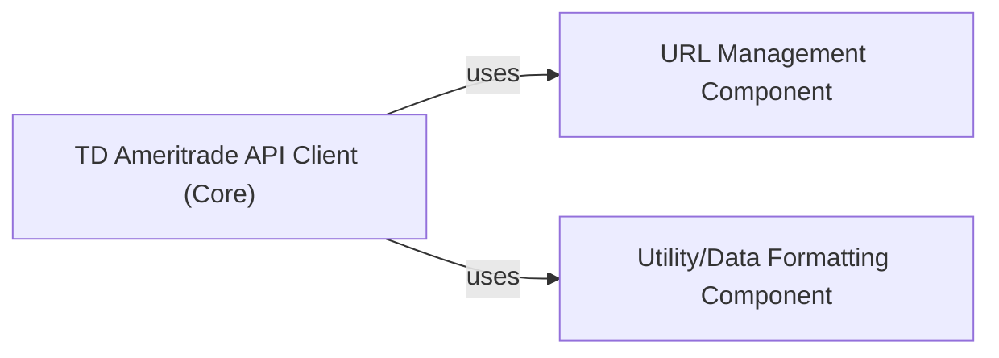

## Details

The TD Ameritrade API Client subsystem is primarily encapsulated within the `robin_stocks.tda` package, providing an interface for interacting with the TD Ameritrade API.

### TD Ameritrade API Client (Core)
This is the primary entry point for interacting with the TD Ameritrade API. It acts as a facade, orchestrating calls to other internal components to facilitate various API operations such as account management, transaction history, and order management, abstracting the underlying complexities of API communication.

**Related Classes/Methods**:

- <a href="https://github.com/jmfernandes/robin_stocks/blob/master/robin_stocks/tda/__init__.py" target="_blank" rel="noopener noreferrer">`robin_stocks.tda`</a>

### URL Management Component
Solely responsible for constructing and managing all specific TD Ameritrade API endpoints. It acts as a centralized registry for API paths, ensuring consistency and ease of maintenance for all API requests. This component is crucial for abstracting the API's endpoint structure.

**Related Classes/Methods**:

- <a href="https://github.com/jmfernandes/robin_stocks/blob/master/robin_stocks/tda/urls.py" target="_blank" rel="noopener noreferrer">`robin_stocks.tda.urls`</a>

### Utility/Data Formatting Component
Provides utility functions, primarily focused on data formatting, validation, and potentially configuration retrieval related to data processing. This ensures that data sent to and received from the API is correctly structured and parsed.

**Related Classes/Methods**:

- <a href="https://github.com/jmfernandes/robin_stocks/blob/master/robin_stocks/tda/helper.py" target="_blank" rel="noopener noreferrer">`robin_stocks.tda.helper`</a>

### [FAQ](https://github.com/CodeBoarding/GeneratedOnBoardings/tree/main?tab=readme-ov-file#faq)