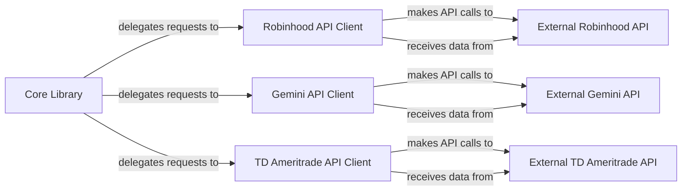

## Details

The `robin_stocks` library acts as a unified interface for various financial trading platforms. Its `Core Library` serves as the central orchestrator, delegating user requests to specific API clients. Each dedicated API client (Robinhood, Gemini, TD Ameritrade) handles the intricacies of interacting with its respective external trading platform. This design ensures clear separation of concerns, allowing the `Core Library` to provide a consistent user experience while individual clients manage platform-specific authentication, data formatting, and transaction logic. Data flows from the `Core Library` to the API clients for request processing, and then to the external APIs. Conversely, responses and market data flow back from the external APIs, through the clients, and ultimately to the `Core Library` for user consumption.

### Core Library [[Expand]](./Core_Library.md)
The central entry point and facade for the `robin_stocks` library, providing a unified interface to various financial APIs. It orchestrates and delegates requests to specific API clients.

**Related Classes/Methods**:

- <a href="https://github.com/jmfernandes/robin_stocks/blob/master/robin_stocks" target="_blank" rel="noopener noreferrer">`robin_stocks`</a>

### Robinhood API Client [[Expand]](./Robinhood_API_Client.md)
Encapsulates all functionalities for interacting with the Robinhood API, including authentication, order management, and data retrieval.

**Related Classes/Methods**:

- <a href="https://github.com/jmfernandes/robin_stocks/blob/master/robin_stocks/robinhood" target="_blank" rel="noopener noreferrer">`robin_stocks.robinhood`</a>

### Gemini API Client [[Expand]](./Gemini_API_Client.md)
Manages all interactions with the Gemini API for cryptocurrency trading, handling authentication, order placement, and market data.

**Related Classes/Methods**:

- <a href="https://github.com/jmfernandes/robin_stocks/blob/master/robin_stocks/gemini" target="_blank" rel="noopener noreferrer">`robin_stocks.gemini`</a>

### TD Ameritrade API Client [[Expand]](./TD_Ameritrade_API_Client.md)
Responsible for interactions with the TD Ameritrade API, covering account management, transaction history, and order management.

**Related Classes/Methods**:

- <a href="https://github.com/jmfernandes/robin_stocks/blob/master/robin_stocks/tda" target="_blank" rel="noopener noreferrer">`robin_stocks.tda`</a>

### External Robinhood API
Represents the actual external Robinhood trading platform API, an external service consumed by the `Robinhood API Client`.

**Related Classes/Methods**: _None_

### External Gemini API
Represents the actual external Gemini cryptocurrency exchange API, an external service consumed by the `Gemini API Client`.

**Related Classes/Methods**: _None_

### External TD Ameritrade API
Represents the actual external TD Ameritrade brokerage API, an external service consumed by the `TD Ameritrade API Client`.

**Related Classes/Methods**: _None_

### [FAQ](https://github.com/CodeBoarding/GeneratedOnBoardings/tree/main?tab=readme-ov-file#faq)