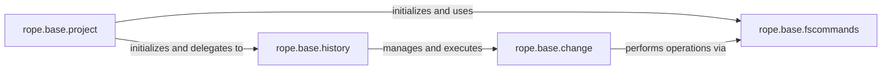

## Details

The `rope.base` subsystem forms the core of the Rope refactoring tool, orchestrating code modifications and managing project state. The `rope.base.project` component serves as the central hub, representing the codebase and managing its configuration, resources, and the overall refactoring lifecycle. It delegates the execution and management of code changes to `rope.base.history`, which maintains a stack of `rope.base.change` objects, enabling robust undo/redo functionality. Each `rope.base.change` object encapsulates an atomic, reversible modification (e.g., file content changes, resource moves, creations, or deletions). These changes, in turn, rely on `rope.base.fscommands` to perform actual file system operations. `rope.base.fscommands` provides an essential abstraction layer, allowing Rope to interact with the file system uniformly, even when integrated with various version control systems like Git or Mercurial, by dynamically selecting the appropriate command implementation. This architecture ensures that refactorings are applied consistently, tracked, and can be easily reverted.

### rope.base.change
This component defines the abstract concept of a code modification. The `Change` class serves as the base for various concrete change types (e.g., `ChangeContents`, `MoveResource`, `CreateResource`, `RemoveResource`). Each `Change` object encapsulates an atomic, reversible operation with `do()` and `undo()` methods. `ChangeSet` aggregates multiple `Change` objects, allowing complex refactorings to be treated as a single unit. These changes interact with the file system through an internal `_ResourceOperations` helper, which in turn leverages `rope.base.fscommands`.

**Related Classes/Methods**:

- <a href="https://github.com/python-rope/rope/blob/master/rope/base/change.py" target="_blank" rel="noopener noreferrer">`rope.base.change.Change`</a>

### rope.base.history
This component acts as the central manager for refactoring operations, providing undo/redo capabilities. The `History` class maintains a chronological stack of `rope.base.change.Change` objects (specifically `ChangeSet` instances). It orchestrates the execution (`do`) and reversal (`undo`) of these changes, ensuring the codebase can be reverted to previous states. It interacts with the `Project` to save and load its state.

**Related Classes/Methods**:

- <a href="https://github.com/python-rope/rope/blob/master/rope/base/history.py#L4-L201" target="_blank" rel="noopener noreferrer">`rope.base.history.History`:4-201</a>

### rope.base.fscommands
This component provides an abstraction layer for file system operations, enabling Rope to interact with files and directories uniformly, regardless of the underlying version control system. The `FileSystemCommands` class defines basic operations like `create_file`, `create_folder`, `move`, `remove`, `write`, and `read`. It has specialized subclasses (e.g., `SubversionCommands`, `MercurialCommands`, `GITCommands`, `DarcsCommands`) that override these methods to integrate with specific VCS tools, ensuring that file system changes are properly tracked and managed by the respective VCS. The `create_fscommands` function dynamically selects the appropriate implementation at runtime.

**Related Classes/Methods**:

- <a href="https://github.com/python-rope/rope/blob/master/rope/base/fscommands.py#L37-L62" target="_blank" rel="noopener noreferrer">`rope.base.fscommands.FileSystemCommands`:37-62</a>

### rope.base.project
This is a high-level component representing the entire codebase being refactored. The `Project` class manages project-wide settings, resources (files and folders), and orchestrates refactoring operations. It initializes and holds references to the `History` component to apply changes (`do` method delegates to `History`) and the `fscommands` component to perform file system operations. It also manages observers for resource changes and provides access to Python-specific code analysis (`pycore`).

**Related Classes/Methods**:

- <a href="https://github.com/python-rope/rope/blob/master/rope/base/project.py" target="_blank" rel="noopener noreferrer">`rope.base.project.Project`</a>

### [FAQ](https://github.com/CodeBoarding/GeneratedOnBoardings/tree/main?tab=readme-ov-file#faq)