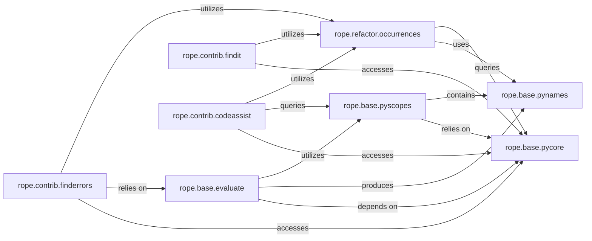

## Details

The `rope` analysis subsystem is built around a core semantic model managed by `rope.base.pycore`, which provides a comprehensive representation of the Python project's code, including parsed modules and resource change tracking. This core model is leveraged by `rope.base.pynames` for symbol representation and resolution, and by `rope.base.pyscopes` for managing code context and name visibility. `rope.base.evaluate` acts as the expression evaluation engine, inferring types and resolving symbols by interacting with `pyscopes` and `pynames`. Building upon these foundational components, `rope.refactor.occurrences` provides a project-wide search capability. Higher-level `rope.contrib` modules, such as `rope.contrib.findit` (for code navigation), `rope.contrib.codeassist` (for intelligent completion), and `rope.contrib.finderrors` (for static analysis), utilize these core services to deliver their respective functionalities, forming a cohesive system for advanced Python code analysis and manipulation.

### rope.base.pycore
Represents the core of `rope`'s Project & Semantic Model. It manages the project's Python code, providing access to parsed modules (`PyObject`s) and handling caching and resource change notifications. It serves as the central hub for all components needing to interact with the parsed code structure.

**Related Classes/Methods**:

- <a href="https://github.com/python-rope/rope/blob/master/rope/base/pycore.py" target="_blank" rel="noopener noreferrer">`rope.base.pycore:PyCore`</a>
- <a href="https://github.com/python-rope/rope/blob/master/rope/base/pycore.py" target="_blank" rel="noopener noreferrer">`rope.base.pycore:_ModuleCache`</a>
- <a href="https://github.com/python-rope/rope/blob/master/rope/base/pycore.py" target="_blank" rel="noopener noreferrer">`rope.base.pycore:_ExtensionCache`</a>
- <a href="https://github.com/python-rope/rope/blob/master/rope/base/pycore.py" target="_blank" rel="noopener noreferrer">`rope.base.pycore:resource_to_pyobject`</a>

### rope.base.pynames
Defines and manages the representation of Python names (symbols) within the project's code. It provides a hierarchy of `PyName` types (e.g., `DefinedName`, `ImportedName`, `EvaluatedName`) to accurately track and resolve references to `PyObject`s.

**Related Classes/Methods**:

- <a href="https://github.com/python-rope/rope/blob/master/rope/base/pynames.py" target="_blank" rel="noopener noreferrer">`rope.base.pynames:PyName`</a>
- <a href="https://github.com/python-rope/rope/blob/master/rope/base/pynames.py" target="_blank" rel="noopener noreferrer">`rope.base.pynames:DefinedName`</a>
- <a href="https://github.com/python-rope/rope/blob/master/rope/base/pynames.py" target="_blank" rel="noopener noreferrer">`rope.base.pynames:EvaluatedName`</a>
- <a href="https://github.com/python-rope/rope/blob/master/rope/base/pynames.py" target="_blank" rel="noopener noreferrer">`rope.base.pynames:ImportedModule`</a>
- <a href="https://github.com/python-rope/rope/blob/master/rope/base/pynames.py" target="_blank" rel="noopener noreferrer">`rope.base.pynames:ImportedName`</a>

### rope.base.pyscopes
Manages the hierarchical structure of Python code scopes (e.g., module, class, function, comprehension). It enables context-sensitive name lookup and provides information about the visibility and boundaries of code elements.

**Related Classes/Methods**:

- <a href="https://github.com/python-rope/rope/blob/master/rope/base/pyscopes.py" target="_blank" rel="noopener noreferrer">`rope.base.pyscopes:Scope`</a>
- <a href="https://github.com/python-rope/rope/blob/master/rope/base/pyscopes.py" target="_blank" rel="noopener noreferrer">`rope.base.pyscopes:GlobalScope`</a>
- <a href="https://github.com/python-rope/rope/blob/master/rope/base/pyscopes.py" target="_blank" rel="noopener noreferrer">`rope.base.pyscopes:FunctionScope`</a>
- <a href="https://github.com/python-rope/rope/blob/master/rope/base/pyscopes.py" target="_blank" rel="noopener noreferrer">`rope.base.pyscopes:ClassScope`</a>
- <a href="https://github.com/python-rope/rope/blob/master/rope/base/pyscopes.py" target="_blank" rel="noopener noreferrer">`rope.base.pyscopes:lookup`</a>

### rope.base.evaluate
Implements the core logic for evaluating Python expressions and inferring the `PyObject` or `PyName` they refer to. It uses scope information and AST traversal to resolve symbols and determine their types, supporting static analysis and code understanding features.

**Related Classes/Methods**:

- <a href="https://github.com/python-rope/rope/blob/master/rope/base/evaluate.py" target="_blank" rel="noopener noreferrer">`rope.base.evaluate:eval_location`</a>
- <a href="https://github.com/python-rope/rope/blob/master/rope/base/evaluate.py" target="_blank" rel="noopener noreferrer">`rope.base.evaluate:eval_node`</a>
- <a href="https://github.com/python-rope/rope/blob/master/rope/base/evaluate.py" target="_blank" rel="noopener noreferrer">`rope.base.evaluate:eval_str`</a>
- <a href="https://github.com/python-rope/rope/blob/master/rope/base/evaluate.py" target="_blank" rel="noopener noreferrer">`rope.base.evaluate:ScopeNameFinder`</a>
- <a href="https://github.com/python-rope/rope/blob/master/rope/base/evaluate.py" target="_blank" rel="noopener noreferrer">`rope.base.evaluate:StatementEvaluator`</a>

### rope.refactor.occurrences
Acts as the fundamental search engine for the subsystem. It is responsible for finding all occurrences of Python names and patterns within the project's source code, supporting various filtering mechanisms. This component is crucial for any feature requiring code element lookup.

**Related Classes/Methods**: _None_

### rope.contrib.findit
Provides high-level, user-facing interfaces for code navigation. It abstracts the underlying search mechanisms to offer functionalities like finding definitions, implementations, and general occurrences of symbols, making code exploration intuitive.

**Related Classes/Methods**: _None_

### rope.contrib.codeassist
Implements intelligent code completion and call tip functionalities. It analyzes the current code context and cursor position to offer relevant suggestions and function signatures, enhancing developer productivity.

**Related Classes/Methods**: _None_

### rope.contrib.finderrors
Focuses on static code analysis. Its responsibility is to identify and report potential errors, bad practices, or undefined names within the codebase, contributing to code quality and reliability.

**Related Classes/Methods**: _None_

### [FAQ](https://github.com/CodeBoarding/GeneratedOnBoardings/tree/main?tab=readme-ov-file#faq)