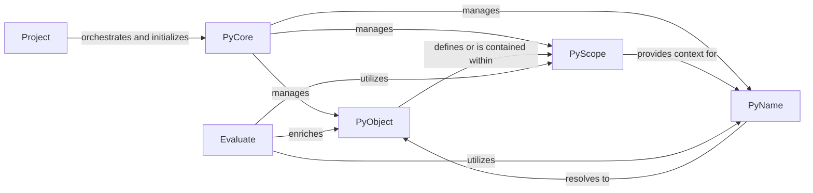

## Details

The Project & Semantic Model subsystem forms the analytical core of rope, responsible for understanding and representing Python code semantically.

### Project
The top-level orchestrator and entry point for code analysis. It manages project-wide configurations, resources, and acts as the primary interface for interacting with the semantic model.

**Related Classes/Methods**:

- <a href="https://github.com/python-rope/rope/blob/master/rope/base/project.py" target="_blank" rel="noopener noreferrer">`rope.base.project.Project`</a>

### PyCore
The central manager for the in-memory Python Object Model. It is responsible for building, caching, and maintaining the semantic representation of Python modules, classes, functions, and variables.

**Related Classes/Methods**:

- <a href="https://github.com/python-rope/rope/blob/master/rope/base/pycore.py" target="_blank" rel="noopener noreferrer">`rope.base.pycore.PyCore`</a>

### PyObject
Represents fundamental Python entities (e.g., modules, classes, functions, variables) within the semantic model. It holds basic structural and type information, forming the nodes of the semantic graph.

**Related Classes/Methods**:

- <a href="https://github.com/python-rope/rope/blob/master/rope/base/pyobjects.py#L6-L81" target="_blank" rel="noopener noreferrer">`rope.base.pyobjects.PyObject`:6-81</a>
- <a href="https://github.com/python-rope/rope/blob/master/rope/base/pyobjects.py#L327-L328" target="_blank" rel="noopener noreferrer">`rope.base.pyobjects.PyModule`:327-328</a>
- <a href="https://github.com/python-rope/rope/blob/master/rope/base/pyobjects.py#L280-L281" target="_blank" rel="noopener noreferrer">`rope.base.pyobjects.PyClass`:280-281</a>
- <a href="https://github.com/python-rope/rope/blob/master/rope/base/pyobjects.py#L269-L270" target="_blank" rel="noopener noreferrer">`rope.base.pyobjects.PyFunction`:269-270</a>

### PyName
Represents a named entity in the code. Its primary function is to resolve a name to its corresponding PyObject, incorporating inferred type information. It acts as a pointer within the semantic model.

**Related Classes/Methods**:

- <a href="https://github.com/python-rope/rope/blob/master/rope/base/pynames.py#L14-L21" target="_blank" rel="noopener noreferrer">`rope.base.pynames.PyName`:14-21</a>

### PyScope
Defines lexical and semantic boundaries within the code (e.g., module scope, class scope, function scope). It manages the names defined within its context and maintains parent-child relationships with other scopes, crucial for name lookup.

**Related Classes/Methods**:

- <a href="https://github.com/python-rope/rope/blob/master/rope/base/pyscopes.py" target="_blank" rel="noopener noreferrer">`rope.base.pyscopes.PyScope`</a>

### Evaluate
Performs static analysis and runtime object inference to determine types, values, and other semantic properties of code elements. It enriches the PyObject model with deeper semantic understanding.

**Related Classes/Methods**:

- <a href="https://github.com/python-rope/rope/blob/master/rope/base/evaluate.py" target="_blank" rel="noopener noreferrer">`rope.base.evaluate.Evaluate`</a>

### [FAQ](https://github.com/CodeBoarding/GeneratedOnBoardings/tree/main?tab=readme-ov-file#faq)