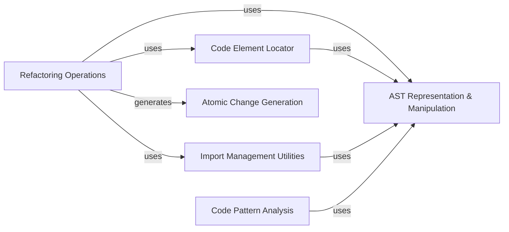

## Details

The `rope.refactor` subsystem is designed around a core principle of precise, non-destructive code transformation. At its heart, the AST Representation & Manipulation component provides an enhanced Abstract Syntax Tree, serving as the canonical data model for all code operations. Refactoring Operations act as the orchestrators, implementing specific refactoring algorithms by interacting with the AST. These operations rely on the Code Element Locator to identify target code elements and the Import Management Utilities to maintain correct import paths during transformations. All refactoring actions culminate in the generation of Atomic Change Generation objects, which represent the immutable modifications to be applied to the source code. Additionally, the Code Pattern Analysis component supports identifying refactoring opportunities by analyzing code structures. This architecture ensures a modular, extensible, and robust approach to code refactoring.

### Refactoring Operations
This component encapsulates the specific algorithms and logic for various refactoring types (e.g., rename, move, extract). It acts as the orchestrator for a given refactoring, coordinating with other components to analyze code, identify targets, and generate changes. This aligns with the Strategy/Command pattern, where each refactoring is a distinct operation.

**Related Classes/Methods**:

- <a href="https://github.com/python-rope/rope/blob/master/rope/refactor/rename.py" target="_blank" rel="noopener noreferrer">`rope.refactor.rename`</a>
- <a href="https://github.com/python-rope/rope/blob/master/rope/refactor/move.py" target="_blank" rel="noopener noreferrer">`rope.refactor.move`</a>
- <a href="https://github.com/python-rope/rope/blob/master/rope/refactor/extract.py" target="_blank" rel="noopener noreferrer">`rope.refactor.extract`</a>
- <a href="https://github.com/python-rope/rope/blob/master/rope/refactor/change_signature.py" target="_blank" rel="noopener noreferrer">`rope.refactor.change_signature`</a>
- <a href="https://github.com/python-rope/rope/blob/master/rope/refactor/inline.py" target="_blank" rel="noopener noreferrer">`rope.refactor.inline`</a>
- <a href="https://github.com/python-rope/rope/blob/master/rope/refactor/restructure.py" target="_blank" rel="noopener noreferrer">`rope.refactor.restructure`</a>
- <a href="https://github.com/python-rope/rope/blob/master/rope/refactor/usefunction.py" target="_blank" rel="noopener noreferrer">`rope.refactor.usefunction`</a>

### AST Representation & Manipulation
Provides an enhanced Abstract Syntax Tree (AST) representation that is crucial for non-destructive and precise code transformations. It serves as the central data model for the code being refactored and offers interfaces for manipulating its structure while preserving formatting.

**Related Classes/Methods**:

- <a href="https://github.com/python-rope/rope/blob/master/rope/refactor/patchedast.py" target="_blank" rel="noopener noreferrer">`rope.refactor.patchedast`</a>

### Code Element Locator
Offers mechanisms to accurately find and identify all occurrences of specific code elements (e.g., variables, functions, classes) within a given scope or project. This is vital for ensuring comprehensive and correct refactorings.

**Related Classes/Methods**:

- <a href="https://github.com/python-rope/rope/blob/master/rope/refactor/occurrences.py" target="_blank" rel="noopener noreferrer">`rope.refactor.occurrences`</a>

### Import Management Utilities
Provides specialized utilities for parsing, analyzing, and modifying import statements within Python modules. This component ensures that import paths are correctly adjusted after code relocation or restructuring, maintaining code integrity.

**Related Classes/Methods**:

- <a href="https://github.com/python-rope/rope/blob/master/rope/refactor/importutils" target="_blank" rel="noopener noreferrer">`rope.refactor.importutils`</a>

### Atomic Change Generation
Represents an atomic, immutable modification to the source code (e.g., text insertion, deletion, replacement). These objects are the standardized output of all refactoring operations, allowing for a consistent application of changes.

**Related Classes/Methods**:

- <a href="https://github.com/python-rope/rope/blob/master/rope/base/change.py" target="_blank" rel="noopener noreferrer">`rope.base.change`</a>

### Code Pattern Analysis
Detects and identifies similar code blocks or patterns within the codebase. This analysis can be used to suggest refactoring opportunities, such as "extract method," by highlighting redundant code.

**Related Classes/Methods**:

- <a href="https://github.com/python-rope/rope/blob/master/rope/refactor/similarfinder.py" target="_blank" rel="noopener noreferrer">`rope.refactor.similarfinder`</a>

### [FAQ](https://github.com/CodeBoarding/GeneratedOnBoardings/tree/main?tab=readme-ov-file#faq)