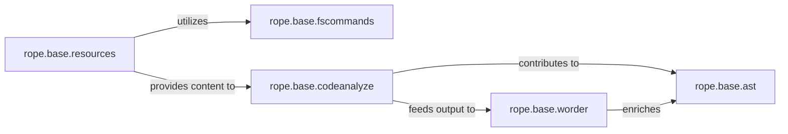

## Details

The Source Code I/O & Parsing subsystem in rope is responsible for handling the input and output of source code, performing lexical analysis, and constructing the Abstract Syntax Tree (AST). It acts as the foundational layer for all subsequent code analysis and refactoring operations.

### rope.base.fscommands
This component provides the lowest-level interface for direct file system operations. It handles reading, writing, creating, deleting, and moving files, and is crucial for managing character encoding and decoding of file data to ensure correct interpretation of source code content.

**Related Classes/Methods**:

- <a href="https://github.com/python-rope/rope/blob/master/rope/base/fscommands.py" target="_blank" rel="noopener noreferrer">`rope.base.fscommands`</a>

### rope.base.resources
This component offers a higher-level, object-oriented abstraction over individual files and folders within the project. It manages resource properties (e.g., paths, names) and facilitates navigation of the project's file hierarchy. It serves as the primary component through which raw source code content is accessed by the parsing components.

**Related Classes/Methods**:

- <a href="https://github.com/python-rope/rope/blob/master/rope/base/resources.py" target="_blank" rel="noopener noreferrer">`rope.base.resources`</a>

### rope.base.codeanalyze
This component performs the initial lexical analysis of source code. It tokenizes the raw text, identifies logical lines, and manages line and block boundaries. It transforms the unstructured raw text into a stream of structured tokens, which is the first step in building a parseable representation.

**Related Classes/Methods**:

- <a href="https://github.com/python-rope/rope/blob/master/rope/base/codeanalyze.py" target="_blank" rel="noopener noreferrer">`rope.base.codeanalyze`</a>

### rope.base.worder
Building upon the output of rope.base.codeanalyze, this component identifies and analyzes words, names, and primary expressions within the token stream. It provides more contextual information about these elements (e.g., distinguishing between a variable name, a function call, or a keyword), enriching the lexical analysis with initial syntactic understanding.

**Related Classes/Methods**:

- <a href="https://github.com/python-rope/rope/blob/master/rope/base/worder.py" target="_blank" rel="noopener noreferrer">`rope.base.worder`</a>

### rope.base.ast
This component manages the Abstract Syntax Tree (AST) representation of the source code. It is the central data structure for all subsequent code analysis and manipulation within rope. It provides functionalities for traversing the tree, querying node types, and accessing information about the code's structural elements.

**Related Classes/Methods**:

- <a href="https://github.com/python-rope/rope/blob/master/rope/base/ast.py" target="_blank" rel="noopener noreferrer">`rope.base.ast`</a>

### [FAQ](https://github.com/CodeBoarding/GeneratedOnBoardings/tree/main?tab=readme-ov-file#faq)