```mermaid
graph LR
    Source_Code_I_O_Parsing["Source Code I/O & Parsing"]
    Project_Semantic_Model["Project & Semantic Model"]
    Refactoring_Engine["Refactoring Engine"]
    Change_Application_History["Change Application & History"]
    Code_Query_Assistance["Code Query & Assistance"]
    Configuration_Management["Configuration Management"]
    Source_Code_I_O_Parsing -- "passes parsed AST to" --> Project_Semantic_Model
    Refactoring_Engine -- "queries and utilizes" --> Project_Semantic_Model
    Refactoring_Engine -- "sends proposed changes to" --> Change_Application_History
    Change_Application_History -- "writes modified code via" --> Source_Code_I_O_Parsing
    Project_Semantic_Model -- "provides semantic model to" --> Code_Query_Assistance
    Configuration_Management -- "provides configuration settings to" --> Project_Semantic_Model
    click Source_Code_I_O_Parsing href "https://github.com/CodeBoarding/GeneratedOnBoardings/blob/main/rope/Source_Code_I_O_Parsing.md" "Details"
    click Project_Semantic_Model href "https://github.com/CodeBoarding/GeneratedOnBoardings/blob/main/rope/Project_Semantic_Model.md" "Details"
    click Refactoring_Engine href "https://github.com/CodeBoarding/GeneratedOnBoardings/blob/main/rope/Refactoring_Engine.md" "Details"
    click Change_Application_History href "https://github.com/CodeBoarding/GeneratedOnBoardings/blob/main/rope/Change_Application_History.md" "Details"
    click Code_Query_Assistance href "https://github.com/CodeBoarding/GeneratedOnBoardings/blob/main/rope/Code_Query_Assistance.md" "Details"
```

## Details

The rope project is structured around a core Project & Semantic Model that serves as the central analytical hub for understanding Python code. Source Code I/O & Parsing acts as the initial entry point, responsible for reading and parsing source files into an Abstract Syntax Tree (AST), which is then fed into the Project & Semantic Model. This model builds a comprehensive in-memory representation of the project, including its structure, dependencies, and semantic details. The Refactoring Engine leverages this semantic model to perform various code transformations, generating atomic changes that are then managed and applied by the Change Application & History component. Change Application & History interacts with Source Code I/O & Parsing to persist these modifications back to the file system. Additionally, the Project & Semantic Model provides its rich semantic understanding to the Code Query & Assistance component, enabling features like code completion and error detection. Finally, Configuration Management provides essential settings and preferences that influence the behavior and setup of the Project & Semantic Model and other components, ensuring adaptable and project-specific operations.

### Source Code I/O & Parsing [[Expand]](./Source_Code_I_O_Parsing.md)
Manages reading and writing source code files, performs lexical analysis to tokenize code, and constructs the Abstract Syntax Tree (AST). It serves as the primary interface for code input and output.

**Related Classes/Methods**:

- <a href="https://github.com/python-rope/rope/blob/master/rope/base/fscommands.py" target="_blank" rel="noopener noreferrer">`rope/base/fscommands.py`</a>
- <a href="https://github.com/python-rope/rope/blob/master/rope/base/resources.py" target="_blank" rel="noopener noreferrer">`rope/base/resources.py`</a>
- <a href="https://github.com/python-rope/rope/blob/master/rope/base/codeanalyze.py" target="_blank" rel="noopener noreferrer">`rope/base/codeanalyze.py`</a>
- <a href="https://github.com/python-rope/rope/blob/master/rope/base/worder.py" target="_blank" rel="noopener noreferrer">`rope/base/worder.py`</a>
- <a href="https://github.com/python-rope/rope/blob/master/rope/base/ast.py" target="_blank" rel="noopener noreferrer">`rope/base/ast.py`</a>

### Project & Semantic Model [[Expand]](./Project_Semantic_Model.md)
The analytical core responsible for managing the overall project structure, module dependencies, and building an in-memory Python Object Model (PyObjects). This model represents the semantic understanding of the code, including scopes, names, types, and is enriched by runtime object inference.

**Related Classes/Methods**:

- <a href="https://github.com/python-rope/rope/blob/master/rope/base/project.py" target="_blank" rel="noopener noreferrer">`rope/base/project.py`</a>
- <a href="https://github.com/python-rope/rope/blob/master/rope/base/pycore.py" target="_blank" rel="noopener noreferrer">`rope/base/pycore.py`</a>
- <a href="https://github.com/python-rope/rope/blob/master/rope/base/pyobjects.py" target="_blank" rel="noopener noreferrer">`rope/base/pyobjects.py`</a>
- <a href="https://github.com/python-rope/rope/blob/master/rope/base/pynames.py" target="_blank" rel="noopener noreferrer">`rope/base/pynames.py`</a>
- <a href="https://github.com/python-rope/rope/blob/master/rope/base/pyscopes.py" target="_blank" rel="noopener noreferrer">`rope/base/pyscopes.py`</a>
- <a href="https://github.com/python-rope/rope/blob/master/rope/base/evaluate.py" target="_blank" rel="noopener noreferrer">`rope/base/evaluate.py`</a>

### Refactoring Engine [[Expand]](./Refactoring_Engine.md)
Encapsulates the various code refactoring algorithms. It utilizes the Project & Semantic Model to understand the code context and directly manipulates the AST to perform transformations, ultimately generating a set of atomic changes.

**Related Classes/Methods**:

- <a href="https://github.com/python-rope/rope/blob/master/rope/refactor/rename.py" target="_blank" rel="noopener noreferrer">`rope/refactor/rename.py`</a>
- <a href="https://github.com/python-rope/rope/blob/master/rope/refactor/move.py" target="_blank" rel="noopener noreferrer">`rope/refactor/move.py`</a>
- <a href="https://github.com/python-rope/rope/blob/master/rope/refactor/extract.py" target="_blank" rel="noopener noreferrer">`rope.refactor.extract.py`</a>
- <a href="https://github.com/python-rope/rope/blob/master/rope/refactor/importutils/__init__.py" target="_blank" rel="noopener noreferrer">`rope/refactor/importutils.py`</a>
- <a href="https://github.com/python-rope/rope/blob/master/rope/refactor/patchedast.py" target="_blank" rel="noopener noreferrer">`rope/refactor/patchedast.py`</a>

### Change Application & History [[Expand]](./Change_Application_History.md)
Responsible for applying the atomic code changes generated by the Refactoring Engine back to the source files. It also maintains a history of these changes, enabling undo/redo functionalities for refactoring operations.

**Related Classes/Methods**:

- <a href="https://github.com/python-rope/rope/blob/master/rope/base/change.py" target="_blank" rel="noopener noreferrer">`rope/base/change.py`</a>
- <a href="https://github.com/python-rope/rope/blob/master/rope/base/history.py" target="_blank" rel="noopener noreferrer">`rope/base/history.py`</a>

### Code Query & Assistance [[Expand]](./Code_Query_Assistance.md)
Provides functionalities that leverage the Project & Semantic Model for various code assistance features. This includes searching for code patterns, finding occurrences of names, providing intelligent code suggestions (e.g., auto-completion, call tips), and identifying potential errors or bad practices (linting).

**Related Classes/Methods**:

- <a href="https://github.com/python-rope/rope/blob/master/rope/refactor/occurrences.py" target="_blank" rel="noopener noreferrer">`rope/refactor/occurrences.py`</a>
- <a href="https://github.com/python-rope/rope/blob/master/rope/contrib/findit.py" target="_blank" rel="noopener noreferrer">`rope/contrib/findit.py`</a>
- <a href="https://github.com/python-rope/rope/blob/master/rope/contrib/codeassist.py" target="_blank" rel="noopener noreferrer">`rope/contrib/codeassist.py`</a>
- <a href="https://github.com/python-rope/rope/blob/master/rope/contrib/finderrors.py" target="_blank" rel="noopener noreferrer">`rope/contrib/finderrors.py`</a>

### Configuration Management
Handles the loading, saving, and management of project-specific preferences and settings. These configurations influence the behavior and setup of various other rope components, particularly the Project & Semantic Model.

**Related Classes/Methods**:

- <a href="https://github.com/python-rope/rope/blob/master/rope/base/prefs.py" target="_blank" rel="noopener noreferrer">`rope/base/prefs.py`</a>

### [FAQ](https://github.com/CodeBoarding/GeneratedOnBoardings/tree/main?tab=readme-ov-file#faq)