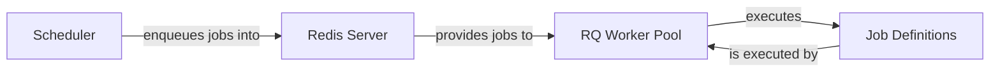

## Details

The `rq-scheduler` subsystem orchestrates the scheduling and execution of asynchronous tasks using Redis as a central message broker. The `Scheduler` component is responsible for managing and enqueuing jobs into the `Redis Server` at predefined times. The `Redis Server` acts as the persistent store for job queues and metadata, facilitating communication between the `Scheduler` and the `RQ Worker Pool`. The `RQ Worker Pool`, composed of `rq` worker processes, continuously monitors Redis for new jobs, retrieves them, and executes the `Job Definitions` (the actual task logic). This architecture ensures reliable and scalable asynchronous task processing by decoupling job scheduling from job execution.

### RQ Worker Pool [[Expand]](./RQ_Worker_Pool.md)
A collection of `rq` worker processes that continuously poll the `Redis Server` for new jobs in their respective queues. Once a job is retrieved, the worker executes the actual task logic defined by the application. This component is the primary consumer of tasks, relying on the `rq` library for its implementation.

**Related Classes/Methods**:

- <a href="https://github.com/rq/rq-scheduler/blob/master/" target="_blank" rel="noopener noreferrer">`rq.Worker`</a>

### Redis Server
Acts as the central message queue and persistent data store for the entire system. It mediates communication between the `Scheduler` (producer) and the `RQ Worker Pool` (consumer), holding job queues and job metadata. The `rq-scheduler` project interacts with Redis primarily through the `redis` Python client library.

**Related Classes/Methods**:

- <a href="https://github.com/rq/rq-scheduler/blob/master/" target="_blank" rel="noopener noreferrer">`redis.Redis`</a>

### Job Definitions
Encapsulates the actual Python functions or methods that represent the asynchronous tasks to be executed. These are the callable units of work that the `RQ Worker Pool` processes. Within `rq-scheduler`, these jobs are typically serialized and deserialized for storage in Redis.

**Related Classes/Methods**:

- <a href="https://github.com/rq/rq-scheduler/blob/master/" target="_blank" rel="noopener noreferrer">`rq.job.Job`</a>

### Scheduler
Responsible for enqueuing jobs into `Redis` at scheduled times for consumption by the `RQ Worker Pool`. This component manages the scheduling logic, including recurring jobs and delayed tasks.

**Related Classes/Methods**:

- <a href="https://github.com/rq/rq-scheduler/blob/master/rq_scheduler/scheduler.py#L23-L500" target="_blank" rel="noopener noreferrer">`rq_scheduler.scheduler.Scheduler`:23-500</a>

### [FAQ](https://github.com/CodeBoarding/GeneratedOnBoardings/tree/main?tab=readme-ov-file#faq)